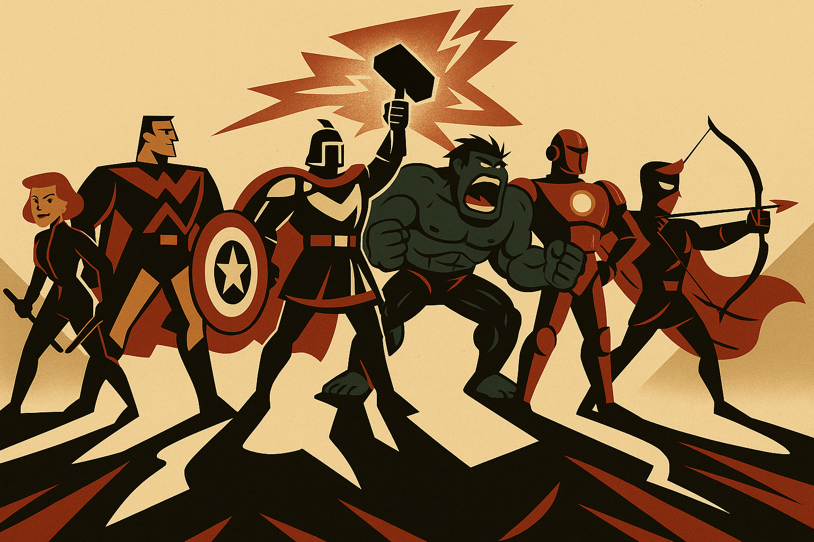
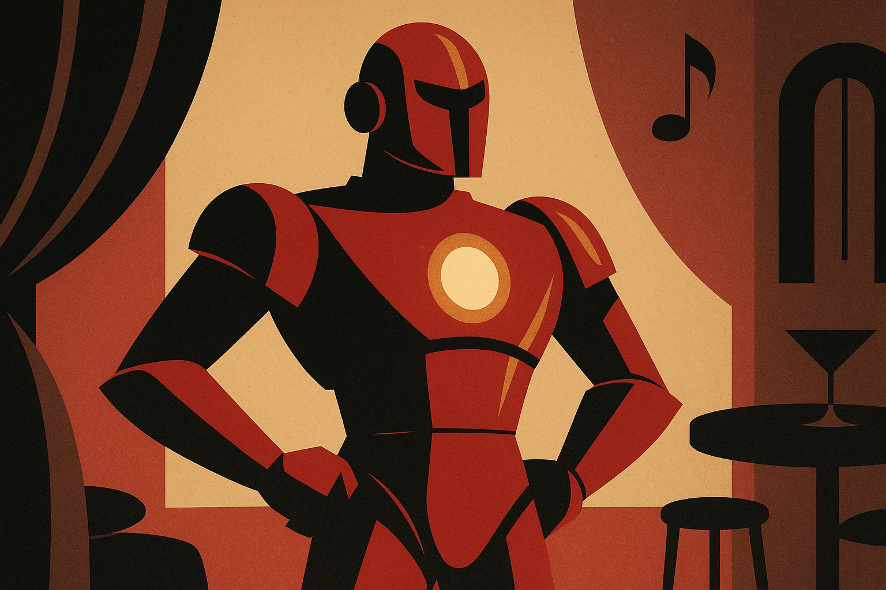
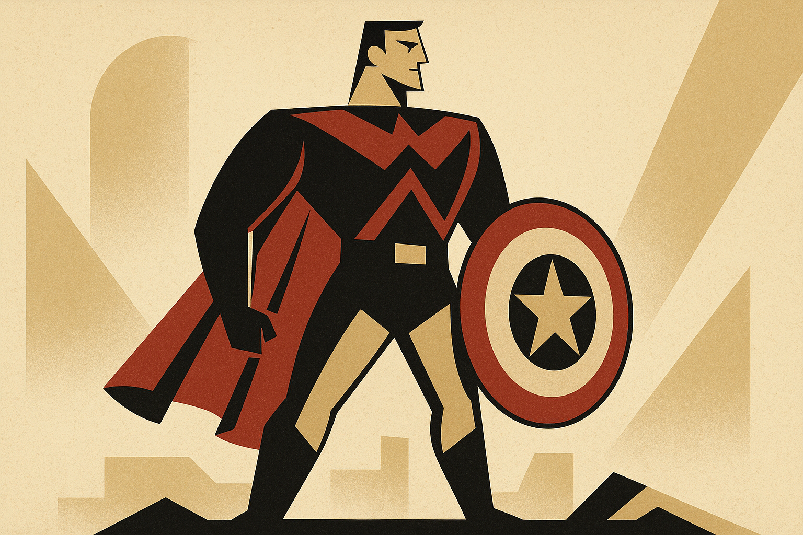
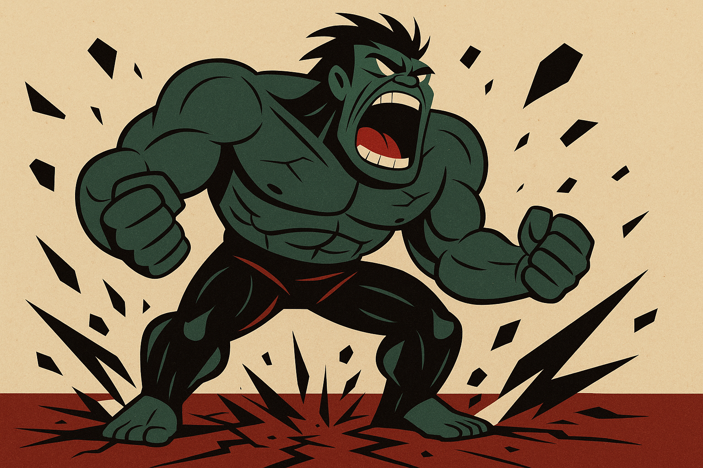
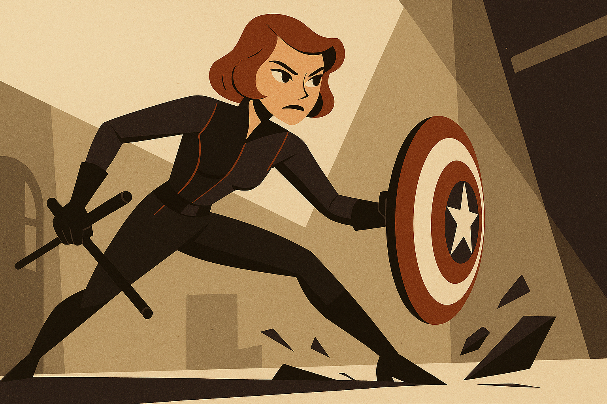
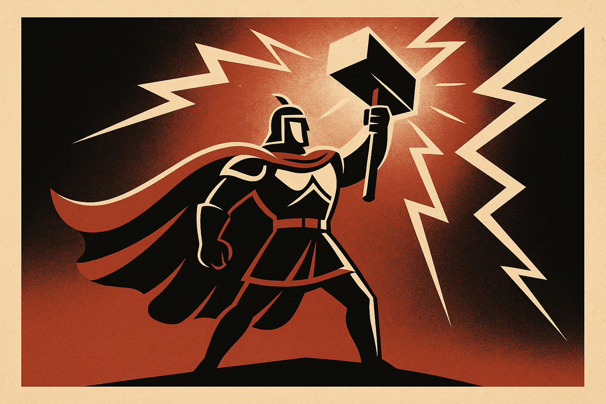
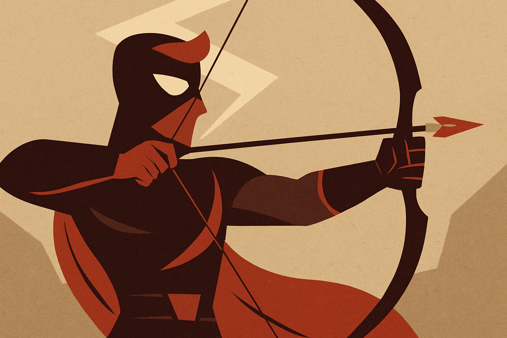
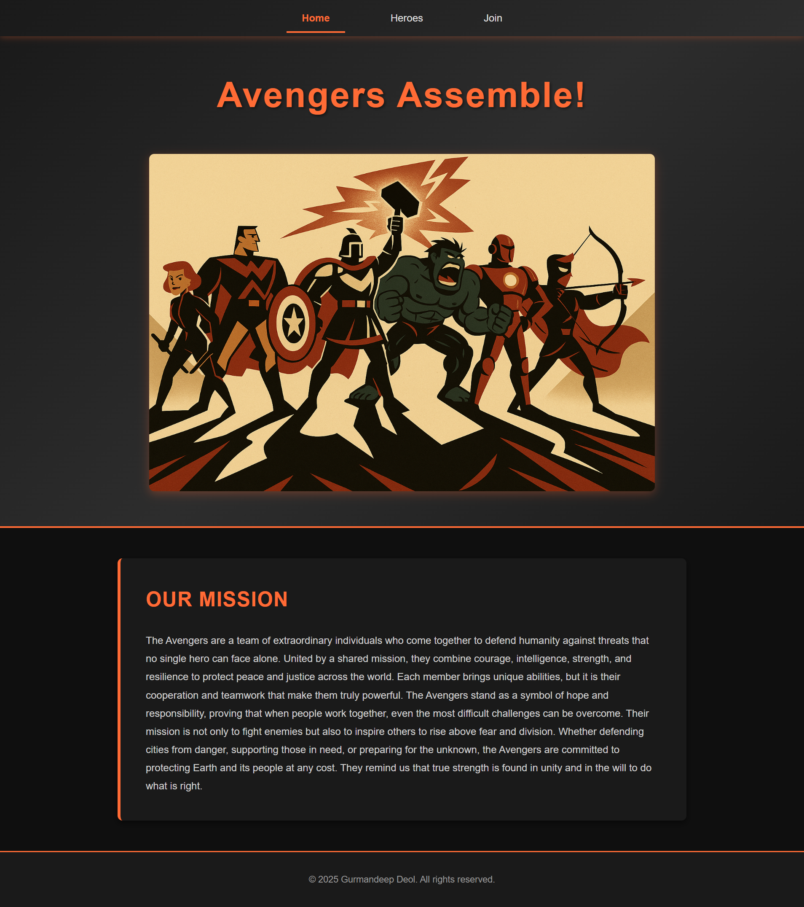
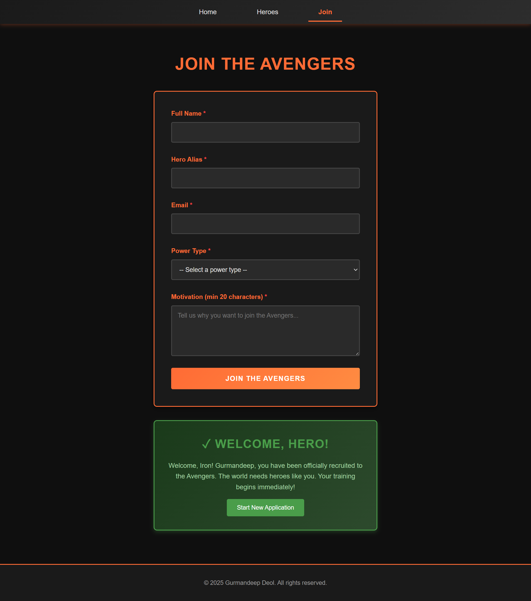
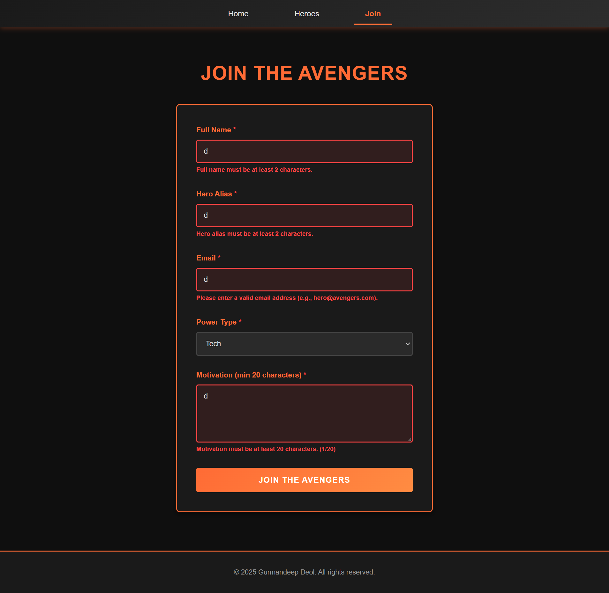

# Lab Submission Template
## Title: Lab 05
- **Name**: Gurmandeep Deol
- **Student ID**: 104120233
- **Date**: 2025-10-14
---
## Table of Contents
1. [Introduction](#introduction)
2. [VM Configuration Details](#vm-configuration-details)
3. [Code Block Deliverables](#code-block-deliverables)
4. [Screenshots Deliverables](#screenshots-deliverables)
5. [Experiences and Challenges](#experiences-and-challenges)
---
## Introduction
In this assignment I built a fully responsive multi-page website for The Avengers using a combination of HTML, CSS and Javascript this assignment demonstrates the application of front-end development including responsive design DOM manipulation event handling and client-side form validation the website had all three pages connected together a homepage with the mission statement a heroes gallery with interactive cards and a recruitment form with real time validation
---
## VM Configuration Details
OS: Window 11 Editor: Visual Studio Code Browser: Microsoft Edge
---
## Code Block Deliverables
### Deliverable 1: index.html
```html
<!DOCTYPE html>
<html lang="en">
<head>
  <meta charset="UTF-8">
  <meta name="viewport" content="width=device-width, initial-scale=1.0">
  <title>Avengers - Assemble!</title>
  <link rel="stylesheet" href="styles.css">
</head>
<body>
  <!-- Navbar -->
  <nav class="navbar">
    <ul class="nav-links">
      <li><a href="index.html" class="nav-link active">Home</a></li>
      <li><a href="heroes.html" class="nav-link">Heroes</a></li>
      <li><a href="join.html" class="nav-link">Join</a></li>
    </ul>
  </nav>

  <!-- Header -->
  <header class="hero-header">
    <h1>Avengers Assemble!</h1>
    
  </header>

  <!-- Mission Statement -->
  <section class="mission-statement">
    <h2>Our Mission</h2>
    <p>The Avengers are a team of extraordinary individuals who come together to defend humanity against threats that no single hero can face alone. United by a shared mission, they combine courage, intelligence, strength, and resilience to protect peace and justice across the world. Each member brings unique abilities, but it is their cooperation and teamwork that make them truly powerful. The Avengers stand as a symbol of hope and responsibility, proving that when people work together, even the most difficult challenges can be overcome. Their mission is not only to fight enemies but also to inspire others to rise above fear and division. Whether defending cities from danger, supporting those in need, or preparing for the unknown, the Avengers are committed to protecting Earth and its people at any cost. They remind us that true strength is found in unity and in the will to do what is right.</p>
  </section>

  <!-- Footer -->
  <footer class="footer">
    <p>&copy; 2025 Gurmandeep Deol. All rights reserved.</p>
  </footer>

  <script src="script.js"></script>
</body>
</html>
```
### Deliverable 2: heroes.html
```html
<!DOCTYPE html>
<html lang="en">
<head>
  <meta charset="UTF-8">
  <meta name="viewport" content="width=device-width, initial-scale=1.0">
  <title>Avengers - Heroes</title>
  <link rel="stylesheet" href="styles.css">
</head>
<body>
  <!-- Navbar -->
  <nav class="navbar">
    <ul class="nav-links">
      <li><a href="index.html" class="nav-link">Home</a></li>
      <li><a href="heroes.html" class="nav-link active">Heroes</a></li>
      <li><a href="join.html" class="nav-link">Join</a></li>
    </ul>
  </nav>

  <!-- Heroes Section -->
  <section class="heroes-container">
    <h1>Our Heroes</h1>
    <div class="hero-grid">
      
      <!-- Iron Man Card -->
      <div class="hero-card" data-hero="iron-man">
        <div class="card-front">
          
          <h3>Iron Man</h3>
        </div>
        <div class="card-back">
          <h3>Iron Man</h3>
          <p>A genius inventor and billionaire who uses his intelligence and technology to build powerful armored suits. Iron Man represents creativity, innovation, and the belief that science and determination can overcome overwhelming odds.</p>
        </div>
      </div>

      <!-- Captain America Card -->
      <div class="hero-card" data-hero="captain-america">
        <div class="card-front">
          
          <h3>Captain America</h3>
        </div>
        <div class="card-back">
          <h3>Captain America</h3>
          <p>A super-soldier enhanced to peak human ability, he embodies honor, leadership, and determination. With his unbreakable shield, Captain America inspires his teammates and leads by example, always putting others before himself.</p>
        </div>
      </div>

      <!-- Hulk Card -->
      <div class="hero-card" data-hero="hulk">
        <div class="card-front">
          
          <h3>Hulk</h3>
        </div>
        <div class="card-back">
          <h3>Hulk</h3>
          <p>A brilliant scientist whose exposure to gamma radiation transforms him into the Hulk, a being of immense strength and resilience. Despite his struggles to control his power, he channels it to protect those who cannot protect themselves.</p>
        </div>
      </div>

      <!-- Black Widow Card -->
      <div class="hero-card" data-hero="black-widow">
        <div class="card-front">
          
          <h3>Black Widow</h3>
        </div>
        <div class="card-back">
          <h3>Black Widow</h3>
          <p>A skilled spy and expert martial artist trained in espionage and combat. Black Widow uses her intelligence, stealth, and agility to outwit enemies and support her teammates on critical missions.</p>
        </div>
      </div>

      <!-- Thor Card -->
      <div class="hero-card" data-hero="thor">
        <div class="card-front">
          
          <h3>Thor</h3>
        </div>
        <div class="card-back">
          <h3>Thor</h3>
          <p>The god of thunder from Asgard who wields the enchanted hammer Mjölnir. Thor combines divine strength with a sense of honor and loyalty, defending both his home and Earth from cosmic and earthly threats alike.</p>
        </div>
      </div>

      <!-- Hawkeye Card -->
      <div class="hero-card" data-hero="hawkeye">
        <div class="card-front">
          
          <h3>Hawkeye</h3>
        </div>
        <div class="card-back">
          <h3>Hawkeye</h3>
          <p>A master archer with unparalleled accuracy and sharp instincts. Though he has no superpowers, his dedication, skill, and quick thinking make him a vital member of the team.</p>
        </div>
      </div>

    </div>
  </section>

  <!-- Footer -->
  <footer class="footer">
    <p>&copy; 2025 Gurmandeep Deol. All rights reserved.</p>
  </footer>

  <script src="script.js"></script>
</body>
</html>
```
### Deliverable 3: join.html
```html
<!DOCTYPE html>
<html lang="en">
<head>
  <meta charset="UTF-8">
  <meta name="viewport" content="width=device-width, initial-scale=1.0">
  <title>Avengers - Join</title>
  <link rel="stylesheet" href="styles.css">
</head>
<body>
  <!-- Navbar -->
  <nav class="navbar">
    <ul class="nav-links">
      <li><a href="index.html" class="nav-link">Home</a></li>
      <li><a href="heroes.html" class="nav-link">Heroes</a></li>
      <li><a href="join.html" class="nav-link active">Join</a></li>
    </ul>
  </nav>

  <!-- Join Section -->
  <section class="join-container">
    <h1>Join the Avengers</h1>
    
    <form id="avengers-form" novalidate>
      
      <!-- Full Name Field -->
      <div class="form-group">
        <label for="full-name">Full Name <span class="required">*</span></label>
        <input type="text" id="full-name" name="fullName" required>
        <span class="error" id="name-error"></span>
      </div>

      <!-- Hero Alias Field -->
      <div class="form-group">
        <label for="hero-alias">Hero Alias <span class="required">*</span></label>
        <input type="text" id="hero-alias" name="heroAlias" required>
        <span class="error" id="alias-error"></span>
      </div>

      <!-- Email Field -->
      <div class="form-group">
        <label for="email">Email <span class="required">*</span></label>
        <input type="email" id="email" name="email" required>
        <span class="error" id="email-error"></span>
      </div>

      <!-- Power Type Dropdown -->
      <div class="form-group">
        <label for="power-type">Power Type <span class="required">*</span></label>
        <select id="power-type" name="powerType" required>
          <option value="">-- Select a power type --</option>
          <option value="tech">Tech</option>
          <option value="strength">Strength</option>
          <option value="magic">Magic</option>
          <option value="stealth">Stealth</option>
        </select>
        <span class="error" id="power-error"></span>
      </div>

      <!-- Motivation Textarea -->
      <div class="form-group">
        <label for="motivation">Motivation (min 20 characters) <span class="required">*</span></label>
        <textarea id="motivation" name="motivation" rows="5" required placeholder="Tell us why you want to join the Avengers..."></textarea>
        <span class="error" id="motivation-error"></span>
      </div>

      <!-- Submit Button -->
      <button type="submit" class="submit-btn">Join the Avengers</button>
    </form>

    <!-- Quest Log (Success Message) -->
    <div id="quest-log" class="quest-log hidden">
      <h2>✓ Welcome, Hero!</h2>
      <p id="success-message"></p>
      <button onclick="document.getElementById('avengers-form').reset(); document.getElementById('quest-log').classList.add('hidden');" class="close-btn">Start New Application</button>
    </div>
  </section>

  <!-- Footer -->
  <footer class="footer">
    <p>&copy; 2025 Gurmandeep Deol. All rights reserved.</p>
  </footer>

  <script src="script.js"></script>
</body>
</html>
```
### Deliverable 4: styles.css
```css
/* GENERAL STYLES */ 
* {
  margin: 0;
  padding: 0;
  box-sizing: border-box;
}

body {
  font-family: 'Arial', sans-serif;
  background-color: #0f0f0f;
  color: #e0e0e0;
  line-height: 1.6;
}

html {
  scroll-behavior: smooth;
}

/* NAVBAR */
.navbar {
  background: linear-gradient(135deg, #1a1a1a, #2d2d2d);
  padding: 1rem 0;
  position: sticky;
  top: 0;
  z-index: 100;
  box-shadow: 0 2px 10px rgba(255, 107, 53, 0.3);
}

.nav-links {
  list-style: none;
  display: flex;
  justify-content: center;
  gap: 3rem;
  margin: 0;
  padding: 0 2rem;
}

.nav-link {
  color: #e0e0e0;
  text-decoration: none;
  padding: 0.75rem 1.5rem;
  border-bottom: 3px solid transparent;
  transition: all 0.3s ease;
  font-size: 1rem;
  font-weight: 500;
}

.nav-link:hover {
  color: #ff6b35;
  border-bottom-color: #ff6b35;
  transform: translateY(-2px);
}

.nav-link.active {
  color: #ff6b35;
  border-bottom-color: #ff6b35;
  font-weight: bold;
}

/*  HOMEPAGE HERO HEADER  */
.hero-header {
  text-align: center;
  padding: 3rem 2rem;
  background: linear-gradient(135deg, #1a1a1a 0%, #2d2d2d 50%, #1a1a1a 100%);
  border-bottom: 3px solid #ff6b35;
}

.hero-header h1 {
  font-size: 3.5rem;
  color: #ff6b35;
  margin-bottom: 1.5rem;
  text-shadow: 2px 2px 4px rgba(0, 0, 0, 0.5);
  letter-spacing: 2px;
}

.banner-image {
  width: 100%;
  max-width: 800px;
  height: auto;
  margin-top: 1.5rem;
  border-radius: 8px;
  box-shadow: 0 4px 15px rgba(255, 107, 53, 0.3);
}

/* MISSION STATEMENT */
.mission-statement {
  max-width: 900px;
  margin: 3rem auto;
  padding: 2.5rem;
  background-color: #1a1a1a;
  border-left: 5px solid #ff6b35;
  border-radius: 8px;
  box-shadow: 0 4px 10px rgba(0, 0, 0, 0.5);
}

.mission-statement h2 {
  color: #ff6b35;
  font-size: 2rem;
  margin-bottom: 1.5rem;
  text-transform: uppercase;
  letter-spacing: 1px;
}

.mission-statement p {
  line-height: 1.8;
  font-size: 1rem;
  color: #d0d0d0;
}

/* HEROES CONTAINER */
.heroes-container {
  max-width: 1200px;
  margin: 0 auto;
  padding: 3rem 2rem;
}

.heroes-container h1 {
  text-align: center;
  color: #ff6b35;
  font-size: 2.5rem;
  margin-bottom: 3rem;
  text-transform: uppercase;
  letter-spacing: 1px;
}

/* HERO GRID  */
.hero-grid {
  display: grid;
  grid-template-columns: repeat(auto-fit, minmax(280px, 1fr));
  gap: 2rem;
  margin-top: 2rem;
}

/* HERO CARDS */
.hero-card {
  height: 380px;
  cursor: pointer;
  perspective: 1000px;
  position: relative;
  border-radius: 8px;
  overflow: hidden;
}

.card-front,
.card-back {
  position: absolute;
  width: 100%;
  height: 100%;
  backface-visibility: hidden;
  display: flex;
  flex-direction: column;
  justify-content: center;
  align-items: center;
  padding: 1.5rem;
  text-align: center;
  border-radius: 8px;
  transition: transform 0.6s;
}

.card-front {
  background-color: #1a1a1a;
  border: 2px solid #ff6b35;
  transform: rotateY(0deg);
}

.card-front img {
  width: 100%;
  height: 280px;
  object-fit: cover;
  border-radius: 4px;
  margin-bottom: 0.5rem;
}

.card-front h3 {
  margin-top: 0.5rem;
  color: #ff6b35;
  font-size: 1.3rem;
  text-transform: uppercase;
}

.card-back {
  background: linear-gradient(135deg, #ff6b35 0%, #ff8c42 100%);
  color: white;
  transform: rotateY(180deg);
  padding: 2rem;
}

.card-back h3 {
  color: white;
  font-size: 1.3rem;
  margin-bottom: 1rem;
  text-transform: uppercase;
}

.card-back p {
  font-size: 0.9rem;
  line-height: 1.6;
}

/* Flip Animation */
.hero-card.flipped .card-front {
  transform: rotateY(180deg);
}

.hero-card.flipped .card-back {
  transform: rotateY(0deg);
}

/* JOIN CONTAINER */
.join-container {
  max-width: 600px;
  margin: 2rem auto;
  padding: 2rem;
}

.join-container h1 {
  text-align: center;
  color: #ff6b35;
  margin-bottom: 2rem;
  font-size: 2.5rem;
  text-transform: uppercase;
  letter-spacing: 1px;
}

/* FORM STYLES  */
#avengers-form {
  background-color: #1a1a1a;
  padding: 2.5rem;
  border-radius: 8px;
  border: 2px solid #ff6b35;
  box-shadow: 0 4px 10px rgba(0, 0, 0, 0.5);
}

.form-group {
  margin-bottom: 1.75rem;
  display: flex;
  flex-direction: column;
}

label {
  color: #ff6b35;
  margin-bottom: 0.5rem;
  font-weight: bold;
  font-size: 0.95rem;
}

.required {
  color: #ff4444;
}

input,
select,
textarea {
  padding: 0.85rem;
  border: 2px solid #444;
  border-radius: 4px;
  background-color: #2a2a2a;
  color: #e0e0e0;
  font-family: 'Arial', sans-serif;
  font-size: 0.95rem;
  transition: all 0.3s ease;
}

input:focus,
select:focus,
textarea:focus {
  outline: none;
  border-color: #ff6b35;
  background-color: #333;
  box-shadow: 0 0 8px rgba(255, 107, 53, 0.4);
}

textarea {
  resize: vertical;
  min-height: 120px;
}

/* Error State*/
.error {
  color: #ff4444;
  font-size: 0.8rem;
  margin-top: 0.25rem;
  display: none;
  font-weight: bold;
}

.error.show {
  display: block;
}

input.invalid,
select.invalid,
textarea.invalid {
  border-color: #ff4444;
  background-color: rgba(255, 68, 68, 0.1);
}

/* BUTTONS  */
.submit-btn {
  background: linear-gradient(135deg, #ff6b35, #ff8c42);
  color: white;
  padding: 1rem 2rem;
  border: none;
  border-radius: 4px;
  font-size: 1.05rem;
  font-weight: bold;
  cursor: pointer;
  transition: all 0.3s ease;
  text-transform: uppercase;
  letter-spacing: 1px;
  width: 100%;
}

.submit-btn:hover {
  transform: translateY(-2px);
  box-shadow: 0 6px 15px rgba(255, 107, 53, 0.4);
}

.submit-btn:active {
  transform: translateY(0);
}

.close-btn {
  background-color: #4a9d4a;
  color: white;
  padding: 0.75rem 1.5rem;
  border: none;
  border-radius: 4px;
  font-size: 0.9rem;
  cursor: pointer;
  transition: all 0.3s ease;
  margin-top: 1rem;
}

.close-btn:hover {
  background-color: #5ab85a;
}

/* QUEST LOG (SUCCESS MESSAGE) */
.quest-log {
  margin-top: 2rem;
  padding: 2rem;
  background: linear-gradient(135deg, #1a3a1a, #2d4a2d);
  border: 2px solid #4a9d4a;
  border-radius: 8px;
  text-align: center;
  color: #4a9d4a;
  box-shadow: 0 4px 10px rgba(74, 157, 74, 0.3);
}

.quest-log.hidden {
  display: none;
}

.quest-log h2 {
  margin: 0 0 1rem 0;
  font-size: 1.8rem;
  text-transform: uppercase;
  letter-spacing: 1px;
}

#success-message {
  font-size: 1rem;
  line-height: 1.6;
  color: #a0d0a0;
}

/* FOOTER */
.footer {
  text-align: center;
  padding: 2rem;
  background-color: #1a1a1a;
  border-top: 2px solid #ff6b35;
  margin-top: 3rem;
  color: #999;
  font-size: 0.9rem;
}

/* RESPONSIVE DESIGN */

/* Tablet (768px and below) */
@media (max-width: 768px) {
  .navbar {
    padding: 0.75rem 0;
  }

  .nav-links {
    gap: 1.5rem;
    padding: 0 1rem;
    flex-wrap: wrap;
  }

  .nav-link {
    padding: 0.5rem 1rem;
    font-size: 0.9rem;
  }

  .hero-header h1 {
    font-size: 2.5rem;
    margin-bottom: 1rem;
  }

  .banner-image {
    max-width: 100%;
    margin-top: 1rem;
  }

  .mission-statement {
    margin: 2rem 1rem;
    padding: 1.5rem;
  }

  .mission-statement h2 {
    font-size: 1.5rem;
    margin-bottom: 1rem;
  }

  .mission-statement p {
    font-size: 0.95rem;
  }

  .heroes-container h1 {
    font-size: 2rem;
    margin-bottom: 2rem;
  }

  .hero-grid {
    grid-template-columns: repeat(auto-fit, minmax(220px, 1fr));
    gap: 1.5rem;
    padding: 1.5rem;
  }

  .hero-card {
    height: 340px;
  }

  .card-front img {
    height: 240px;
  }

  .join-container {
    padding: 1.5rem;
    max-width: 100%;
  }

  .join-container h1 {
    font-size: 2rem;
  }

  #avengers-form {
    padding: 1.5rem;
  }

  .footer {
    padding: 1.5rem;
  }
}

/* Mobile (480px and below) */
@media (max-width: 480px) {
  .navbar {
    padding: 0.5rem 0;
  }

  .nav-links {
    flex-direction: column;
    gap: 0;
    padding: 0;
  }

  .nav-link {
    padding: 0.75rem;
    border-bottom: 1px solid #333;
    border-right: none;
    width: 100%;
    text-align: center;
  }

  .nav-link.active {
    border-bottom: 2px solid #ff6b35;
  }

  .hero-header {
    padding: 2rem 1rem;
  }

  .hero-header h1 {
    font-size: 1.8rem;
    margin-bottom: 0.75rem;
  }

  .banner-image {
    margin-top: 0.75rem;
  }

  .mission-statement {
    margin: 1.5rem 0.5rem;
    padding: 1rem;
    border-left: 3px solid #ff6b35;
  }

  .mission-statement h2 {
    font-size: 1.3rem;
    margin-bottom: 0.75rem;
  }

  .mission-statement p {
    font-size: 0.85rem;
    line-height: 1.5;
  }

  .heroes-container {
    padding: 1.5rem 0.5rem;
  }

  .heroes-container h1 {
    font-size: 1.5rem;
    margin-bottom: 1.5rem;
  }

  .hero-grid {
    grid-template-columns: 1fr;
    gap: 1rem;
    padding: 0.5rem;
  }

  .hero-card {
    height: 300px;
  }

  .card-front img {
    height: 200px;
  }

  .card-front,
  .card-back {
    padding: 1rem;
  }

  .card-front h3,
  .card-back h3 {
    font-size: 1.1rem;
  }

  .card-back p {
    font-size: 0.8rem;
    line-height: 1.4;
  }

  .join-container {
    padding: 1rem 0.5rem;
  }

  .join-container h1 {
    font-size: 1.5rem;
    margin-bottom: 1.5rem;
  }

  #avengers-form {
    padding: 1rem;
    border: 1px solid #ff6b35;
  }

  .form-group {
    margin-bottom: 1.25rem;
  }

  label {
    font-size: 0.85rem;
  }

  input,
  select,
  textarea {
    padding: 0.7rem;
    font-size: 0.9rem;
  }

  textarea {
    min-height: 100px;
  }

  .submit-btn {
    padding: 0.85rem 1.5rem;
    font-size: 0.95rem;
  }

  .quest-log {
    padding: 1.5rem 1rem;
    margin-top: 1.5rem;
  }

  .quest-log h2 {
    font-size: 1.3rem;
    margin-bottom: 0.75rem;
  }

  #success-message {
    font-size: 0.9rem;
  }

  .close-btn {
    padding: 0.65rem 1rem;
    font-size: 0.8rem;
  }

  .footer {
    padding: 1rem;
    font-size: 0.8rem;
  }
}

/* Extra Small Mobile (under 360px) */
@media (max-width: 360px) {
  .hero-header h1 {
    font-size: 1.5rem;
  }

  .nav-links {
    gap: 0;
  }

  .mission-statement {
    padding: 0.75rem;
    margin: 1rem 0.25rem;
  }

  .mission-statement p {
    font-size: 0.8rem;
  }

  #avengers-form {
    padding: 0.75rem;
  }
}
```
### Deliverable 5: script.js
```js
// NAVBAR ACTIVE LINK FUNCTIONALITY
function setActiveNavLink() {
  const currentPage = window.location.pathname.split('/').pop() || 'index.html';
  const navLinks = document.querySelectorAll('.nav-link');
  
  navLinks.forEach(link => {
    const href = link.getAttribute('href');
    link.classList.remove('active');
    
    // Match current page with nav link
    if (href === currentPage || (currentPage === '' && href === 'index.html')) {
      link.classList.add('active');
    }
  });
}
// HERO CARD FLIP FUNCTIONALITY
function setupHeroCards() {
  const heroCards = document.querySelectorAll('.hero-card');
  
  heroCards.forEach(card => {
    // Click event to flip card
    card.addEventListener('click', function() {
      this.classList.toggle('flipped');
    });
  });
  
  // Close card when clicking outside
  document.addEventListener('click', function(event) {
    if (!event.target.closest('.hero-card')) {
      heroCards.forEach(c => c.classList.remove('flipped'));
    }
  });
}
// FORM VALIDATION SETUP 
function setupFormValidation() {
  const form = document.getElementById('avengers-form');
  if (!form) return; // Only run on join page

  const fullName = document.getElementById('full-name');
  const heroAlias = document.getElementById('hero-alias');
  const email = document.getElementById('email');
  const powerType = document.getElementById('power-type');
  const motivation = document.getElementById('motivation');

  // Real-time validation on blur (when user leaves field)
  if (fullName) fullName.addEventListener('blur', () => validateFullName(fullName));
  if (heroAlias) heroAlias.addEventListener('blur', () => validateHeroAlias(heroAlias));
  if (email) email.addEventListener('blur', () => validateEmail(email));
  if (powerType) powerType.addEventListener('blur', () => validatePowerType(powerType));
  if (motivation) motivation.addEventListener('blur', () => validateMotivation(motivation));

  // Real-time validation on input (as user types)
  if (fullName) fullName.addEventListener('input', () => validateFullName(fullName));
  if (heroAlias) heroAlias.addEventListener('input', () => validateHeroAlias(heroAlias));
  if (email) email.addEventListener('input', () => validateEmail(email));
  if (powerType) powerType.addEventListener('input', () => validatePowerType(powerType));
  if (motivation) motivation.addEventListener('input', () => validateMotivation(motivation));

  // Form submission event
  form.addEventListener('submit', (e) => {
    e.preventDefault();
    
    // Validate all fields
    const isFullNameValid = validateFullName(fullName);
    const isAliasValid = validateHeroAlias(heroAlias);
    const isEmailValid = validateEmail(email);
    const isPowerValid = validatePowerType(powerType);
    const isMotivationValid = validateMotivation(motivation);

    // If all fields are valid, show success message
    if (isFullNameValid && isAliasValid && isEmailValid && isPowerValid && isMotivationValid) {
      showSuccessMessage(fullName.value, heroAlias.value);
      
      // Reset form after 1 second
      setTimeout(() => {
        form.reset();
        document.querySelectorAll('.error').forEach(err => err.classList.remove('show'));
        document.querySelectorAll('input, select, textarea').forEach(field => field.classList.remove('invalid'));
      }, 1000);
    }
  });
}


// VALIDATION FUNCTIONS

// Validate Full Name
function validateFullName(input) {
  const error = document.getElementById('name-error');
  const value = input.value.trim();

  if (value === '') {
    showError(input, error, 'Full name is required.');
    return false;
  }

  if (value.length < 2) {
    showError(input, error, 'Full name must be at least 2 characters.');
    return false;
  }

  clearError(input, error);
  return true;
}

// Validate Hero Alias
function validateHeroAlias(input) {
  const error = document.getElementById('alias-error');
  const value = input.value.trim();

  if (value === '') {
    showError(input, error, 'Hero alias is required.');
    return false;
  }

  if (value.length < 2) {
    showError(input, error, 'Hero alias must be at least 2 characters.');
    return false;
  }

  clearError(input, error);
  return true;
}

// Validate Email
function validateEmail(input) {
  const error = document.getElementById('email-error');
  const value = input.value.trim();
  const emailRegex = /^[^\s@]+@[^\s@]+\.[^\s@]+$/;

  if (value === '') {
    showError(input, error, 'Email is required.');
    return false;
  }

  if (!emailRegex.test(value)) {
    showError(input, error, 'Please enter a valid email address (e.g., hero@avengers.com).');
    return false;
  }

  clearError(input, error);
  return true;
}

// Validate Power Type
function validatePowerType(input) {
  const error = document.getElementById('power-error');
  const value = input.value;

  if (value === '') {
    showError(input, error, 'Please select a power type.');
    return false;
  }

  clearError(input, error);
  return true;
}

// Validate Motivation
function validateMotivation(input) {
  const error = document.getElementById('motivation-error');
  const value = input.value.trim();

  if (value === '') {
    showError(input, error, 'Motivation is required.');
    return false;
  }

  if (value.length < 20) {
    showError(input, error, `Motivation must be at least 20 characters. (${value.length}/20)`);
    return false;
  }

  clearError(input, error);
  return true;
}


// ERROR & SUCCESS HELPERS

// Display error message
function showError(input, errorElement, message) {
  input.classList.add('invalid');
  errorElement.textContent = message;
  errorElement.classList.add('show');
}

// Clear error message
function clearError(input, errorElement) {
  input.classList.remove('invalid');
  errorElement.textContent = '';
  errorElement.classList.remove('show');
}

// Show success message after form submission
function showSuccessMessage(name, alias) {
  const questLog = document.getElementById('quest-log');
  const successMessage = document.getElementById('success-message');
  
  const message = `Welcome, ${alias}! ${name}, you have been officially recruited to the Avengers. The world needs heroes like you. Your training begins immediately!`;
  
  successMessage.textContent = message;
  questLog.classList.remove('hidden');
  
  // Scroll to success message
  questLog.scrollIntoView({ behavior: 'smooth', block: 'nearest' });
}
// INITIALIZE ON PAGE LOAD
document.addEventListener('DOMContentLoaded', function() {
  console.log('Page loaded - initializing Avengers website');
  
  // Set active navbar link based on current page
  setActiveNavLink();
  
  // Setup hero card flip functionality (heroes page)
  setupHeroCards();
  
  // Setup form validation (join page)
  setupFormValidation();
});
```
---
## Screenshots Deliverables
### Deliverable 1: Homepage

### Deliverable 2: Heroes Page

### Deliverable 3: Success

### Deliverable 4: Fail

---
## Experiences and Challenges
### Reflection on Completing the Lab
---
- **What did you learn?** __**I learned how to implement responsive layouts using css I also learned how to use DOM elements to dynamically update content and the styling I also learned how to implement event listeners such as blur input submit to create a good user experience and provide real time validation feedback I also learned how to create navigation across multiple pages improving user experience and site navigation**__
---
- **Challenges Faced**: __**The first challenge I faced was trying to get the card flip animation to work because I had overlapping cards and weird animations The second challenge was deciding when to validate when the user leaves the field (blur) as their typing (input) or when they submit the form The third challenge was trying tog et the hero cards to be responsive across all screen sizes**__
---
- **How You Overcame Challenges**: __**For the first challenge I used css on both the front and back of the card to make it work properly secondly I decided to validate on both blur when the user left the field and as their typing to give users real-time feedback for the final challenge which was the hardest I needed to make sure the hero cards were responsive across all screens so I used CSS grid with auto fit to create columns that automatically adjust based on the screen**__