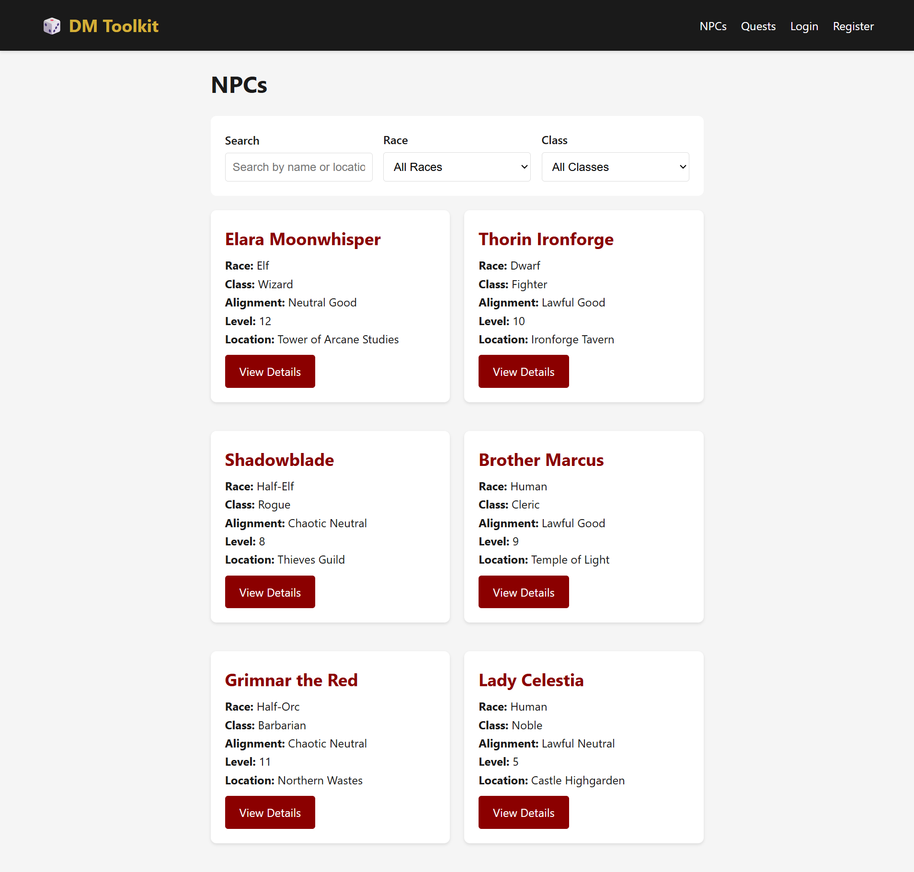
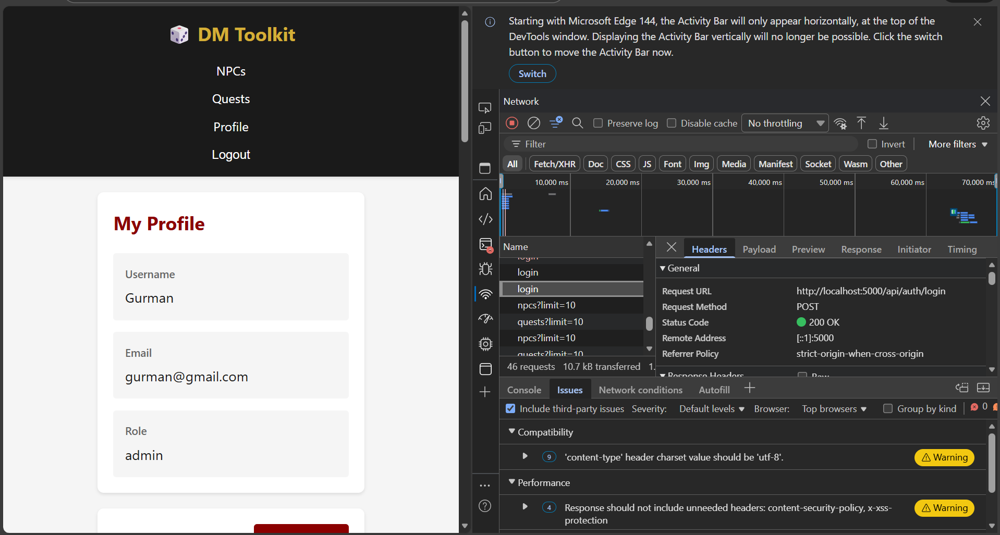
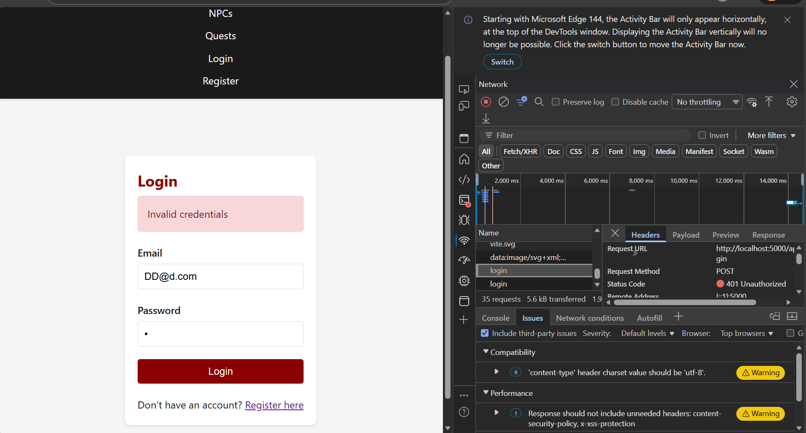
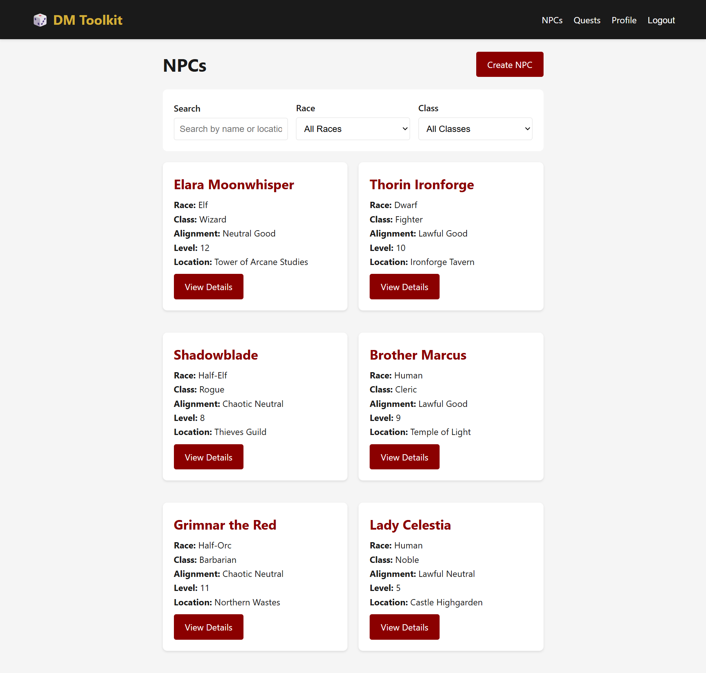
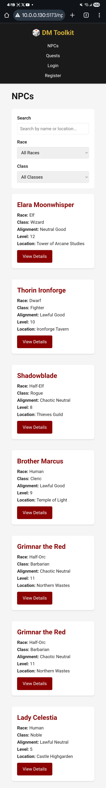
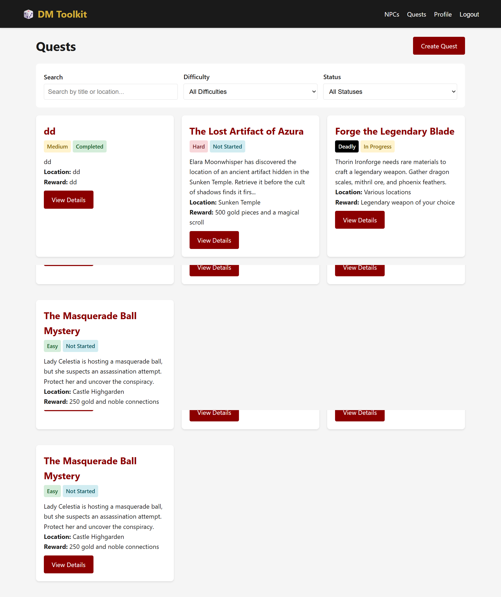
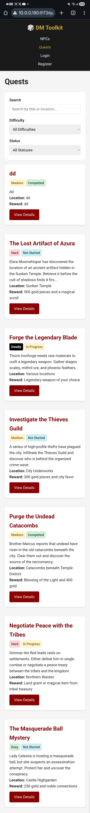
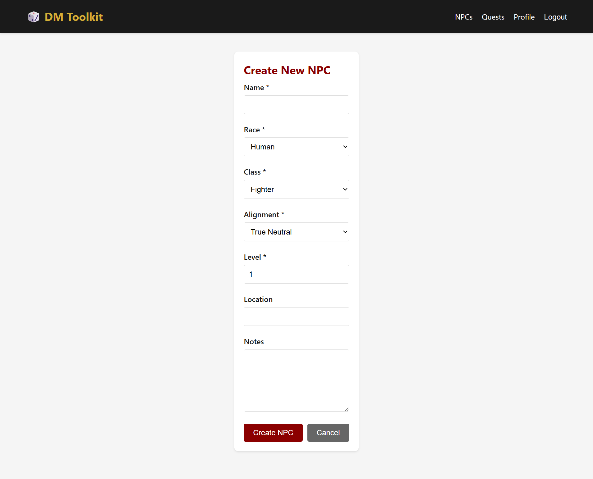
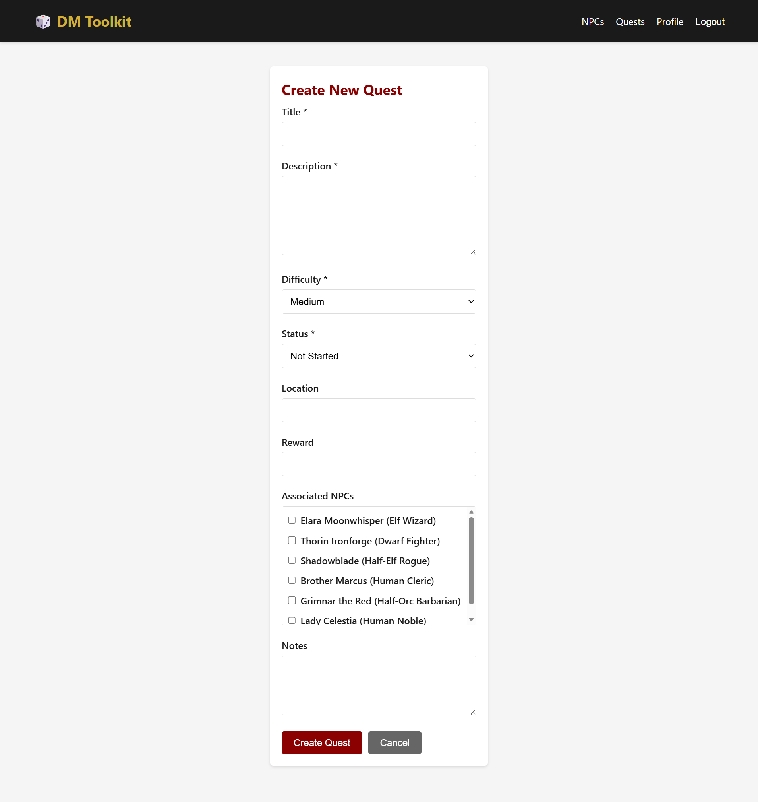

# Assignment 02: Full-Stack Web Application - Dungeon Master Toolkit

**Name**: Gurmandeep Deol  
**Student ID**: 104120233  
**Date**: December 9, 2025  
**Course**: WAS500

---

## Table of Contents
1. [Project Overview](#project-overview)
2. [Technology Stack](#technology-stack)
3. [Data Model & Architecture](#data-model--architecture)
4. [Code Block Deliverables](#code-block-deliverables)
4. [API Endpoints](#api-endpoints)
5. [Setup Instructions](#setup-instructions)
6. [Screenshots](#screenshots)
8. [Experience and Challenges](#experience-and-challenges)

---

## Project Overview

The **Dungeon Master Toolkit** is a full-stack web application designed to help Dungeon Masters manage their D&D campaigns. Users can create accounts, manage NPCs (Non-Player Characters), create and track quests, and organize campaign content efficiently.

### Topic Chosen
**2.1.2. Dungeon Master Toolkit (D&D / RPG Manager)**  
Manage NPCs, quests, monsters, items, and campaign notes. Optionally add AI-generated quests, names, or backstories to support storytelling.

### Framework Chosen
**React with Vite** - I chose it because of its component-based architecture and I have experience with React, which allowed me to build a fast and efficient single-page application.

---

## Technology Stack

### Backend
- **Runtime**: Node.js
- **Framework**: Express.js
- **Database**: MongoDB with Mongoose ODM
- **Authentication**: JWT (JSON Web Tokens)
- **Security**: bcrypt (password hashing), helmet, CORS
- **Validation**: Custom middleware + Mongoose validation

### Frontend
- **Framework**: React 18
- **Build Tool**: Vite
- **Routing**: React Router v6
- **HTTP Client**: Axios
- **Styling**: Custom CSS (Flexbox & Grid)

---

## Data Model & Architecture

### Entity Relationship Diagram

```
┌─────────────────┐
│      User       │
├─────────────────┤
│ _id             │
│ email           │
│ password (hash) │
│ username        │
│ role            │
│ timestamps      │
└────────┬────────┘
         │ createdBy
         │
    ┌────┴─────────────────┐
    │                      │
    ▼                      ▼
┌─────────────────┐  ┌──────────────────┐
│      NPC        │  │      Quest       │
├─────────────────┤  ├──────────────────┤
│ _id             │  │ _id              │
│ name            │  │ title            │
│ race            │  │ description      │
│ class           │  │ difficulty       │
│ alignment       │  │ status           │
│ level           │  │ reward           │
│ location        │  │ location         │
│ notes           │  │ notes            │
│ createdBy (ref) │  │ npcs[] (ref)     │◄───┐
│ timestamps      │  │ createdBy (ref)  │    │
└─────────────────┘  │ timestamps       │    │
         ▲           └──────────────────┘    │
         │                                   │
         └───────────────────────────────────┘
                  N:M Relationship
```
# Code Block Deliverables
## Server Directory
### Deliverable 1: Package.json
```json
{
  "name": "dnd-toolkit-server",
  "version": "1.0.0",
  "description": "Backend API for Dungeon Master Toolkit",
  "main": "server.js",
  "scripts": {
    "dev": "nodemon server.js",
    "start": "node server.js",
    "seed": "node ./seed/index.js"
  },
  "keywords": [],
  "author": "",
  "license": "ISC",
  "dependencies": {
    "express": "^4.18.2",
    "mongoose": "^8.0.3",
    "dotenv": "^16.3.1",
    "cors": "^2.8.5",
    "helmet": "^7.1.0",
    "bcrypt": "^5.1.1",
    "jsonwebtoken": "^9.0.2",
    "morgan": "^1.10.0"
  },
  "devDependencies": {
    "nodemon": "^3.0.2"
  }
}
```
### Deliverable 2: server.js
```js
require('dotenv').config();
const express = require('express');
const cors = require('cors');
const helmet = require('helmet');
const morgan = require('morgan');
const connectDB = require('./config/database');

const authRoutes = require('./routes/auth');
const npcRoutes = require('./routes/npcs');
const questRoutes = require('./routes/quests');

const errorHandler = require('./middleware/errorHandler');

const app = express();
const PORT = process.env.PORT || 5000;

// Connect to MongoDB
connectDB();

// Middleware
app.use(helmet());
app.use(cors({
  origin: (origin, callback) => {
    if (!origin) return callback(null, true); // allow non-browser requests (like Postman)

    // List of allowed origins
    const allowedOrigins = [
      'http://localhost:5173',
      'http://10.0.0.130:5173', 
      'http://10.0.0.138:5173'
    ];

    if (allowedOrigins.includes(origin)) {
      callback(null, true);
    } else {
      callback(new Error('Not allowed by CORS'));
    }
  },
  credentials: true
}));
app.use(morgan('dev'));
app.use(express.json());
app.use(express.urlencoded({ extended: true }));

// Routes
app.get('/', (req, res) => {
  res.json({ message: 'Welcome to Dungeon Master Toolkit API' });
});

app.use('/api/auth', authRoutes);
app.use('/api/npcs', npcRoutes);
app.use('/api/quests', questRoutes);

// Error handling middleware (must be last)
app.use(errorHandler);

app.listen(PORT, () => {
  console.log(`Server running on port ${PORT}`);
});
```
### Deliverable 3: index.js
```js
require('dotenv').config();
const mongoose = require('mongoose');
const bcrypt = require('bcrypt');
const User = require('../models/User');
const NPC = require('../models/NPC');
const Quest = require('../models/Quest');

const seedDatabase = async () => {
  try {
    // Connect to MongoDB
    await mongoose.connect(process.env.MONGODB_URI);
    console.log('MongoDB connected');

    // Clear existing data
    await User.deleteMany({});
    await NPC.deleteMany({});
    await Quest.deleteMany({});
    console.log('Cleared existing data');

    // Create users
    const hashedPassword1 = await bcrypt.hash('Gurman29', 10);
    const hashedPassword2 = await bcrypt.hash('Gurman2930', 10);
    
    const users = await User.insertMany([
      {
        email: 'gurman@gmail.com',
        password: hashedPassword1,
        username: 'Gurman',
        role: 'admin'
      },
      {
        email: 'gurmandeep@gmail.com',
        password: hashedPassword2,
        username: 'Gurmandeep',
        role: 'user'
      }
    ]);
    console.log('Created users');

    // Create NPCs
    const npcs = await NPC.insertMany([
      {
        name: 'Elara Moonwhisper',
        race: 'Elf',
        class: 'Wizard',
        alignment: 'Neutral Good',
        level: 12,
        location: 'Tower of Arcane Studies',
        notes: 'Renowned scholar of ancient magic. Seeks adventurers to recover lost artifacts.',
        createdBy: users[0]._id
      },
      {
        name: 'Thorin Ironforge',
        race: 'Dwarf',
        class: 'Fighter',
        alignment: 'Lawful Good',
        level: 10,
        location: 'Ironforge Tavern',
        notes: 'Veteran warrior and blacksmith. Can craft magical weapons for worthy heroes.',
        createdBy: users[0]._id
      },
      {
        name: 'Shadowblade',
        race: 'Half-Elf',
        class: 'Rogue',
        alignment: 'Chaotic Neutral',
        level: 8,
        location: 'Thieves Guild',
        notes: 'Master thief with connections to the underground. Information broker.',
        createdBy: users[0]._id
      },
      {
        name: 'Brother Marcus',
        race: 'Human',
        class: 'Cleric',
        alignment: 'Lawful Good',
        level: 9,
        location: 'Temple of Light',
        notes: 'Devoted healer who tends to the sick and wounded. Seeks to root out undead.',
        createdBy: users[0]._id
      },
      {
        name: 'Grimnar the Red',
        race: 'Half-Orc',
        class: 'Barbarian',
        alignment: 'Chaotic Neutral',
        level: 11,
        location: 'Northern Wastes',
        notes: 'Tribal chieftain who values strength above all. Can be reasoned with.',
        createdBy: users[1]._id
      },
      {
        name: 'Lady Celestia',
        race: 'Human',
        class: 'Noble',
        alignment: 'Lawful Neutral',
        level: 5,
        location: 'Castle Highgarden',
        notes: 'Wealthy noblewoman with political influence. Hires adventurers for delicate matters.',
        createdBy: users[0]._id
      }
    ]);
    console.log('Created NPCs');

    // Create Quests
    await Quest.insertMany([
      {
        title: 'The Lost Artifact of Azura',
        description: 'Elara Moonwhisper has discovered the location of an ancient artifact hidden in the Sunken Temple. Retrieve it before the cult of shadows finds it first.',
        difficulty: 'Hard',
        status: 'Not Started',
        reward: '500 gold pieces and a magical scroll',
        npcs: [npcs[0]._id],
        location: 'Sunken Temple',
        notes: 'Temple is underwater. Prepare water breathing spells or potions.',
        createdBy: users[0]._id
      },
      {
        title: 'Forge the Legendary Blade',
        description: 'Thorin Ironforge needs rare materials to craft a legendary weapon. Gather dragon scales, mithril ore, and phoenix feathers.',
        difficulty: 'Deadly',
        status: 'In Progress',
        reward: 'Legendary weapon of your choice',
        npcs: [npcs[1]._id],
        location: 'Various locations',
        notes: 'Dragon scales from Crimson Peak, mithril from Deep Mines, phoenix in Fire Mountains.',
        createdBy: users[0]._id
      },
      {
        title: 'Investigate the Thieves Guild',
        description: 'A series of high-profile thefts have plagued the city. Infiltrate the Thieves Guild and discover who is behind the organized crime wave.',
        difficulty: 'Medium',
        status: 'Not Started',
        reward: '300 gold pieces and city favor',
        npcs: [npcs[2]._id],
        location: 'City Underworks',
        notes: 'Stealth and diplomacy will be more useful than combat.',
        createdBy: users[0]._id
      },
      {
        title: 'Purge the Undead Catacombs',
        description: 'Brother Marcus reports that undead have risen in the old catacombs beneath the city. Clear them out and discover the source of the necromancy.',
        difficulty: 'Medium',
        status: 'Completed',
        reward: 'Blessing of the Light and 400 gold',
        npcs: [npcs[3]._id],
        location: 'Catacombs beneath Temple District',
        notes: 'Holy water and radiant damage are effective against undead.',
        createdBy: users[0]._id
      },
      {
        title: 'Negotiate Peace with the Tribes',
        description: 'Grimnar the Red leads raids on settlements. Either defeat him in single combat or negotiate a peace treaty between the tribes and the kingdom.',
        difficulty: 'Hard',
        status: 'In Progress',
        reward: 'Land grant or magical item from tribal treasury',
        npcs: [npcs[4]._id],
        location: 'Northern Wastes',
        notes: 'Strength and honor are valued. Showing respect is crucial.',
        createdBy: users[1]._id
      },
      {
        title: 'The Masquerade Ball Mystery',
        description: 'Lady Celestia is hosting a masquerade ball, but she suspects an assassination attempt. Protect her and uncover the conspiracy.',
        difficulty: 'Easy',
        status: 'Not Started',
        reward: '250 gold and noble connections',
        npcs: [npcs[5]._id],
        location: 'Castle Highgarden',
        notes: 'Formal attire required. Investigation and social skills needed.',
        createdBy: users[0]._id
      }
    ]);
    console.log('Created quests');

    console.log('\nDatabase seeded successfully!');
    console.log('\nTest accounts:');
    console.log('Email: gurman@gmail.com, Password: Gurman29');
    console.log('Email: gurmandeep@gmail.com, Password: Gurman2930');
    
    process.exit(0);
  } catch (error) {
    console.error('Seed error:', error);
    process.exit(1);
  }
};

seedDatabase();
```
### Deliverable 4: npcs.js
```js
const express = require('express');
const router = express.Router();
const npcsController = require('../controllers/npcsController');
const auth = require('../middleware/auth');

router.get('/', npcsController.getAllNPCs);
router.get('/:id', npcsController.getNPCById);
router.post('/', auth, npcsController.createNPC);
router.put('/:id', auth, npcsController.updateNPC);
router.delete('/:id', auth, npcsController.deleteNPC);

module.exports = router;
```
### Deliverable 5: auth.js
```js
const express = require('express');
const router = express.Router();
const authController = require('../controllers/authController');
const auth = require('../middleware/auth');
const { validateRegistration, validateLogin } = require('../middleware/validate');

router.post('/register', validateRegistration, authController.register);
router.post('/login', validateLogin, authController.login);
router.get('/profile', auth, authController.getProfile);

module.exports = router;
```
### Deliverable 6: quests.js
```js
const express = require('express');
const router = express.Router();
const questsController = require('../controllers/questsController');
const auth = require('../middleware/auth');

router.get('/', questsController.getAllQuests);
router.get('/:id', questsController.getQuestById);
router.post('/', auth, questsController.createQuest);
router.put('/:id', auth, questsController.updateQuest);
router.delete('/:id', auth, questsController.deleteQuest);

module.exports = router;
```
### Deliverable 7: Quests.js
```js
const mongoose = require('mongoose');

const questSchema = new mongoose.Schema({
  title: {
    type: String,
    required: [true, 'Quest title is required'],
    trim: true,
    index: true
  },
  description: {
    type: String,
    required: [true, 'Quest description is required'],
    maxlength: [2000, 'Description cannot exceed 2000 characters']
  },
  difficulty: {
    type: String,
    required: [true, 'Difficulty is required'],
    enum: ['Easy', 'Medium', 'Hard', 'Deadly']
  },
  status: {
    type: String,
    enum: ['Not Started', 'In Progress', 'Completed', 'Failed'],
    default: 'Not Started'
  },
  reward: {
    type: String,
    trim: true
  },
  npcs: [{
    type: mongoose.Schema.Types.ObjectId,
    ref: 'NPC'
  }],
  location: {
    type: String,
    trim: true
  },
  notes: {
    type: String,
    maxlength: [1000, 'Notes cannot exceed 1000 characters']
  },
  createdBy: {
    type: mongoose.Schema.Types.ObjectId,
    ref: 'User',
    required: true,
    index: true
  }
}, {
  timestamps: true
});

module.exports = mongoose.model('Quest', questSchema);
```
### Deliverable 8: User.js
```js
const mongoose = require('mongoose');

const userSchema = new mongoose.Schema({
  email: {
    type: String,
    required: [true, 'Email is required'],
    unique: true,
    lowercase: true,
    trim: true,
    match: [/^\w+([.-]?\w+)*@\w+([.-]?\w+)*(\.\w{2,3})+$/, 'Please enter a valid email']
  },
  password: {
    type: String,
    required: [true, 'Password is required'],
    minlength: [6, 'Password must be at least 6 characters']
  },
  username: {
    type: String,
    required: [true, 'Username is required'],
    unique: true,
    trim: true,
    minlength: [3, 'Username must be at least 3 characters']
  },
  role: {
    type: String,
    enum: ['user', 'admin'],
    default: 'user'
  }
}, {
  timestamps: true
});

module.exports = mongoose.model('User', userSchema);
```
### Deliverable 9: NPC.js
```js
const mongoose = require('mongoose');

const npcSchema = new mongoose.Schema({
  name: {
    type: String,
    required: [true, 'NPC name is required'],
    trim: true,
    index: true
  },
  race: {
    type: String,
    required: [true, 'Race is required'],
    enum: ['Human', 'Elf', 'Dwarf', 'Halfling', 'Gnome', 'Half-Elf', 'Half-Orc', 'Tiefling', 'Dragonborn', 'Other']
  },
  class: {
    type: String,
    required: [true, 'Class is required'],
    enum: ['Fighter', 'Wizard', 'Rogue', 'Cleric', 'Ranger', 'Paladin', 'Barbarian', 'Bard', 'Druid', 'Monk', 'Sorcerer', 'Warlock', 'Commoner', 'Noble', 'Merchant', 'Other']
  },
  alignment: {
    type: String,
    required: [true, 'Alignment is required'],
    enum: ['Lawful Good', 'Neutral Good', 'Chaotic Good', 'Lawful Neutral', 'True Neutral', 'Chaotic Neutral', 'Lawful Evil', 'Neutral Evil', 'Chaotic Evil']
  },
  level: {
    type: Number,
    min: [1, 'Level must be at least 1'],
    max: [20, 'Level cannot exceed 20'],
    default: 1
  },
  location: {
    type: String,
    trim: true
  },
  notes: {
    type: String,
    maxlength: [2000, 'Notes cannot exceed 2000 characters']
  },
  createdBy: {
    type: mongoose.Schema.Types.ObjectId,
    ref: 'User',
    required: true,
    index: true
  }
}, {
  timestamps: true
});

module.exports = mongoose.model('NPC', npcSchema);
```
### Deliverable 10: auth.js
```js
const jwt = require('jsonwebtoken');

const auth = (req, res, next) => {
  try {
    const token = req.header('Authorization')?.replace('Bearer ', '');
    
    if (!token) {
      return res.status(401).json({ error: 'Authentication required' });
    }

    const decoded = jwt.verify(token, process.env.JWT_SECRET);
    req.userId = decoded.userId;
    req.userRole = decoded.role;
    next();
  } catch (error) {
    res.status(401).json({ error: 'Invalid or expired token' });
  }
};

module.exports = auth;
```
### Deliverable 11: errorHandler.js
```js
const errorHandler = (err, req, res, next) => {
  console.error(err.stack);

  // Mongoose validation error
  if (err.name === 'ValidationError') {
    const errors = Object.values(err.errors).map(e => e.message);
    return res.status(400).json({ error: 'Validation failed', details: errors });
  }

  // Mongoose duplicate key error
  if (err.code === 11000) {
    const field = Object.keys(err.keyPattern)[0];
    return res.status(400).json({ error: `${field} already exists` });
  }

  // Mongoose cast error (invalid ObjectId)
  if (err.name === 'CastError') {
    return res.status(400).json({ error: 'Invalid ID format' });
  }

  // JWT errors
  if (err.name === 'JsonWebTokenError') {
    return res.status(401).json({ error: 'Invalid token' });
  }

  if (err.name === 'TokenExpiredError') {
    return res.status(401).json({ error: 'Token expired' });
  }

  // Default error
  res.status(err.status || 500).json({
    error: err.message || 'Internal server error'
  });
};

module.exports = errorHandler;
```
### Deliverable 12: validate.js
```js
const validateRegistration = (req, res, next) => {
  const { email, password, username } = req.body;
  const errors = [];

  if (!email || !email.match(/^\w+([.-]?\w+)*@\w+([.-]?\w+)*(\.\w{2,3})+$/)) {
    errors.push('Valid email is required');
  }

  if (!password || password.length < 6) {
    errors.push('Password must be at least 6 characters');
  }

  if (!username || username.length < 3) {
    errors.push('Username must be at least 3 characters');
  }

  if (errors.length > 0) {
    return res.status(400).json({ error: 'Validation failed', details: errors });
  }

  next();
};

const validateLogin = (req, res, next) => {
  const { email, password } = req.body;
  const errors = [];

  if (!email) {
    errors.push('Email is required');
  }

  if (!password) {
    errors.push('Password is required');
  }

  if (errors.length > 0) {
    return res.status(400).json({ error: 'Validation failed', details: errors });
  }

  next();
};

module.exports = { validateRegistration, validateLogin };
```
### Deliverable 13: questsController.js
```js
const Quest = require('../models/Quest');

exports.getAllQuests = async (req, res, next) => {
  try {
    const { page = 1, limit = 10, difficulty, status, search, sort = '-createdAt' } = req.query;
    
    const query = {};
    
    if (difficulty) {
      query.difficulty = difficulty;
    }
    
    if (status) {
      query.status = status;
    }
    
    if (search) {
      query.$or = [
        { title: { $regex: search, $options: 'i' } },
        { location: { $regex: search, $options: 'i' } }
      ];
    }

    const quests = await Quest.find(query)
      .populate('createdBy', 'username')
      .populate('npcs', 'name race class')
      .sort(sort)
      .limit(parseInt(limit))
      .skip((parseInt(page) - 1) * parseInt(limit));

    const total = await Quest.countDocuments(query);

    res.json({
      quests,
      pagination: {
        page: parseInt(page),
        limit: parseInt(limit),
        total,
        pages: Math.ceil(total / parseInt(limit))
      }
    });
  } catch (error) {
    next(error);
  }
};

exports.getQuestById = async (req, res, next) => {
  try {
    const quest = await Quest.findById(req.params.id)
      .populate('createdBy', 'username')
      .populate('npcs', 'name race class level');
    
    if (!quest) {
      return res.status(404).json({ error: 'Quest not found' });
    }

    res.json({ quest });
  } catch (error) {
    next(error);
  }
};

exports.createQuest = async (req, res, next) => {
  try {
    const quest = new Quest({
      ...req.body,
      createdBy: req.userId
    });
    
    await quest.save();
    await quest.populate('createdBy', 'username');
    await quest.populate('npcs', 'name race class');
    
    res.status(201).json({
      message: 'Quest created successfully',
      quest
    });
  } catch (error) {
    next(error);
  }
};

exports.updateQuest = async (req, res, next) => {
  try {
    const quest = await Quest.findOne({
      _id: req.params.id,
      createdBy: req.userId
    });

    if (!quest) {
      return res.status(404).json({ error: 'Quest not found or unauthorized' });
    }

    Object.assign(quest, req.body);
    await quest.save();
    await quest.populate('createdBy', 'username');
    await quest.populate('npcs', 'name race class');

    res.json({
      message: 'Quest updated successfully',
      quest
    });
  } catch (error) {
    next(error);
  }
};

exports.deleteQuest = async (req, res, next) => {
  try {
    const quest = await Quest.findOneAndDelete({
      _id: req.params.id,
      createdBy: req.userId
    });

    if (!quest) {
      return res.status(404).json({ error: 'Quest not found or unauthorized' });
    }

    res.json({ message: 'Quest deleted successfully' });
  } catch (error) {
    next(error);
  }
};
```
### Deliverable 14: authController.js
```js
const bcrypt = require('bcrypt');
const jwt = require('jsonwebtoken');
const User = require('../models/User');

exports.register = async (req, res, next) => {
  try {
    const { email, password, username } = req.body;

    // Hash password
    const hashedPassword = await bcrypt.hash(password, 10);

    // Create user
    const user = new User({
      email,
      password: hashedPassword,
      username
    });

    await user.save();

    // Generate token
    const token = jwt.sign(
      { userId: user._id, role: user.role },
      process.env.JWT_SECRET,
      { expiresIn: '7d' }
    );

    res.status(201).json({
      message: 'User registered successfully',
      token,
      user: {
        id: user._id,
        email: user.email,
        username: user.username,
        role: user.role
      }
    });
  } catch (error) {
    next(error);
  }
};

exports.login = async (req, res, next) => {
  try {
    const { email, password } = req.body;

    // Find user
    const user = await User.findOne({ email });
    if (!user) {
      return res.status(401).json({ error: 'Invalid credentials' });
    }

    // Check password
    const isMatch = await bcrypt.compare(password, user.password);
    if (!isMatch) {
      return res.status(401).json({ error: 'Invalid credentials' });
    }

    // Generate token
    const token = jwt.sign(
      { userId: user._id, role: user.role },
      process.env.JWT_SECRET,
      { expiresIn: '7d' }
    );

    res.json({
      message: 'Login successful',
      token,
      user: {
        id: user._id,
        email: user.email,
        username: user.username,
        role: user.role
      }
    });
  } catch (error) {
    next(error);
  }
};

exports.getProfile = async (req, res, next) => {
  try {
    const user = await User.findById(req.userId).select('-password');
    if (!user) {
      return res.status(404).json({ error: 'User not found' });
    }
    res.json({ user });
  } catch (error) {
    next(error);
  }
};
```
### Deliverable 15: npcsController.js
```js
const NPC = require('../models/NPC');

exports.getAllNPCs = async (req, res, next) => {
  try {
    const { page = 1, limit = 10, race, class: npcClass, search, sort = '-createdAt' } = req.query;
    
    const query = {};
    
    if (race) {
      query.race = race;
    }
    
    if (npcClass) {
      query.class = npcClass;
    }
    
    if (search) {
      query.$or = [
        { name: { $regex: search, $options: 'i' } },
        { location: { $regex: search, $options: 'i' } }
      ];
    }

    const npcs = await NPC.find(query)
      .populate('createdBy', 'username')
      .sort(sort)
      .limit(parseInt(limit))
      .skip((parseInt(page) - 1) * parseInt(limit));

    const total = await NPC.countDocuments(query);

    res.json({
      npcs,
      pagination: {
        page: parseInt(page),
        limit: parseInt(limit),
        total,
        pages: Math.ceil(total / parseInt(limit))
      }
    });
  } catch (error) {
    next(error);
  }
};

exports.getNPCById = async (req, res, next) => {
  try {
    const npc = await NPC.findById(req.params.id).populate('createdBy', 'username');
    
    if (!npc) {
      return res.status(404).json({ error: 'NPC not found' });
    }

    res.json({ npc });
  } catch (error) {
    next(error);
  }
};

exports.createNPC = async (req, res, next) => {
  try {
    const npc = new NPC({
      ...req.body,
      createdBy: req.userId
    });
    
    await npc.save();
    await npc.populate('createdBy', 'username');
    
    res.status(201).json({
      message: 'NPC created successfully',
      npc
    });
  } catch (error) {
    next(error);
  }
};

exports.updateNPC = async (req, res, next) => {
  try {
    const npc = await NPC.findOne({
      _id: req.params.id,
      createdBy: req.userId
    });

    if (!npc) {
      return res.status(404).json({ error: 'NPC not found or unauthorized' });
    }

    Object.assign(npc, req.body);
    await npc.save();
    await npc.populate('createdBy', 'username');

    res.json({
      message: 'NPC updated successfully',
      npc
    });
  } catch (error) {
    next(error);
  }
};

exports.deleteNPC = async (req, res, next) => {
  try {
    const npc = await NPC.findOneAndDelete({
      _id: req.params.id,
      createdBy: req.userId
    });

    if (!npc) {
      return res.status(404).json({ error: 'NPC not found or unauthorized' });
    }

    res.json({ message: 'NPC deleted successfully' });
  } catch (error) {
    next(error);
  }
};
```
### Deliverable 16: database.js
```js
const mongoose = require('mongoose');

const connectDB = async () => {
  try {
    await mongoose.connect(process.env.MONGODB_URI);
    console.log('MongoDB connected successfully');
  } catch (error) {
    console.error('MongoDB connection error:', error);
    process.exit(1);
  }
};

module.exports = connectDB;
```
## Client
### Deliverable 1: Package.json
```json
{
  "name": "dnd-toolkit-client",
  "private": true,
  "version": "1.0.0",
  "type": "module",
  "scripts": {
    "dev": "vite",
    "build": "vite build",
    "preview": "vite preview"
  },
  "dependencies": {
    "react": "^18.2.0",
    "react-dom": "^18.2.0",
    "react-router-dom": "^6.20.0",
    "axios": "^1.6.2"
  },
  "devDependencies": {
    "@types/react": "^18.2.43",
    "@types/react-dom": "^18.2.17",
    "@vitejs/plugin-react": "^4.2.1",
    "vite": "^5.0.8"
  }
}
```
### Deliverable 2: index.html
```html
<!doctype html>
<html lang="en">
  <head>
    <meta charset="UTF-8" />
    <link rel="icon" type="image/svg+xml" href="/vite.svg" />
    <meta name="viewport" content="width=device-width, initial-scale=1.0" />
    <title>Dungeon Master Toolkit</title>
  </head>
  <body>
    <div id="root"></div>
    <script type="module" src="/src/main.jsx"></script>
  </body>
</html>
```
### Deliverable 3: app.css
```css
.App {
  min-height: 100vh;
  display: flex;
  flex-direction: column;
}

.main-content {
  flex: 1;
  padding: 20px;
  max-width: 1400px;
  margin: 0 auto;
  width: 100%;
}

.navbar {
  background: rgba(255, 255, 255, 0.95);
  backdrop-filter: blur(10px);
  box-shadow: 0 2px 10px rgba(0, 0, 0, 0.1);
  position: sticky;
  top: 0;
  z-index: 1000;
}

.nav-container {
  max-width: 1400px;
  margin: 0 auto;
  padding: 1rem 2rem;
  display: flex;
  justify-content: space-between;
  align-items: center;
}

.nav-logo {
  font-size: 1.5rem;
  font-weight: bold;
  color: #667eea;
  text-decoration: none;
  transition: transform 0.2s;
}

.nav-logo:hover {
  transform: scale(1.05);
}

.nav-menu {
  display: flex;
  list-style: none;
  gap: 2rem;
  align-items: center;
}

.nav-link {
  text-decoration: none;
  color: #333;
  font-weight: 500;
  transition: color 0.2s;
  background: none;
  border: none;
  cursor: pointer;
  font-size: 1rem;
  font-family: inherit;
}

.nav-link:hover {
  color: #667eea;
}

.btn-link {
  padding: 0;
}

.nav-user {
  color: #667eea;
  font-weight: 600;
}

.btn {
  padding: 0.75rem 1.5rem;
  border-radius: 8px;
  border: none;
  font-size: 1rem;
  font-weight: 600;
  cursor: pointer;
  transition: all 0.3s;
  text-decoration: none;
  display: inline-block;
  text-align: center;
}

.btn-primary {
  background: linear-gradient(135deg, #667eea 0%, #764ba2 100%);
  color: white;
}

.btn-primary:hover {
  transform: translateY(-2px);
  box-shadow: 0 5px 15px rgba(102, 126, 234, 0.4);
}

.btn-primary:disabled {
  opacity: 0.6;
  cursor: not-allowed;
  transform: none;
}

.btn-secondary {
  background: white;
  color: #667eea;
  border: 2px solid #667eea;
}

.btn-secondary:hover {
  background: #667eea;
  color: white;
}

.btn-small {
  padding: 0.5rem 1rem;
  font-size: 0.9rem;
}

.btn-danger {
  background: #e74c3c;
  color: white;
}

.btn-danger:hover {
  background: #c0392b;
}

.home {
  text-align: center;
}

.hero {
  background: white;
  border-radius: 20px;
  padding: 4rem 2rem;
  margin-bottom: 3rem;
  box-shadow: 0 10px 30px rgba(0, 0, 0, 0.1);
}

.hero h1 {
  font-size: 3rem;
  color: #667eea;
  margin-bottom: 1rem;
}

.hero-subtitle {
  font-size: 1.5rem;
  color: #764ba2;
  margin-bottom: 1rem;
}

.hero-description {
  font-size: 1.1rem;
  color: #666;
  max-width: 800px;
  margin: 0 auto 2rem;
  line-height: 1.6;
}

.hero-buttons {
  display: flex;
  gap: 1rem;
  justify-content: center;
  flex-wrap: wrap;
}

.features {
  display: grid;
  grid-template-columns: repeat(auto-fit, minmax(280px, 1fr));
  gap: 2rem;
  margin-bottom: 3rem;
}

.feature-card {
  background: white;
  border-radius: 15px;
  padding: 2rem;
  box-shadow: 0 5px 15px rgba(0, 0, 0, 0.1);
  transition: transform 0.3s;
}

.feature-card:hover {
  transform: translateY(-5px);
}

.feature-icon {
  font-size: 3rem;
  margin-bottom: 1rem;
}

.feature-card h3 {
  color: #667eea;
  margin-bottom: 0.5rem;
}

.cta-section {
  background: white;
  border-radius: 20px;
  padding: 3rem 2rem;
  box-shadow: 0 10px 30px rgba(0, 0, 0, 0.1);
}

.cta-section h2 {
  color: #667eea;
  margin-bottom: 1rem;
}

.auth-page {
  display: flex;
  justify-content: center;
  align-items: center;
  min-height: calc(100vh - 200px);
}

.auth-container {
  background: white;
  border-radius: 15px;
  padding: 2rem;
  box-shadow: 0 10px 30px rgba(0, 0, 0, 0.1);
  width: 100%;
  max-width: 450px;
}

.auth-container h2 {
  color: #667eea;
  margin-bottom: 1.5rem;
  text-align: center;
}

.auth-form {
  display: flex;
  flex-direction: column;
  gap: 1rem;
}

.form-group {
  display: flex;
  flex-direction: column;
  gap: 0.5rem;
}

.form-group label {
  font-weight: 600;
  color: #333;
}

.form-group input,
.form-group textarea,
.form-group select {
  padding: 0.75rem;
  border: 2px solid #e0e0e0;
  border-radius: 8px;
  font-size: 1rem;
  transition: border-color 0.2s;
  font-family: inherit;
}

.form-group input:focus,
.form-group textarea:focus,
.form-group select:focus {
  outline: none;
  border-color: #667eea;
}

.form-group small {
  color: #666;
  font-size: 0.85rem;
}

.error-message {
  background: #fee;
  color: #c33;
  padding: 1rem;
  border-radius: 8px;
  margin-bottom: 1rem;
  border-left: 4px solid #c33;
}

.auth-link {
  text-align: center;
  margin-top: 1rem;
  color: #666;
}

.auth-link a {
  color: #667eea;
  text-decoration: none;
  font-weight: 600;
}

.auth-link a:hover {
  text-decoration: underline;
}

.creatures-page h1 {
  color: white;
  text-align: center;
  margin-bottom: 2rem;
  font-size: 2.5rem;
  text-shadow: 2px 2px 4px rgba(0, 0, 0, 0.2);
}

.filters {
  background: white;
  border-radius: 15px;
  padding: 1.5rem;
  margin-bottom: 2rem;
  display: flex;
  gap: 2rem;
  flex-wrap: wrap;
  box-shadow: 0 5px 15px rgba(0, 0, 0, 0.1);
}

.filter-group {
  display: flex;
  align-items: center;
  gap: 0.5rem;
}

.filter-group label {
  font-weight: 600;
  color: #333;
}

.filter-group select {
  padding: 0.5rem 1rem;
  border: 2px solid #e0e0e0;
  border-radius: 8px;
  font-size: 1rem;
  cursor: pointer;
}

.creatures-grid {
  display: grid;
  grid-template-columns: repeat(auto-fill, minmax(300px, 1fr));
  gap: 2rem;
  margin-bottom: 2rem;
}

.creature-card {
  background: white;
  border-radius: 15px;
  overflow: hidden;
  box-shadow: 0 5px 15px rgba(0, 0, 0, 0.1);
  transition: transform 0.3s;
}

.creature-card:hover {
  transform: translateY(-5px);
}

.creature-image {
  width: 100%;
  height: 250px;
  object-fit: cover;
}

.creature-info {
  padding: 1.5rem;
}

.creature-info h3 {
  color: #667eea;
  margin-bottom: 0.5rem;
}

.creature-species {
  color: #764ba2;
  font-weight: 600;
  margin-bottom: 0.5rem;
}

.creature-temperament,
.creature-age {
  color: #666;
  font-size: 0.9rem;
  margin-bottom: 0.3rem;
}

.creature-status {
  display: inline-block;
  padding: 0.25rem 0.75rem;
  border-radius: 20px;
  font-size: 0.85rem;
  font-weight: 600;
  margin: 0.5rem 0 1rem;
}

.creature-status.available {
  background: #d4edda;
  color: #155724;
}

.creature-status.adopted {
  background: #f8d7da;
  color: #721c24;
}

.pagination {
  display: flex;
  justify-content: center;
  align-items: center;
  gap: 1rem;
  margin-top: 2rem;
}

.page-info {
  color: white;
  font-weight: 600;
  background: rgba(255, 255, 255, 0.2);
  padding: 0.5rem 1rem;
  border-radius: 8px;
}

.no-results {
  background: white;
  border-radius: 15px;
  padding: 3rem;
  text-align: center;
  box-shadow: 0 5px 15px rgba(0, 0, 0, 0.1);
}

.creature-detail {
  background: white;
  border-radius: 20px;
  padding: 2rem;
  box-shadow: 0 10px 30px rgba(0, 0, 0, 0.1);
}

.detail-container {
  display: grid;
  grid-template-columns: 1fr 1fr;
  gap: 3rem;
}

.detail-image img {
  width: 100%;
  height: auto;
  border-radius: 15px;
  box-shadow: 0 5px 15px rgba(0, 0, 0, 0.1);
}

.detail-content h1 {
  color: #667eea;
  margin-bottom: 1rem;
  font-size: 2.5rem;
}

.detail-badges {
  display: flex;
  gap: 0.5rem;
  flex-wrap: wrap;
  margin-bottom: 1.5rem;
}

.badge {
  padding: 0.5rem 1rem;
  border-radius: 20px;
  font-size: 0.9rem;
  font-weight: 600;
  background: #e0e7ff;
  color: #667eea;
}

.badge.available {
  background: #d4edda;
  color: #155724;
}

.badge.adopted {
  background: #f8d7da;
  color: #721c24;
}

.detail-section {
  margin-bottom: 1.5rem;
}

.detail-section h3 {
  color: #333;
  margin-bottom: 0.5rem;
}

.detail-info {
  background: #f8f9fa;
  border-radius: 10px;
  padding: 1rem;
  margin: 1.5rem 0;
}

.info-item {
  margin-bottom: 0.5rem;
  color: #666;
}

.info-item strong {
  color: #333;
}

.abilities-list {
  list-style: none;
  padding: 0;
}

.abilities-list li {
  padding: 0.5rem;
  margin-bottom: 0.3rem;
  background: #f8f9fa;
  border-radius: 5px;
  padding-left: 1.5rem;
  position: relative;
}

.abilities-list li::before {
  content: "✨";
  position: absolute;
  left: 0.5rem;
}

.auth-required {
  color: #666;
  margin-top: 1rem;
}

.auth-required a {
  color: #667eea;
  text-decoration: none;
  font-weight: 600;
}

.adoption-form {
  margin-top: 2rem;
  padding: 2rem;
  background: #f8f9fa;
  border-radius: 10px;
}

.adoption-form h3 {
  color: #667eea;
  margin-bottom: 1rem;
}

.form-actions {
  display: flex;
  gap: 1rem;
  margin-top: 1rem;
}

.create-creature-page {
  max-width: 800px;
  margin: 0 auto;
}

.form-container {
  background: white;
  border-radius: 20px;
  padding: 2rem;
  box-shadow: 0 10px 30px rgba(0, 0, 0, 0.1);
}

.form-container h1 {
  color: #667eea;
  margin-bottom: 2rem;
  text-align: center;
}

.creature-form {
  display: flex;
  flex-direction: column;
  gap: 1.5rem;
}

.form-row {
  display: grid;
  grid-template-columns: 1fr 1fr;
  gap: 1rem;
}

.my-adoptions-page h1 {
  color: white;
  text-align: center;
  margin-bottom: 2rem;
  font-size: 2.5rem;
  text-shadow: 2px 2px 4px rgba(0, 0, 0, 0.2);
}

.no-adoptions {
  background: white;
  border-radius: 15px;
  padding: 3rem;
  text-align: center;
  box-shadow: 0 5px 15px rgba(0, 0, 0, 0.1);
}

.no-adoptions p {
  margin-bottom: 1.5rem;
  font-size: 1.1rem;
  color: #666;
}

.adoptions-list {
  display: flex;
  flex-direction: column;
  gap: 2rem;
}

.adoption-card {
  background: white;
  border-radius: 15px;
  padding: 2rem;
  box-shadow: 0 5px 15px rgba(0, 0, 0, 0.1);
  display: grid;
  grid-template-columns: auto 1fr;
  gap: 2rem;
}

.adoption-creature-info {
  display: flex;
  align-items: center;
  gap: 1rem;
}

.adoption-creature-image {
  width: 150px;
  height: 150px;
  object-fit: cover;
  border-radius: 10px;
}

.adoption-details h3 {
  color: #667eea;
  margin-bottom: 0.5rem;
}

.adoption-status {
  display: inline-block;
  padding: 0.5rem 1rem;
  border-radius: 20px;
  font-weight: 600;
  font-size: 0.9rem;
  margin-top: 0.5rem;
}

.status-pending {
  background: #fff3cd;
  color: #856404;
}

.status-approved {
  background: #d4edda;
  color: #155724;
}

.status-rejected {
  background: #f8d7da;
  color: #721c24;
}

.status-completed {
  background: #d1ecf1;
  color: #0c5460;
}

.adoption-info {
  display: flex;
  flex-direction: column;
  gap: 1rem;
}

.info-section h4 {
  color: #333;
  margin-bottom: 0.5rem;
}

.info-section p {
  color: #666;
  margin-bottom: 0.3rem;
}

.adoption-actions {
  display: flex;
  gap: 1rem;
  margin-top: 1rem;
}

.loading {
  text-align: center;
  padding: 3rem;
  font-size: 1.2rem;
  color: white;
  font-weight: 600;
}

@media (max-width: 768px) {
  .nav-container {
    flex-direction: column;
    gap: 1rem;
  }

  .nav-menu {
    flex-wrap: wrap;
    justify-content: center;
    gap: 1rem;
  }

  .hero h1 {
    font-size: 2rem;
  }

  .hero-subtitle {
    font-size: 1.2rem;
  }

  .features {
    grid-template-columns: 1fr;
  }

  .detail-container {
    grid-template-columns: 1fr;
  }

  .creatures-grid {
    grid-template-columns: 1fr;
  }

  .form-row {
    grid-template-columns: 1fr;
  }

  .adoption-card {
    grid-template-columns: 1fr;
  }

  .adoption-creature-info {
    flex-direction: column;
  }
}
```
### Deliverable 4: App.jsx
```jsx
import { BrowserRouter as Router, Routes, Route } from 'react-router-dom';
import { AuthProvider } from './context/AuthContext';
import Navbar from './components/Navbar';
import ProtectedRoute from './components/ProtectedRoute';
import Home from './pages/Home';
import Login from './pages/Login';
import Register from './pages/Register';
import NPCList from './pages/NPCList';
import NPCDetail from './pages/NPCDetail';
import NPCForm from './pages/NPCForm';
import QuestList from './pages/QuestList';
import QuestDetail from './pages/QuestDetail';
import QuestForm from './pages/QuestForm';
import Profile from './pages/Profile';

function App() {
  return (
    <AuthProvider>
      <Router>
        <div className="app">
          <Navbar />
          <main className="container">
            <Routes>
              <Route path="/" element={<Home />} />
              <Route path="/login" element={<Login />} />
              <Route path="/register" element={<Register />} />
              <Route path="/npcs" element={<NPCList />} />
              <Route path="/npcs/:id" element={<NPCDetail />} />
              <Route path="/npcs/create" element={<ProtectedRoute><NPCForm /></ProtectedRoute>} />
              <Route path="/npcs/edit/:id" element={<ProtectedRoute><NPCForm /></ProtectedRoute>} />
              <Route path="/quests" element={<QuestList />} />
              <Route path="/quests/:id" element={<QuestDetail />} />
              <Route path="/quests/create" element={<ProtectedRoute><QuestForm /></ProtectedRoute>} />
              <Route path="/quests/edit/:id" element={<ProtectedRoute><QuestForm /></ProtectedRoute>} />
              <Route path="/profile" element={<ProtectedRoute><Profile /></ProtectedRoute>} />
            </Routes>
          </main>
        </div>
      </Router>
    </AuthProvider>
  );
}

export default App;
```
### Deliverable 5: index.css
```css
* {
  margin: 0;
  padding: 0;
  box-sizing: border-box;
}

:root {
  --primary: #8b0000;
  --secondary: #d4af37;
  --dark: #1a1a1a;
  --darker: #0d0d0d;
  --light: #f5f5f5;
  --gray: #666;
  --success: #28a745;
  --danger: #dc3545;
  --border: #ddd;
}

body {
  font-family: 'Segoe UI', Tahoma, Geneva, Verdana, sans-serif;
  line-height: 1.6;
  color: var(--dark);
  background-color: var(--light);
}

.app {
  min-height: 100vh;
  display: flex;
  flex-direction: column;
}

.container {
  max-width: 1200px;
  margin: 0 auto;
  padding: 20px;
  flex: 1;
}

/* Navbar */
.navbar {
  background-color: var(--dark);
  color: white;
  padding: 1rem 0;
  box-shadow: 0 2px 4px rgba(0,0,0,0.1);
}

.navbar-content {
  max-width: 1200px;
  margin: 0 auto;
  padding: 0 20px;
  display: flex;
  justify-content: space-between;
  align-items: center;
}

.navbar-brand {
  font-size: 1.5rem;
  font-weight: bold;
  color: var(--secondary);
  text-decoration: none;
}

.navbar-links {
  display: flex;
  gap: 20px;
  list-style: none;
}

.navbar-links a {
  color: white;
  text-decoration: none;
  transition: color 0.3s;
}

.navbar-links a:hover {
  color: var(--secondary);
}

.navbar-links button {
  background: none;
  border: none;
  color: white;
  cursor: pointer;
  font-size: 1rem;
  transition: color 0.3s;
}

.navbar-links button:hover {
  color: var(--secondary);
}

/* Cards */
.card {
  background: white;
  border-radius: 8px;
  padding: 20px;
  margin-bottom: 20px;
  box-shadow: 0 2px 4px rgba(0,0,0,0.1);
}

.card-header {
  border-bottom: 2px solid var(--border);
  padding-bottom: 10px;
  margin-bottom: 15px;
}

.card-title {
  font-size: 1.5rem;
  color: var(--primary);
  margin-bottom: 5px;
}

/* Grid */
.grid {
  display: grid;
  grid-template-columns: repeat(auto-fill, minmax(300px, 1fr));
  gap: 20px;
  margin-top: 20px;
}

/* Forms */
.form-group {
  margin-bottom: 20px;
}

.form-group label {
  display: block;
  margin-bottom: 5px;
  font-weight: 600;
  color: var(--dark);
}

.form-control {
  width: 100%;
  padding: 10px;
  border: 1px solid var(--border);
  border-radius: 4px;
  font-size: 1rem;
}

.form-control:focus {
  outline: none;
  border-color: var(--primary);
}

textarea.form-control {
  min-height: 100px;
  resize: vertical;
}

select.form-control {
  cursor: pointer;
}

.form-error {
  color: var(--danger);
  font-size: 0.875rem;
  margin-top: 5px;
}

/* Buttons */
.btn {
  padding: 10px 20px;
  border: none;
  border-radius: 4px;
  cursor: pointer;
  font-size: 1rem;
  transition: all 0.3s;
  text-decoration: none;
  display: inline-block;
}

.btn-primary {
  background-color: var(--primary);
  color: white;
}

.btn-primary:hover {
  background-color: #6b0000;
}

.btn-secondary {
  background-color: var(--gray);
  color: white;
}

.btn-secondary:hover {
  background-color: #555;
}

.btn-danger {
  background-color: var(--danger);
  color: white;
}

.btn-danger:hover {
  background-color: #c82333;
}

.btn-success {
  background-color: var(--success);
  color: white;
}

.btn-success:hover {
  background-color: #218838;
}

/* Hero Section */
.hero {
  text-align: center;
  padding: 60px 20px;
  background: linear-gradient(135deg, var(--dark) 0%, var(--darker) 100%);
  color: white;
  border-radius: 8px;
  margin-bottom: 40px;
}

.hero h1 {
  font-size: 3rem;
  margin-bottom: 20px;
  color: var(--secondary);
}

.hero p {
  font-size: 1.25rem;
  margin-bottom: 30px;
}

/* Filters */
.filters {
  background: white;
  padding: 20px;
  border-radius: 8px;
  margin-bottom: 20px;
  display: flex;
  gap: 15px;
  flex-wrap: wrap;
  align-items: end;
}

.filters .form-group {
  margin-bottom: 0;
  flex: 1;
  min-width: 200px;
}

/* Pagination */
.pagination {
  display: flex;
  justify-content: center;
  gap: 10px;
  margin-top: 30px;
}

.pagination button {
  padding: 8px 12px;
  border: 1px solid var(--border);
  background: white;
  cursor: pointer;
  border-radius: 4px;
}

.pagination button:hover:not(:disabled) {
  background-color: var(--primary);
  color: white;
}

.pagination button:disabled {
  opacity: 0.5;
  cursor: not-allowed;
}

.pagination .active {
  background-color: var(--primary);
  color: white;
}

/* Loading and Error */
.loading {
  text-align: center;
  padding: 40px;
  font-size: 1.25rem;
  color: var(--gray);
}

.error {
  background-color: #f8d7da;
  color: #721c24;
  padding: 15px;
  border-radius: 4px;
  margin-bottom: 20px;
  border: 1px solid #f5c6cb;
}

.success {
  background-color: #d4edda;
  color: #155724;
  padding: 15px;
  border-radius: 4px;
  margin-bottom: 20px;
  border: 1px solid #c3e6cb;
}

/* Detail Page */
.detail-header {
  display: flex;
  justify-content: space-between;
  align-items: start;
  margin-bottom: 20px;
}

.detail-actions {
  display: flex;
  gap: 10px;
}

.detail-info {
  display: grid;
  grid-template-columns: repeat(auto-fit, minmax(200px, 1fr));
  gap: 15px;
  margin-top: 20px;
}

.info-item {
  padding: 15px;
  background-color: var(--light);
  border-radius: 4px;
}

.info-label {
  font-weight: 600;
  color: var(--gray);
  font-size: 0.875rem;
  margin-bottom: 5px;
}

.info-value {
  font-size: 1.1rem;
  color: var(--dark);
}

/* Badge */
.badge {
  display: inline-block;
  padding: 4px 8px;
  border-radius: 4px;
  font-size: 0.875rem;
  font-weight: 600;
}

.badge-easy { background-color: #d4edda; color: #155724; }
.badge-medium { background-color: #fff3cd; color: #856404; }
.badge-hard { background-color: #f8d7da; color: #721c24; }
.badge-deadly { background-color: #000; color: #fff; }

.badge-not-started { background-color: #d1ecf1; color: #0c5460; }
.badge-in-progress { background-color: #fff3cd; color: #856404; }
.badge-completed { background-color: #d4edda; color: #155724; }
.badge-failed { background-color: #f8d7da; color: #721c24; }

/* Responsive */
@media (max-width: 768px) {
  .navbar-content {
    flex-direction: column;
    gap: 15px;
  }

  .navbar-links {
    flex-direction: column;
    text-align: center;
    gap: 10px;
  }

  .hero h1 {
    font-size: 2rem;
  }

  .filters {
    flex-direction: column;
  }

  .filters .form-group {
    width: 100%;
  }

  .detail-header {
    flex-direction: column;
    gap: 15px;
  }

  .detail-actions {
    width: 100%;
    flex-direction: column;
  }

  .detail-actions .btn {
    width: 100%;
  }
}
```
### Deliverable 6: main.jsx
```jsx
import React from 'react'
import ReactDOM from 'react-dom/client'
import App from './App.jsx'
import './index.css'

ReactDOM.createRoot(document.getElementById('root')).render(
  <React.StrictMode>
    <App />
  </React.StrictMode>,
)
```
### Deliverable 7: navbar.jsx
```jsx
import { Link } from 'react-router-dom';
import { useAuth } from '../context/AuthContext';

function Navbar() {
  const { user, logout, isAuthenticated } = useAuth();

  return (
    <nav className="navbar">
      <div className="navbar-content">
        <Link to="/" className="navbar-brand">
          🎲 DM Toolkit
        </Link>
        <ul className="navbar-links">
          <li><Link to="/npcs">NPCs</Link></li>
          <li><Link to="/quests">Quests</Link></li>
          {isAuthenticated ? (
            <>
              <li><Link to="/profile">Profile</Link></li>
              <li><button onClick={logout}>Logout</button></li>
            </>
          ) : (
            <>
              <li><Link to="/login">Login</Link></li>
              <li><Link to="/register">Register</Link></li>
            </>
          )}
        </ul>
      </div>
    </nav>
  );
}

export default Navbar;
```
### Deliverable 8: Protected Route.jsx
```jsx
import { Navigate } from 'react-router-dom';
import { useAuth } from '../context/AuthContext';

function ProtectedRoute({ children }) {
  const { isAuthenticated, loading } = useAuth();

  if (loading) {
    return <div className="loading">Loading...</div>;
  }

  if (!isAuthenticated) {
    return <Navigate to="/login" replace />;
  }

  return children;
}

export default ProtectedRoute;
```
### Deliverable 9: AuthContext.jsx
```jsx
import { createContext, useContext, useState, useEffect } from 'react';
import { authAPI } from '../services/api';

const AuthContext = createContext();

export const useAuth = () => {
  const context = useContext(AuthContext);
  if (!context) {
    throw new Error('useAuth must be used within AuthProvider');
  }
  return context;
};

export const AuthProvider = ({ children }) => {
  const [user, setUser] = useState(null);
  const [loading, setLoading] = useState(true);

  useEffect(() => {
    const token = localStorage.getItem('token');
    if (token) {
      loadUser();
    } else {
      setLoading(false);
    }
  }, []);

  const loadUser = async () => {
    try {
      const response = await authAPI.getProfile();
      setUser(response.data.user);
    } catch (error) {
      console.error('Failed to load user:', error);
      localStorage.removeItem('token');
    } finally {
      setLoading(false);
    }
  };

  const login = async (credentials) => {
    const response = await authAPI.login(credentials);
    localStorage.setItem('token', response.data.token);
    setUser(response.data.user);
    return response.data;
  };

  const register = async (data) => {
    const response = await authAPI.register(data);
    localStorage.setItem('token', response.data.token);
    setUser(response.data.user);
    return response.data;
  };

  const logout = () => {
    localStorage.removeItem('token');
    setUser(null);
  };

  const value = {
    user,
    loading,
    login,
    register,
    logout,
    isAuthenticated: !!user
  };

  return <AuthContext.Provider value={value}>{children}</AuthContext.Provider>;
};
```
### Deliverable 10: QuestDetail.jsx
```jsx
import { useState, useEffect } from 'react';
import { useParams, useNavigate, Link } from 'react-router-dom';
import { questAPI } from '../services/api';
import { useAuth } from '../context/AuthContext';

function QuestDetail() {
  const { id } = useParams();
  const navigate = useNavigate();
  const { user } = useAuth();
  const [quest, setQuest] = useState(null);
  const [loading, setLoading] = useState(true);
  const [error, setError] = useState('');

  useEffect(() => {
    fetchQuest();
  }, [id]);

  const fetchQuest = async () => {
    try {
      const response = await questAPI.getById(id);
      setQuest(response.data.quest);
    } catch (err) {
      setError('Failed to load quest');
    } finally {
      setLoading(false);
    }
  };

  const handleDelete = async () => {
    if (!window.confirm('Are you sure you want to delete this quest?')) return;
    
    try {
      await questAPI.delete(id);
      navigate('/quests');
    } catch (err) {
      setError('Failed to delete quest');
    }
  };

  if (loading) return <div className="loading">Loading Quest...</div>;
  if (error) return <div className="error">{error}</div>;
  if (!quest) return <div className="error">Quest not found</div>;

  const canEdit = user && quest.createdBy._id === user.id;

  return (
    <div>
      <div className="card">
        <div className="detail-header">
          <div>
            <h1 className="card-title">{quest.title}</h1>
            <p style={{ color: '#666' }}>Created by {quest.createdBy.username}</p>
            <div style={{ marginTop: '10px' }}>
              <span className={`badge badge-${quest.difficulty.toLowerCase()}`}>{quest.difficulty}</span>
              {' '}
              <span className={`badge badge-${quest.status.toLowerCase().replace(' ', '-')}`}>{quest.status}</span>
            </div>
          </div>
          {canEdit && (
            <div className="detail-actions">
              <Link to={`/quests/edit/${quest._id}`} className="btn btn-primary">Edit</Link>
              <button onClick={handleDelete} className="btn btn-danger">Delete</button>
            </div>
          )}
        </div>

        <div style={{ marginTop: '20px' }}>
          <h3>Description</h3>
          <p style={{ whiteSpace: 'pre-wrap' }}>{quest.description}</p>
        </div>

        <div className="detail-info" style={{ marginTop: '20px' }}>
          {quest.location && (
            <div className="info-item">
              <div className="info-label">Location</div>
              <div className="info-value">{quest.location}</div>
            </div>
          )}
          {quest.reward && (
            <div className="info-item">
              <div className="info-label">Reward</div>
              <div className="info-value">{quest.reward}</div>
            </div>
          )}
        </div>

        {quest.npcs && quest.npcs.length > 0 && (
          <div style={{ marginTop: '20px' }}>
            <h3>Associated NPCs</h3>
            <div className="grid">
              {quest.npcs.map((npc) => (
                <div key={npc._id} className="card">
                  <h4>{npc.name}</h4>
                  <p>{npc.race} {npc.class}</p>
                  <Link to={`/npcs/${npc._id}`} className="btn btn-secondary">View NPC</Link>
                </div>
              ))}
            </div>
          </div>
        )}

        {quest.notes && (
          <div style={{ marginTop: '20px' }}>
            <h3>Notes</h3>
            <p style={{ whiteSpace: 'pre-wrap' }}>{quest.notes}</p>
          </div>
        )}

        <div style={{ marginTop: '20px' }}>
          <Link to="/quests" className="btn btn-secondary">Back to Quests</Link>
        </div>
      </div>
    </div>
  );
}

export default QuestDetail;
```
### Deliverable 11: QuestList.jsx
```jsx
import { useState, useEffect } from 'react';
import { Link } from 'react-router-dom';
import { questAPI } from '../services/api';
import { useAuth } from '../context/AuthContext';

function QuestList() {
  const { isAuthenticated } = useAuth();
  const [quests, setQuests] = useState([]);
  const [loading, setLoading] = useState(true);
  const [error, setError] = useState('');
  const [filters, setFilters] = useState({ difficulty: '', status: '', search: '', page: 1 });
  const [pagination, setPagination] = useState({});

  useEffect(() => {
    fetchQuests();
  }, [filters]);

  const fetchQuests = async () => {
    try {
      setLoading(true);
      const response = await questAPI.getAll(filters);
      setQuests(response.data.quests);
      setPagination(response.data.pagination);
    } catch (err) {
      setError('Failed to load quests');
    } finally {
      setLoading(false);
    }
  };

  const handleFilterChange = (e) => {
    setFilters({ ...filters, [e.target.name]: e.target.value, page: 1 });
  };

  if (loading) return <div className="loading">Loading Quests...</div>;

  return (
    <div>
      <div style={{ display: 'flex', justifyContent: 'space-between', alignItems: 'center', marginBottom: '20px' }}>
        <h1>Quests</h1>
        {isAuthenticated && (
          <Link to="/quests/create" className="btn btn-primary">Create Quest</Link>
        )}
      </div>

      {error && <div className="error">{error}</div>}

      <div className="filters">
        <div className="form-group">
          <label htmlFor="search">Search</label>
          <input
            type="text"
            id="search"
            name="search"
            className="form-control"
            value={filters.search}
            onChange={handleFilterChange}
            placeholder="Search by title or location..."
          />
        </div>

        <div className="form-group">
          <label htmlFor="difficulty">Difficulty</label>
          <select id="difficulty" name="difficulty" className="form-control" value={filters.difficulty} onChange={handleFilterChange}>
            <option value="">All Difficulties</option>
            <option value="Easy">Easy</option>
            <option value="Medium">Medium</option>
            <option value="Hard">Hard</option>
            <option value="Deadly">Deadly</option>
          </select>
        </div>

        <div className="form-group">
          <label htmlFor="status">Status</label>
          <select id="status" name="status" className="form-control" value={filters.status} onChange={handleFilterChange}>
            <option value="">All Statuses</option>
            <option value="Not Started">Not Started</option>
            <option value="In Progress">In Progress</option>
            <option value="Completed">Completed</option>
            <option value="Failed">Failed</option>
          </select>
        </div>
      </div>

      {quests.length === 0 ? (
        <div className="card">
          <p>No quests found. {isAuthenticated && 'Create your first quest to get started!'}</p>
        </div>
      ) : (
        <>
          <div className="grid">
            {quests.map((quest) => (
              <div key={quest._id} className="card">
                <h3 className="card-title">{quest.title}</h3>
                <div style={{ marginBottom: '10px' }}>
                  <span className={`badge badge-${quest.difficulty.toLowerCase()}`}>{quest.difficulty}</span>
                  {' '}
                  <span className={`badge badge-${quest.status.toLowerCase().replace(' ', '-')}`}>{quest.status}</span>
                </div>
                <p>{quest.description.substring(0, 150)}{quest.description.length > 150 ? '...' : ''}</p>
                {quest.location && <p><strong>Location:</strong> {quest.location}</p>}
                {quest.reward && <p><strong>Reward:</strong> {quest.reward}</p>}
                <Link to={`/quests/${quest._id}`} className="btn btn-primary" style={{ marginTop: '10px' }}>
                  View Details
                </Link>
              </div>
            ))}
          </div>

          {pagination.pages > 1 && (
            <div className="pagination">
              <button
                disabled={filters.page === 1}
                onClick={() => setFilters({ ...filters, page: filters.page - 1 })}
              >
                Previous
              </button>
              <span>Page {pagination.page} of {pagination.pages}</span>
              <button
                disabled={filters.page === pagination.pages}
                onClick={() => setFilters({ ...filters, page: filters.page + 1 })}
              >
                Next
              </button>
            </div>
          )}
        </>
      )}
    </div>
  );
}

export default QuestList;
```
### Deliverable 12: Profile.jsx
```jsx
import { useState, useEffect } from 'react';
import { Link } from 'react-router-dom';
import { useAuth } from '../context/AuthContext';
import { npcAPI, questAPI } from '../services/api';

function Profile() {
  const { user } = useAuth();
  const [myNPCs, setMyNPCs] = useState([]);
  const [myQuests, setMyQuests] = useState([]);
  const [loading, setLoading] = useState(true);

  useEffect(() => {
    fetchMyContent();
  }, []);

  const fetchMyContent = async () => {
    try {
      const [npcsRes, questsRes] = await Promise.all([
        npcAPI.getAll({ limit: 10 }),
        questAPI.getAll({ limit: 10 })
      ]);
      
      // Filter to only show user's content
      setMyNPCs(npcsRes.data.npcs.filter(npc => npc.createdBy._id === user.id));
      setMyQuests(questsRes.data.quests.filter(quest => quest.createdBy._id === user.id));
    } catch (err) {
      console.error('Failed to load content');
    } finally {
      setLoading(false);
    }
  };

  if (loading) return <div className="loading">Loading profile...</div>;

  return (
    <div>
      <div className="card">
        <h1 className="card-title">My Profile</h1>
        <div className="detail-info">
          <div className="info-item">
            <div className="info-label">Username</div>
            <div className="info-value">{user.username}</div>
          </div>
          <div className="info-item">
            <div className="info-label">Email</div>
            <div className="info-value">{user.email}</div>
          </div>
          <div className="info-item">
            <div className="info-label">Role</div>
            <div className="info-value">{user.role}</div>
          </div>
        </div>
      </div>

      <div className="card">
        <div style={{ display: 'flex', justifyContent: 'space-between', alignItems: 'center', marginBottom: '15px' }}>
          <h2>My NPCs ({myNPCs.length})</h2>
          <Link to="/npcs/create" className="btn btn-primary">Create NPC</Link>
        </div>
        {myNPCs.length === 0 ? (
          <p>You haven't created any NPCs yet.</p>
        ) : (
          <div className="grid">
            {myNPCs.map(npc => (
              <div key={npc._id} className="card">
                <h3>{npc.name}</h3>
                <p>{npc.race} {npc.class}</p>
                <Link to={`/npcs/${npc._id}`} className="btn btn-secondary">View</Link>
              </div>
            ))}
          </div>
        )}
      </div>

      <div className="card">
        <div style={{ display: 'flex', justifyContent: 'space-between', alignItems: 'center', marginBottom: '15px' }}>
          <h2>My Quests ({myQuests.length})</h2>
          <Link to="/quests/create" className="btn btn-primary">Create Quest</Link>
        </div>
        {myQuests.length === 0 ? (
          <p>You haven't created any quests yet.</p>
        ) : (
          <div className="grid">
            {myQuests.map(quest => (
              <div key={quest._id} className="card">
                <h3>{quest.title}</h3>
                <div style={{ marginBottom: '10px' }}>
                  <span className={`badge badge-${quest.difficulty.toLowerCase()}`}>{quest.difficulty}</span>
                  {' '}
                  <span className={`badge badge-${quest.status.toLowerCase().replace(' ', '-')}`}>{quest.status}</span>
                </div>
                <Link to={`/quests/${quest._id}`} className="btn btn-secondary">View</Link>
              </div>
            ))}
          </div>
        )}
      </div>
    </div>
  );
}

export default Profile;
```
### Deliverable 13: Register.jsx
```jsx
import { useState } from 'react';
import { useNavigate, Link } from 'react-router-dom';
import { useAuth } from '../context/AuthContext';

function Register() {
  const navigate = useNavigate();
  const { register } = useAuth();
  const [formData, setFormData] = useState({ email: '', password: '', username: '' });
  const [errors, setErrors] = useState({});
  const [loading, setLoading] = useState(false);

  const handleChange = (e) => {
    setFormData({ ...formData, [e.target.name]: e.target.value });
    setErrors({ ...errors, [e.target.name]: '' });
  };

  const validate = () => {
    const newErrors = {};
    if (!formData.email) newErrors.email = 'Email is required';
    else if (!/\S+@\S+\.\S+/.test(formData.email)) newErrors.email = 'Email is invalid';
    if (!formData.username) newErrors.username = 'Username is required';
    else if (formData.username.length < 3) newErrors.username = 'Username must be at least 3 characters';
    if (!formData.password) newErrors.password = 'Password is required';
    else if (formData.password.length < 6) newErrors.password = 'Password must be at least 6 characters';
    return newErrors;
  };

  const handleSubmit = async (e) => {
    e.preventDefault();
    const newErrors = validate();
    if (Object.keys(newErrors).length > 0) {
      setErrors(newErrors);
      return;
    }

    setLoading(true);
    try {
      await register(formData);
      navigate('/profile');
    } catch (error) {
      setErrors({ submit: error.response?.data?.error || 'Registration failed' });
    } finally {
      setLoading(false);
    }
  };

  return (
    <div className="container" style={{ maxWidth: '500px', marginTop: '50px' }}>
      <div className="card">
        <h1 className="card-title">Register</h1>
        {errors.submit && <div className="error">{errors.submit}</div>}
        
        <form onSubmit={handleSubmit}>
          <div className="form-group">
            <label htmlFor="username">Username</label>
            <input
              type="text"
              id="username"
              name="username"
              className="form-control"
              value={formData.username}
              onChange={handleChange}
            />
            {errors.username && <div className="form-error">{errors.username}</div>}
          </div>

          <div className="form-group">
            <label htmlFor="email">Email</label>
            <input
              type="email"
              id="email"
              name="email"
              className="form-control"
              value={formData.email}
              onChange={handleChange}
            />
            {errors.email && <div className="form-error">{errors.email}</div>}
          </div>

          <div className="form-group">
            <label htmlFor="password">Password</label>
            <input
              type="password"
              id="password"
              name="password"
              className="form-control"
              value={formData.password}
              onChange={handleChange}
            />
            {errors.password && <div className="form-error">{errors.password}</div>}
          </div>

          <button type="submit" className="btn btn-primary" disabled={loading} style={{ width: '100%' }}>
            {loading ? 'Registering...' : 'Register'}
          </button>
        </form>

        <p style={{ marginTop: '20px', textAlign: 'center' }}>
          Already have an account? <Link to="/login">Login here</Link>
        </p>
      </div>
    </div>
  );
}

export default Register;
```
### Deliverable 14: QuestForm.jsx
```jsx
import { useState, useEffect } from 'react';
import { useParams, useNavigate } from 'react-router-dom';
import { questAPI, npcAPI } from '../services/api';

const difficulties = ['Easy', 'Medium', 'Hard', 'Deadly'];
const statuses = ['Not Started', 'In Progress', 'Completed', 'Failed'];

function QuestForm() {
  const { id } = useParams();
  const navigate = useNavigate();
  const isEdit = !!id;

  const [formData, setFormData] = useState({
    title: '',
    description: '',
    difficulty: 'Medium',
    status: 'Not Started',
    reward: '',
    location: '',
    notes: '',
    npcs: []
  });
  const [availableNPCs, setAvailableNPCs] = useState([]);
  const [errors, setErrors] = useState({});
  const [loading, setLoading] = useState(false);

  useEffect(() => {
    fetchNPCs();
    if (isEdit) {
      fetchQuest();
    }
  }, [id]);

  const fetchNPCs = async () => {
    try {
      const response = await npcAPI.getAll({ limit: 100 });
      setAvailableNPCs(response.data.npcs);
    } catch (err) {
      console.error('Failed to load NPCs');
    }
  };

  const fetchQuest = async () => {
    try {
      const response = await questAPI.getById(id);
      const quest = response.data.quest;
      setFormData({
        ...quest,
        npcs: quest.npcs.map(npc => npc._id)
      });
    } catch (err) {
      setErrors({ submit: 'Failed to load quest' });
    }
  };

  const handleChange = (e) => {
    setFormData({ ...formData, [e.target.name]: e.target.value });
    setErrors({ ...errors, [e.target.name]: '' });
  };

  const handleNPCToggle = (npcId) => {
    const npcs = formData.npcs.includes(npcId)
      ? formData.npcs.filter(id => id !== npcId)
      : [...formData.npcs, npcId];
    setFormData({ ...formData, npcs });
  };

  const validate = () => {
    const newErrors = {};
    if (!formData.title.trim()) newErrors.title = 'Title is required';
    if (!formData.description.trim()) newErrors.description = 'Description is required';
    return newErrors;
  };

  const handleSubmit = async (e) => {
    e.preventDefault();
    const newErrors = validate();
    if (Object.keys(newErrors).length > 0) {
      setErrors(newErrors);
      return;
    }

    setLoading(true);
    try {
      if (isEdit) {
        await questAPI.update(id, formData);
      } else {
        await questAPI.create(formData);
      }
      navigate('/quests');
    } catch (err) {
      setErrors({ submit: err.response?.data?.error || 'Failed to save quest' });
    } finally {
      setLoading(false);
    }
  };

  return (
    <div className="container" style={{ maxWidth: '700px' }}>
      <div className="card">
        <h1 className="card-title">{isEdit ? 'Edit Quest' : 'Create New Quest'}</h1>
        {errors.submit && <div className="error">{errors.submit}</div>}

        <form onSubmit={handleSubmit}>
          <div className="form-group">
            <label htmlFor="title">Title *</label>
            <input
              type="text"
              id="title"
              name="title"
              className="form-control"
              value={formData.title}
              onChange={handleChange}
            />
            {errors.title && <div className="form-error">{errors.title}</div>}
          </div>

          <div className="form-group">
            <label htmlFor="description">Description *</label>
            <textarea
              id="description"
              name="description"
              className="form-control"
              value={formData.description}
              onChange={handleChange}
              rows="6"
            />
            {errors.description && <div className="form-error">{errors.description}</div>}
          </div>

          <div className="form-group">
            <label htmlFor="difficulty">Difficulty *</label>
            <select id="difficulty" name="difficulty" className="form-control" value={formData.difficulty} onChange={handleChange}>
              {difficulties.map(diff => <option key={diff} value={diff}>{diff}</option>)}
            </select>
          </div>

          <div className="form-group">
            <label htmlFor="status">Status *</label>
            <select id="status" name="status" className="form-control" value={formData.status} onChange={handleChange}>
              {statuses.map(stat => <option key={stat} value={stat}>{stat}</option>)}
            </select>
          </div>

          <div className="form-group">
            <label htmlFor="location">Location</label>
            <input
              type="text"
              id="location"
              name="location"
              className="form-control"
              value={formData.location}
              onChange={handleChange}
            />
          </div>

          <div className="form-group">
            <label htmlFor="reward">Reward</label>
            <input
              type="text"
              id="reward"
              name="reward"
              className="form-control"
              value={formData.reward}
              onChange={handleChange}
            />
          </div>

          <div className="form-group">
            <label>Associated NPCs</label>
            <div style={{ maxHeight: '200px', overflow: 'auto', border: '1px solid var(--border)', borderRadius: '4px', padding: '10px' }}>
              {availableNPCs.length === 0 ? (
                <p>No NPCs available</p>
              ) : (
                availableNPCs.map(npc => (
                  <div key={npc._id} style={{ marginBottom: '8px' }}>
                    <label style={{ display: 'flex', alignItems: 'center', cursor: 'pointer' }}>
                      <input
                        type="checkbox"
                        checked={formData.npcs.includes(npc._id)}
                        onChange={() => handleNPCToggle(npc._id)}
                        style={{ marginRight: '8px' }}
                      />
                      {npc.name} ({npc.race} {npc.class})
                    </label>
                  </div>
                ))
              )}
            </div>
          </div>

          <div className="form-group">
            <label htmlFor="notes">Notes</label>
            <textarea
              id="notes"
              name="notes"
              className="form-control"
              value={formData.notes}
              onChange={handleChange}
              rows="4"
            />
          </div>

          <div style={{ display: 'flex', gap: '10px' }}>
            <button type="submit" className="btn btn-primary" disabled={loading}>
              {loading ? 'Saving...' : (isEdit ? 'Update Quest' : 'Create Quest')}
            </button>
            <button type="button" className="btn btn-secondary" onClick={() => navigate('/quests')}>
              Cancel
            </button>
          </div>
        </form>
      </div>
    </div>
  );
}

export default QuestForm;
```
### Deliverable 15: NPCDetail.jsx
```jsx
import { useState, useEffect } from 'react';
import { useParams, useNavigate, Link } from 'react-router-dom';
import { npcAPI } from '../services/api';
import { useAuth } from '../context/AuthContext';

function NPCDetail() {
  const { id } = useParams();
  const navigate = useNavigate();
  const { user } = useAuth();
  const [npc, setNpc] = useState(null);
  const [loading, setLoading] = useState(true);
  const [error, setError] = useState('');

  useEffect(() => {
    fetchNPC();
  }, [id]);

  const fetchNPC = async () => {
    try {
      const response = await npcAPI.getById(id);
      setNpc(response.data.npc);
    } catch (err) {
      setError('Failed to load NPC');
    } finally {
      setLoading(false);
    }
  };

  const handleDelete = async () => {
    if (!window.confirm('Are you sure you want to delete this NPC?')) return;
    
    try {
      await npcAPI.delete(id);
      navigate('/npcs');
    } catch (err) {
      setError('Failed to delete NPC');
    }
  };

  if (loading) return <div className="loading">Loading NPC...</div>;
  if (error) return <div className="error">{error}</div>;
  if (!npc) return <div className="error">NPC not found</div>;

  const canEdit = user && npc.createdBy._id === user.id;

  return (
    <div>
      <div className="card">
        <div className="detail-header">
          <div>
            <h1 className="card-title">{npc.name}</h1>
            <p style={{ color: '#666' }}>Created by {npc.createdBy.username}</p>
          </div>
          {canEdit && (
            <div className="detail-actions">
              <Link to={`/npcs/edit/${npc._id}`} className="btn btn-primary">Edit</Link>
              <button onClick={handleDelete} className="btn btn-danger">Delete</button>
            </div>
          )}
        </div>

        <div className="detail-info">
          <div className="info-item">
            <div className="info-label">Race</div>
            <div className="info-value">{npc.race}</div>
          </div>
          <div className="info-item">
            <div className="info-label">Class</div>
            <div className="info-value">{npc.class}</div>
          </div>
          <div className="info-item">
            <div className="info-label">Alignment</div>
            <div className="info-value">{npc.alignment}</div>
          </div>
          <div className="info-item">
            <div className="info-label">Level</div>
            <div className="info-value">{npc.level}</div>
          </div>
          {npc.location && (
            <div className="info-item">
              <div className="info-label">Location</div>
              <div className="info-value">{npc.location}</div>
            </div>
          )}
        </div>

        {npc.notes && (
          <div style={{ marginTop: '20px' }}>
            <h3>Notes</h3>
            <p style={{ whiteSpace: 'pre-wrap' }}>{npc.notes}</p>
          </div>
        )}

        <div style={{ marginTop: '20px' }}>
          <Link to="/npcs" className="btn btn-secondary">Back to NPCs</Link>
        </div>
      </div>
    </div>
  );
}

export default NPCDetail;
```
### Deliverable 16: Login.jsx
```jsx
import { useState } from 'react';
import { useNavigate, Link } from 'react-router-dom';
import { useAuth } from '../context/AuthContext';

function Login() {
  const navigate = useNavigate();
  const { login } = useAuth();
  const [formData, setFormData] = useState({ email: '', password: '' });
  const [errors, setErrors] = useState({});
  const [loading, setLoading] = useState(false);

  const handleChange = (e) => {
    setFormData({ ...formData, [e.target.name]: e.target.value });
    setErrors({ ...errors, [e.target.name]: '' });
  };

  const validate = () => {
    const newErrors = {};
    if (!formData.email) newErrors.email = 'Email is required';
    if (!formData.password) newErrors.password = 'Password is required';
    return newErrors;
  };

  const handleSubmit = async (e) => {
    e.preventDefault();
    const newErrors = validate();
    if (Object.keys(newErrors).length > 0) {
      setErrors(newErrors);
      return;
    }

    setLoading(true);
    try {
      await login(formData);
      navigate('/profile');
    } catch (error) {
      setErrors({ submit: error.response?.data?.error || 'Login failed' });
    } finally {
      setLoading(false);
    }
  };

  return (
    <div className="container" style={{ maxWidth: '500px', marginTop: '50px' }}>
      <div className="card">
        <h1 className="card-title">Login</h1>
        {errors.submit && <div className="error">{errors.submit}</div>}
        
        <form onSubmit={handleSubmit}>
          <div className="form-group">
            <label htmlFor="email">Email</label>
            <input
              type="email"
              id="email"
              name="email"
              className="form-control"
              value={formData.email}
              onChange={handleChange}
            />
            {errors.email && <div className="form-error">{errors.email}</div>}
          </div>

          <div className="form-group">
            <label htmlFor="password">Password</label>
            <input
              type="password"
              id="password"
              name="password"
              className="form-control"
              value={formData.password}
              onChange={handleChange}
            />
            {errors.password && <div className="form-error">{errors.password}</div>}
          </div>

          <button type="submit" className="btn btn-primary" disabled={loading} style={{ width: '100%' }}>
            {loading ? 'Logging in...' : 'Login'}
          </button>
        </form>

        <p style={{ marginTop: '20px', textAlign: 'center' }}>
          Don't have an account? <Link to="/register">Register here</Link>
        </p>
      </div>
    </div>
  );
}

export default Login;
```
### Deliverable 17: Home.jsx
```jsx
import { Link } from 'react-router-dom';
import { useAuth } from '../context/AuthContext';

function Home() {
  const { isAuthenticated } = useAuth();

  return (
    <div>
      <div className="hero">
        <h1>Dungeon Master Toolkit</h1>
        <p>Manage your campaigns, NPCs, and quests all in one place</p>
        {!isAuthenticated && (
          <div style={{ display: 'flex', gap: '15px', justifyContent: 'center' }}>
            <Link to="/register" className="btn btn-primary">Get Started</Link>
            <Link to="/login" className="btn btn-secondary">Login</Link>
          </div>
        )}
      </div>

      <div className="grid">
        <div className="card">
          <h2 className="card-title">📜 Manage NPCs</h2>
          <p>Create and organize your non-player characters with detailed profiles including race, class, alignment, and notes.</p>
          <Link to="/npcs" className="btn btn-primary" style={{ marginTop: '15px' }}>Browse NPCs</Link>
        </div>

        <div className="card">
          <h2 className="card-title">⚔️ Track Quests</h2>
          <p>Keep track of your campaign quests with difficulty ratings, status updates, rewards, and associated NPCs.</p>
          <Link to="/quests" className="btn btn-primary" style={{ marginTop: '15px' }}>View Quests</Link>
        </div>

        <div className="card">
          <h2 className="card-title">🎲 Campaign Tools</h2>
          <p>Link NPCs to quests, organize by location, and manage your entire D&D campaign efficiently.</p>
          {isAuthenticated ? (
            <Link to="/profile" className="btn btn-primary" style={{ marginTop: '15px' }}>My Profile</Link>
          ) : (
            <Link to="/register" className="btn btn-primary" style={{ marginTop: '15px' }}>Sign Up</Link>
          )}
        </div>
      </div>
    </div>
  );
}

export default Home;
```
### Deliverable 18: NPCForm.jsx
```jsx
import { useState, useEffect } from 'react';
import { useParams, useNavigate } from 'react-router-dom';
import { npcAPI } from '../services/api';

const races = ['Human', 'Elf', 'Dwarf', 'Halfling', 'Gnome', 'Half-Elf', 'Half-Orc', 'Tiefling', 'Dragonborn', 'Other'];
const classes = ['Fighter', 'Wizard', 'Rogue', 'Cleric', 'Ranger', 'Paladin', 'Barbarian', 'Bard', 'Druid', 'Monk', 'Sorcerer', 'Warlock', 'Commoner', 'Noble', 'Merchant', 'Other'];
const alignments = ['Lawful Good', 'Neutral Good', 'Chaotic Good', 'Lawful Neutral', 'True Neutral', 'Chaotic Neutral', 'Lawful Evil', 'Neutral Evil', 'Chaotic Evil'];

function NPCForm() {
  const { id } = useParams();
  const navigate = useNavigate();
  const isEdit = !!id;

  const [formData, setFormData] = useState({
    name: '',
    race: 'Human',
    class: 'Fighter',
    alignment: 'True Neutral',
    level: 1,
    location: '',
    notes: ''
  });
  const [errors, setErrors] = useState({});
  const [loading, setLoading] = useState(false);

  useEffect(() => {
    if (isEdit) {
      fetchNPC();
    }
  }, [id]);

  const fetchNPC = async () => {
    try {
      const response = await npcAPI.getById(id);
      setFormData(response.data.npc);
    } catch (err) {
      setErrors({ submit: 'Failed to load NPC' });
    }
  };

  const handleChange = (e) => {
    setFormData({ ...formData, [e.target.name]: e.target.value });
    setErrors({ ...errors, [e.target.name]: '' });
  };

  const validate = () => {
    const newErrors = {};
    if (!formData.name.trim()) newErrors.name = 'Name is required';
    if (formData.level < 1 || formData.level > 20) newErrors.level = 'Level must be between 1 and 20';
    return newErrors;
  };

  const handleSubmit = async (e) => {
    e.preventDefault();
    const newErrors = validate();
    if (Object.keys(newErrors).length > 0) {
      setErrors(newErrors);
      return;
    }

    setLoading(true);
    try {
      if (isEdit) {
        await npcAPI.update(id, formData);
      } else {
        await npcAPI.create(formData);
      }
      navigate('/npcs');
    } catch (err) {
      setErrors({ submit: err.response?.data?.error || 'Failed to save NPC' });
    } finally {
      setLoading(false);
    }
  };

  return (
    <div className="container" style={{ maxWidth: '700px' }}>
      <div className="card">
        <h1 className="card-title">{isEdit ? 'Edit NPC' : 'Create New NPC'}</h1>
        {errors.submit && <div className="error">{errors.submit}</div>}

        <form onSubmit={handleSubmit}>
          <div className="form-group">
            <label htmlFor="name">Name *</label>
            <input
              type="text"
              id="name"
              name="name"
              className="form-control"
              value={formData.name}
              onChange={handleChange}
            />
            {errors.name && <div className="form-error">{errors.name}</div>}
          </div>

          <div className="form-group">
            <label htmlFor="race">Race *</label>
            <select id="race" name="race" className="form-control" value={formData.race} onChange={handleChange}>
              {races.map(race => <option key={race} value={race}>{race}</option>)}
            </select>
          </div>

          <div className="form-group">
            <label htmlFor="class">Class *</label>
            <select id="class" name="class" className="form-control" value={formData.class} onChange={handleChange}>
              {classes.map(cls => <option key={cls} value={cls}>{cls}</option>)}
            </select>
          </div>

          <div className="form-group">
            <label htmlFor="alignment">Alignment *</label>
            <select id="alignment" name="alignment" className="form-control" value={formData.alignment} onChange={handleChange}>
              {alignments.map(align => <option key={align} value={align}>{align}</option>)}
            </select>
          </div>

          <div className="form-group">
            <label htmlFor="level">Level *</label>
            <input
              type="number"
              id="level"
              name="level"
              className="form-control"
              value={formData.level}
              onChange={handleChange}
              min="1"
              max="20"
            />
            {errors.level && <div className="form-error">{errors.level}</div>}
          </div>

          <div className="form-group">
            <label htmlFor="location">Location</label>
            <input
              type="text"
              id="location"
              name="location"
              className="form-control"
              value={formData.location}
              onChange={handleChange}
            />
          </div>

          <div className="form-group">
            <label htmlFor="notes">Notes</label>
            <textarea
              id="notes"
              name="notes"
              className="form-control"
              value={formData.notes}
              onChange={handleChange}
              rows="6"
            />
          </div>

          <div style={{ display: 'flex', gap: '10px' }}>
            <button type="submit" className="btn btn-primary" disabled={loading}>
              {loading ? 'Saving...' : (isEdit ? 'Update NPC' : 'Create NPC')}
            </button>
            <button type="button" className="btn btn-secondary" onClick={() => navigate('/npcs')}>
              Cancel
            </button>
          </div>
        </form>
      </div>
    </div>
  );
}

export default NPCForm;
```
### Deliverable 19: NPClist.jsx
```jsx
import { useState, useEffect } from 'react';
import { Link } from 'react-router-dom';
import { npcAPI } from '../services/api';
import { useAuth } from '../context/AuthContext';

function NPCList() {
  const { isAuthenticated } = useAuth();
  const [npcs, setNpcs] = useState([]);
  const [loading, setLoading] = useState(true);
  const [error, setError] = useState('');
  const [filters, setFilters] = useState({ race: '', class: '', search: '', page: 1 });
  const [pagination, setPagination] = useState({});

  useEffect(() => {
    fetchNPCs();
  }, [filters]);

  const fetchNPCs = async () => {
    try {
      setLoading(true);
      const response = await npcAPI.getAll(filters);
      setNpcs(response.data.npcs);
      setPagination(response.data.pagination);
    } catch (err) {
      setError('Failed to load NPCs');
    } finally {
      setLoading(false);
    }
  };

  const handleFilterChange = (e) => {
    setFilters({ ...filters, [e.target.name]: e.target.value, page: 1 });
  };

  if (loading) return <div className="loading">Loading NPCs...</div>;

  return (
    <div>
      <div style={{ display: 'flex', justifyContent: 'space-between', alignItems: 'center', marginBottom: '20px' }}>
        <h1>NPCs</h1>
        {isAuthenticated && (
          <Link to="/npcs/create" className="btn btn-primary">Create NPC</Link>
        )}
      </div>

      {error && <div className="error">{error}</div>}

      <div className="filters">
        <div className="form-group">
          <label htmlFor="search">Search</label>
          <input
            type="text"
            id="search"
            name="search"
            className="form-control"
            value={filters.search}
            onChange={handleFilterChange}
            placeholder="Search by name or location..."
          />
        </div>

        <div className="form-group">
          <label htmlFor="race">Race</label>
          <select id="race" name="race" className="form-control" value={filters.race} onChange={handleFilterChange}>
            <option value="">All Races</option>
            <option value="Human">Human</option>
            <option value="Elf">Elf</option>
            <option value="Dwarf">Dwarf</option>
            <option value="Halfling">Halfling</option>
            <option value="Gnome">Gnome</option>
            <option value="Half-Elf">Half-Elf</option>
            <option value="Half-Orc">Half-Orc</option>
            <option value="Tiefling">Tiefling</option>
            <option value="Dragonborn">Dragonborn</option>
          </select>
        </div>

        <div className="form-group">
          <label htmlFor="class">Class</label>
          <select id="class" name="class" className="form-control" value={filters.class} onChange={handleFilterChange}>
            <option value="">All Classes</option>
            <option value="Fighter">Fighter</option>
            <option value="Wizard">Wizard</option>
            <option value="Rogue">Rogue</option>
            <option value="Cleric">Cleric</option>
            <option value="Ranger">Ranger</option>
            <option value="Paladin">Paladin</option>
            <option value="Barbarian">Barbarian</option>
            <option value="Bard">Bard</option>
            <option value="Commoner">Commoner</option>
            <option value="Noble">Noble</option>
          </select>
        </div>
      </div>

      {npcs.length === 0 ? (
        <div className="card">
          <p>No NPCs found. {isAuthenticated && 'Create your first NPC to get started!'}</p>
        </div>
      ) : (
        <>
          <div className="grid">
            {npcs.map((npc) => (
              <div key={npc._id} className="card">
                <h3 className="card-title">{npc.name}</h3>
                <p><strong>Race:</strong> {npc.race}</p>
                <p><strong>Class:</strong> {npc.class}</p>
                <p><strong>Alignment:</strong> {npc.alignment}</p>
                <p><strong>Level:</strong> {npc.level}</p>
                {npc.location && <p><strong>Location:</strong> {npc.location}</p>}
                <Link to={`/npcs/${npc._id}`} className="btn btn-primary" style={{ marginTop: '10px' }}>
                  View Details
                </Link>
              </div>
            ))}
          </div>

          {pagination.pages > 1 && (
            <div className="pagination">
              <button
                disabled={filters.page === 1}
                onClick={() => setFilters({ ...filters, page: filters.page - 1 })}
              >
                Previous
              </button>
              <span>Page {pagination.page} of {pagination.pages}</span>
              <button
                disabled={filters.page === pagination.pages}
                onClick={() => setFilters({ ...filters, page: filters.page + 1 })}
              >
                Next
              </button>
            </div>
          )}
        </>
      )}
    </div>
  );
}

export default NPCList;
```
### Deliverable 20: api.js
```js
import axios from 'axios';

const API_BASE_URL = import.meta.env.VITE_API_BASE_URL || 'http://localhost:5000/api';

const api = axios.create({
  baseURL: API_BASE_URL,
  headers: {
    'Content-Type': 'application/json'
  }
});

// Add token to requests
api.interceptors.request.use((config) => {
  const token = localStorage.getItem('token');
  if (token) {
    config.headers.Authorization = `Bearer ${token}`;
  }
  return config;
});

// Auth API
export const authAPI = {
  register: (data) => api.post('/auth/register', data),
  login: (data) => api.post('/auth/login', data),
  getProfile: () => api.get('/auth/profile')
};

// NPC API
export const npcAPI = {
  getAll: (params) => api.get('/npcs', { params }),
  getById: (id) => api.get(`/npcs/${id}`),
  create: (data) => api.post('/npcs', data),
  update: (id, data) => api.put(`/npcs/${id}`, data),
  delete: (id) => api.delete(`/npcs/${id}`)
};

// Quest API
export const questAPI = {
  getAll: (params) => api.get('/quests', { params }),
  getById: (id) => api.get(`/quests/${id}`),
  create: (data) => api.post('/quests', data),
  update: (id, data) => api.put(`/quests/${id}`, data),
  delete: (id) => api.delete(`/quests/${id}`)
};

export default api;
```
### Collections

#### 1. User Collection
- Stores user authentication and profile information
- Passwords hashed with bcrypt (10 rounds)
- Role-based access (user/admin)

#### 2. NPCs Collection
- Character information (race, class, alignment, level)
- Location tracking for campaign organization
- Notes field for DM references
- Indexed on `name` and `createdBy` for efficient queries

#### 3. Quests Collection
- Quest details with difficulty ratings
- Status tracking (Not Started, In Progress, Completed, Failed)
- Many-to-many relationship with NPCs via references
- Indexed on `title` and `createdBy`

### Relationships
- **User → NPC**: One-to-Many (one user creates many NPCs)
- **User → Quest**: One-to-Many (one user creates many quests)
- **Quest → NPC**: Many-to-Many (quests can involve multiple NPCs, NPCs can appear in multiple quests)

---

## API Endpoints

### Base URL
```
http://localhost:5000/api
```

## Setup Instructions

### Prerequisites
- Node.js (v16 or higher)
- MongoDB (running locally or MongoDB Atlas)
- Git

### Backend Setup

1. Navigate to the server directory:
```bash
cd server
```

2. Install dependencies:
```bash
npm install
```

3. Create `.env` file:
```bash
cp .env.example .env
```

4. Edit `.env` file with your configuration:
```env
PORT=5000
MONGODB_URI=mongodb://localhost:27017/dnd-toolkit
JWT_SECRET=your_super_secret_jwt_key_change_this
```

5. Seed the database with sample data:
```bash
npm run seed
```

6. Start the development server:
```bash
npm run dev
```

The backend will run on `http://localhost:5000`

### Frontend Setup

1. Navigate to the client directory:
```bash
cd client
```

2. Install dependencies:
```bash
npm install
```

3. Create `.env` file:
```bash
cp .env.example .env
```

4. Edit `.env` file:
```env
VITE_API_BASE_URL=http://localhost:5000/api
```

5. Start the development server:
```bash
npm run dev
```

The frontend will run on `http://localhost:5173`

### Test Accounts

After running the seed script, you can log in with:
- **Email**: gurman@gmail.com | **Password**: Gurman29 (Admin)
- **Email**: gurmandeep@gmail.com | **Password**: Gurman2930 (User)

---

## Screenshots

### Home Page


### Login Successful


### Invalid Login


### Register


### NPCs


### NPC Phone


### Quests


### Quests Phone


### Create NPC


### Create Quest


---
## Experience and Challenges

### What I Learned
**__I learned how to create a full stack web applications including how to use MongoDB database in the backend to store all the data and I learned how to do the front end and back end handling CORS and makes sure the front end and back end work all together to make the website functional and how to make a good RESTful API with proper routes controllers and middleware.__**

### Challenges Faced

**__Form validation: The first challenge I faced was that server side validation was not working I had to make sure client side was being validated along with the server side__**

### Solutions 
**__I fixed this by making sure that client side and server side validation worked by checking using inspect network tools__**

**__I didn't face many challenges this time__**

### Conclusion
**__In this assignment I made a production ready full-stack application back end and front end I now understand how websites actually work what users see is just the front end but the main stuff validating the login credentials showing user data all happens in the back end in databases such as mongoDB The best part was seeing everything worked together__** 

---

## Project Structure

```
assignment02/
├── server/
│   ├── config/
│   │   └── database.js
│   ├── controllers/
│   │   ├── authController.js
│   │   ├── npcsController.js
│   │   └── questsController.js
│   ├── middleware/
│   │   ├── auth.js
│   │   ├── errorHandler.js
│   │   └── validate.js
│   ├── models/
│   │   ├── User.js
│   │   ├── NPC.js
│   │   └── Quest.js
│   ├── routes/
│   │   ├── auth.js
│   │   ├── npcs.js
│   │   └── quests.js
│   ├── seed/
│   │   └── index.js
│   ├── .env.example
│   ├── package.json
│   └── server.js
├── client/
│   ├── src/
│   │   ├── components/
│   │   │   ├── Navbar.jsx
│   │   │   └── ProtectedRoute.jsx
│   │   ├── context/
│   │   │   └── AuthContext.jsx
│   │   ├── pages/
│   │   │   ├── Home.jsx
│   │   │   ├── Login.jsx
│   │   │   ├── Register.jsx
│   │   │   ├── NPCList.jsx
│   │   │   ├── NPCDetail.jsx
│   │   │   ├── NPCForm.jsx
│   │   │   ├── QuestList.jsx
│   │   │   ├── QuestDetail.jsx
│   │   │   ├── QuestForm.jsx
│   │   │   └── Profile.jsx
│   │   ├── services/
│   │   │   └── api.js
│   │   ├── App.jsx
│   │   ├── index.css
│   │   └── main.jsx
│   ├── .env.example
│   ├── index.html
│   ├── package.json
│   └── vite.config.js
└── report02.md
```