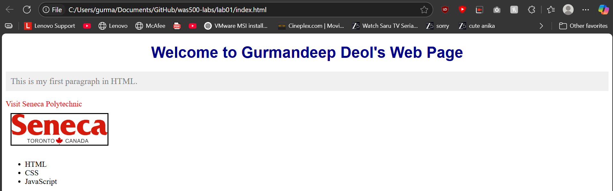

# Lab Submission Template
## Title: [Lab 01]
- **Name**: [Gurmandeep Deol]
- **Student ID**: [104120233]
- **Date**: [2025-09-04]
---
## Table of Contents
1. [Introduction](#introduction)
2. [VM Configuration Details](#vm-configuration-details)
3. [Command Outputs](#command-outputs)
4. [Screenshots](#screenshots)
5. [Experience and Challenges](#experience-and-challenges)
---
## Introduction
### Provide a brief overview of the lab. Summarize its objective and key tasks you performed.
This lab introduced html and css styling I created a new folder for this lab in my was500-labs repository using github and wrote a index.html document with proper structure and html elements such as headings body etc I also applied attribute and linked an external stylesheet to style the website this lab introduced how to write a webpage using a html document and than styling it with the css stylesheet

---

## VM Configuration Details
**OS**: Windows 11
**Editor**: Visual studio code
**Browser**: Microsoft Edge
**Repo**: was500-labs

---

## Code Block Deliverables
### Deliverable 1: [index.html]
```html
<!DOCTYPE html>
<html>
  <head>
    <meta charset="UTF-8">
    <title>My First Web Page</title>
    <link rel="stylesheet" href="styles.css">
  </head>
  <body>
    <h1 class="title">Welcome to Gurmandeep Deol's Web Page</h1>
    <p id="main-paragraph">This is my first paragraph in HTML.</p>
    <a href="https://www.senecapolytechnic.ca">Visit Seneca Polytechnic</a>
    <br>
    
    <ul>
      <li>HTML</li>
      <li>CSS</li>
      <li>JavaScript</li>
    </ul>
  </body>
</html>
```
### Deliverable 2: [style.css]
```css
h1 {
  color: darkblue;
  text-align: center;
}

p {
  font-size: 18px;
  color: gray;
}

a {
  color: red;
  text-decoration: none;
}

img {
  border: 2px solid black;
  margin: 10px;
}

/* Style by class */
.title {
  font-family: Arial, sans-serif;
}

/* Style by ID */
#main-paragraph {
  background-color: #f0f0f0;
  padding: 10px;
}
```
---

## Screenshots Deliverables
### Deliverable 1: [Webpage Screenshot]


---

## Experience and Challenges

### Reflection on Completing the Lab
- **What did you learn?** Provide a brief summary of your takeaways from this lab.

I learned how to style a webpage with css and make it colorful and add buttons to click links that can take you somewhere else also how to link css style sheet in the index.html.

- **Challenges Faced**: Highlight any difficulties you encountered during the lab.

Some difficulties I faced in this lab were originally when I opened the webpage the seneca screenshot would not load the rest of the page would load but not the seneca screenshot.

- **How You Overcame Challenges**: Describe the steps you took or solutions you implemented to resolve the challenges.

I overcame this challenge by adding the screenshot in the folder because the error was it was not able to find the screenshot in the folder but once I added it everything started working.