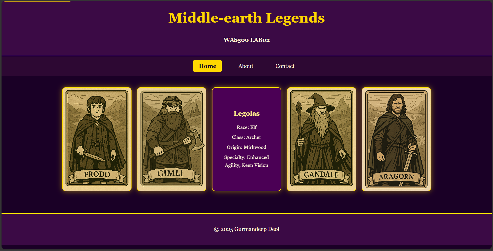

# Lab Submission Template
## Title: [Lab 02]
- **Name**: [Gurmandeep Deol]
- **Student ID**: [104120233]
- **Date**: [09/19/2025]

## Table of Contents
1. [Introduction](#introduction)
2. [VM Configuration Details](#vm-configuration-details)
3. [Code Block Deliverables](#code-block-deliverables)
3. [Screenshot Deliverables](#screenshots-deliverables)
4. [Reflection On Completing The Lab](#reflection-on-completing-the-lab)

## Introduction
__In this lab I created responsive web layouts using html5 and css the main objective was to build an accessible responsive webpage that featured a card based layout featuring the characters of Middle-Earth.__
## VM Configuration Details
OS: __Windows 11 Editor: Visual studio code Browser: Microsoft Edge Repo: was500-labs__

## Code Block Deliverables
### Deliverable 1: [index.html]
```html
<!DOCTYPE html>
<html lang="en">
<head>
  <meta charset="UTF-8" />
  <meta name="viewport" content="width=device-width, initial-scale=1.0">
  <title>Middle-earth Legends</title>
  <link rel="stylesheet" href="styles.css" />
</head>
<body>
  <a class="skip-link" href="#main">Skip to main content</a>
  
  <header>
    <h1>Middle-earth Legends</h1>
    <p><strong>WAS500 LAB02</strong></p>
  </header>
  
  <nav aria-label="Primary" role="navigation">
    <ul class="nav-list">
      <li><a href="#" aria-current="page">Home</a></li>
      <li><a href="#">About</a></li>
      <li><a href="#">Contact</a></li>
    </ul>
  </nav>
  
  <main id="main" class="card-container">
    <div class="card">
      <div class="card-inner">
        <div class="card-front" style="background-image: url('images/frodo.png')"></div>
        <div class="card-back">
          <h2>Frodo Baggins</h2>
          <p>Race: Hobbit</p>
          <p>Class: Ring-bearer</p>
          <p>Origin: The Shire</p>
          <p>Specialty: Resistance to the Ring</p>
        </div>
      </div>
    </div>
    <div class="card">
      <div class="card-inner">
        <div class="card-front" style="background-image: url('images/gimli.png')"></div>
        <div class="card-back">
          <h2>Gimli</h2>
          <p>Race: Dwarf</p>
          <p>Class: Warrior</p>
          <p>Origin: Erebor</p>
          <p>Specialty: Strength, Endurance</p>
        </div>
      </div>
    </div>
    <div class="card">
      <div class="card-inner">
        <div class="card-front" style="background-image: url('images/legolas.png')"></div>
        <div class="card-back">
          <h2>Legolas</h2>
          <p>Race: Elf</p>
          <p>Class: Archer</p>
          <p>Origin: Mirkwood</p>
          <p>Specialty: Enhanced Agility, Keen Vision</p>
        </div>
      </div>
    </div>
    <div class="card">
      <div class="card-inner">
        <div class="card-front" style="background-image: url('images/gandalf.png')"></div>
        <div class="card-back">
          <h2>Gandalf</h2>
          <p>Race: Maia</p>
          <p>Class: Wizard</p>
          <p>Origin: Valinor</p>
          <p>Specialty: Magic, Wisdom, Immortality</p>
        </div>
      </div>
    </div>
    <div class="card">
      <div class="card-inner">
        <div class="card-front" style="background-image: url('images/aragorn.png')"></div>
        <div class="card-back">
          <h2>Aragorn</h2>
          <p>Race: Human</p>
          <p>Class: Ranger</p>
          <p>Origin: Rivendell</p>
          <p>Specialty: Leadership, Healing</p>
        </div>
      </div>
    </div>
  </main>
  
  <footer>
    <p>&copy; 2025 Gurmandeep Deol</p>
  </footer>
</body>
</html>
```
### Deliverable 4: [styles.css]
```css
/* Reset and base styles */
* {
  box-sizing: border-box;
}

body {
  background: #1a0026; 
  color: #fff8dc; 
  font-family: 'Georgia', serif;
  margin: 0;
  padding: 0;
  line-height: 1.6;
}

/* Skip link - hidden by default, visible on focus */
.skip-link {
  position: absolute;
  top: -40px;
  left: 6px;
  background: #ffd700;
  color: #1a0026;
  padding: 8px 12px;
  border-radius: 4px;
  text-decoration: none;
  font-weight: bold;
  z-index: 1000;
  transition: top 0.3s;
}

.skip-link:focus {
  top: 6px;
  outline: 2px solid #fff;
}

/* Header and footer */
header, footer {
  background: #3b0a45; 
  text-align: center;
  padding: 1em;
  border-bottom: 2px solid #ffd700; 
}

footer {
  border-top: 2px solid #ffd700;
  border-bottom: none;
  margin-top: 2em;
}

h1 {
  color: #ffd700; 
  font-size: 2.5em;
  margin: 0 0 0.5em 0;
}

/* Navigation */
nav {
  background: #2d0833;
  padding: 1em;
}

.nav-list {
  list-style: none;
  margin: 0;
  padding: 0;
  display: flex;
  justify-content: center;
  gap: 2em;
}

.nav-list li {
  margin: 0;
}

.nav-list a {
  color: #fff8dc;
  text-decoration: none;
  padding: 0.5em 1em;
  border-radius: 4px;
  transition: all 0.3s ease;
}

.nav-list a:hover {
  background: #4b0055;
  color: #ffd700;
}

.nav-list a:focus {
  outline: 2px solid #ffd700;
  background: #4b0055;
  color: #ffd700;
}

.nav-list a[aria-current="page"] {
  background: #ffd700;
  color: #1a0026;
  font-weight: bold;
}

/* Card container - Flexbox layout with wrapping and centering */
.card-container {
  display: flex;
  flex-wrap: wrap;
  justify-content: center;
  gap: 1em;
  padding: 2em;
  max-width: 1200px;
  margin: 0 auto;
}

/* Individual cards */
.card {
  perspective: 1000px;
  width: 200px;
  height: 300px;
  flex-shrink: 0;
}

.card-inner {
  position: relative;
  width: 100%;
  height: 100%;
  text-align: center;
  transition: transform 0.8s;
  transform-style: preserve-3d;
  cursor: pointer;
}

.card:hover .card-inner {
  transform: rotateY(180deg);
}

.card-front, .card-back {
  position: absolute;
  width: 100%;
  height: 100%;
  backface-visibility: hidden;
  border: 2px solid #ffd700; 
  border-radius: 10px;
  overflow: hidden;
  box-shadow: 0 0 15px rgba(255, 215, 0, 0.5);
}

.card-front {
  background-size: cover;
  background-position: center;
  background-repeat: no-repeat;
}

/* Card back - Flexbox column with centering */
.card-back {
  background-color: #4b0055; 
  color: #fff8dc; 
  transform: rotateY(180deg);
  display: flex;
  flex-direction: column;
  justify-content: center;
  align-items: center;
  padding: 1em;
  text-align: center;
}

.card-back h2 {
  margin: 0 0 0.5em 0;
  color: #ffec8b; 
  font-size: 1.2em;
}

.card-back p {
  margin: 0.2em 0;
  font-size: 0.9em;
}

/* Responsive design */
@media (max-width: 768px) {
  /* Navigation stacks vertically on mobile */
  .nav-list {
    flex-direction: column;
    align-items: center;
    gap: 0.5em;
  }
  
  .nav-list a {
    display: block;
    width: 200px;
    text-align: center;
  }
  
  /* Card container adjustments for mobile */
  .card-container {
    padding: 1em;
    gap: 1.5em;
  }
  
  /* Single column layout on mobile */
  .card {
    width: 100%;
    max-width: 250px;
  }
  
  /* Adjust header text size */
  h1 {
    font-size: 2em;
  }
}

@media (max-width: 480px) {
  .card-container {
    padding: 0.5em;
  }
  
  .card {
    max-width: 200px;
    height: 280px;
  }
  
  .card-back {
    padding: 0.8em;
  }
  
  .card-back h2 {
    font-size: 1.1em;
  }
  
  .card-back p {
    font-size: 0.8em;
  }
}

@media (min-width: 769px) and (max-width: 1024px) {
  /* Tablet layout - 2-3 cards per row */
  .card-container {
    max-width: 800px;
  }
}

@media (min-width: 1025px) {
  /* Desktop layout - multiple cards per row */
  .card-container {
    max-width: 1200px;
  }
}
```

## Screenshots Deliverables
### Deliverable 1: [Desktop Layout]

### Deliverable 2: [Mobile Layout]


### Reflection on Completing the Lab
- **How did you improve the skip link and navigation bar?** 
__I improved the skip line by positioning it off screen by default but keeping it focusable for keyboard users. When focused it slides into view For the navigation bar I added gaps between links and added hover and focus with background color changes.__
- **How did you make the layout responsive?** 
__I made the layout responsive by allowing the cards to move to new line as needed and to keep them centered I also made three different ways for the cards to display for desktop there are multiple cards per row with full navigation for tablet there are fewer cards per row with spacing adjusted and mobile is a single column layout.__
- **What challenges did you face and how did you solve them?**
__The main challenge I faced was getting the layout to display properly on my phone it would display perfectly on my laptop but on my phone the cards would be cut off and I could not properly navigate through them I fixed this by editing css and making a responsive layout for each device and with these changes the cards were displaying properly on my phone.__