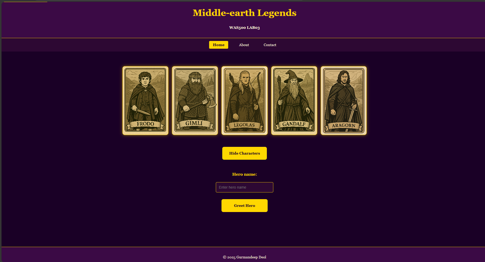

# Lab Submission Template
## Title: Lab03
- **Name**: Gurmandeep Deol
- **Student ID**: 104120233
- **Date**: 10-03-2025
---
## Table of Contents
1. [Introduction](#introduction)
2. [VM Configuration Details](#vm-configuration-details)
3. [Code Block Deliverables](#code-block-deliverables)
4. [Screenshot Deliverables](#screenshot-deliverables)
5. [Experience and Challenges](#experience-and-challenges)
---
## Introduction
In this lab I enhanced the middle earth legends website from lab 2 by adding javascript interactivity the objectives in this lab are
- Link a JavaScript file to an existing HTML/CSS project (your Middle-earth Legends site).
- Use variables, conditionals, and loops.
- Get an introductory look at DOM manipulation by enhancing the cards.
- Provide immediate, user-friendly feedback in the browser.
## VM Configuration Details
OS: Windows 11 Editor: Visual Studio Code Browser: Microsoft Edge Repo:was500-labs
---
## Code Block Deliverables
### Deliverable 1: [index.html]
```html
<!DOCTYPE html>
<html lang="en">
<head>
  <meta charset="UTF-8" />
  <meta name="viewport" content="width=device-width, initial-scale=1.0">
  <title>Middle-earth Legends</title>
  <link rel="stylesheet" href="styles.css" />
</head>
<body>
  <a class="skip-link" href="#main">Skip to main content</a>
  
  <header>
    <h1>Middle-earth Legends</h1>
    <p><strong>WAS500 LAB03</strong></p>
  </header>
  
  <nav aria-label="Primary" role="navigation">
    <ul class="nav-list">
      <li><a href="#" aria-current="page">Home</a></li>
      <li><a href="#">About</a></li>
      <li><a href="#">Contact</a></li>
    </ul>
  </nav>
  
  <main id="main" class="main-container">
    <!-- Character cards section -->
    <section id="characters" class="card-container">
      <div class="card">
        <div class="card-inner">
          <div class="card-front" style="background-image: url('images/frodo.png')"></div>
          <div class="card-back">
            <h2>Frodo Baggins</h2>
            <p>Race: Hobbit</p>
            <p>Class: Ring-bearer</p>
            <p>Origin: The Shire</p>
            <p>Specialty: Resistance to the Ring</p>
          </div>
        </div>
      </div>
      <div class="card">
        <div class="card-inner">
          <div class="card-front" style="background-image: url('images/gimli.png')"></div>
          <div class="card-back">
            <h2>Gimli</h2>
            <p>Race: Dwarf</p>
            <p>Class: Warrior</p>
            <p>Origin: Erebor</p>
            <p>Specialty: Strength, Endurance</p>
          </div>
        </div>
      </div>
      <div class="card">
        <div class="card-inner">
          <div class="card-front" style="background-image: url('images/legolas.png')"></div>
          <div class="card-back">
            <h2>Legolas</h2>
            <p>Race: Elf</p>
            <p>Class: Archer</p>
            <p>Origin: Mirkwood</p>
            <p>Specialty: Enhanced Agility, Keen Vision</p>
          </div>
        </div>
      </div>
      <div class="card">
        <div class="card-inner">
          <div class="card-front" style="background-image: url('images/gandalf.png')"></div>
          <div class="card-back">
            <h2>Gandalf</h2>
            <p>Race: Maia</p>
            <p>Class: Wizard</p>
            <p>Origin: Valinor</p>
            <p>Specialty: Magic, Wisdom, Immortality</p>
          </div>
        </div>
      </div>
      <div class="card">
        <div class="card-inner">
          <div class="card-front" style="background-image: url('images/aragorn.png')"></div>
          <div class="card-back">
            <h2>Aragorn</h2>
            <p>Race: Human</p>
            <p>Class: Ranger</p>
            <p>Origin: Rivendell</p>
            <p>Specialty: Leadership, Healing</p>
          </div>
        </div>
      </div>
    </section>
    
    <!-- Toggle button -->
    <div id="toggleBtn" class="siteBtn" tabindex="0">Hide Characters</div>
    
    <!-- Greeting section -->
    <div class="greeting-section">
      <label for="heroName">Hero name:</label>
      <input type="text" id="heroName" placeholder="Enter hero name">
      <div id="greetBtn" class="siteBtn" tabindex="0">Greet Hero</div>
      <p id="greetMsg"></p>
    </div>
  </main>
  
  <footer>
    <p>&copy; 2025 Gurmandeep Deol</p>
  </footer>
  
  <script src="script.js"></script>
</body>
</html>
```
### Deliverable 2: [styles.css]
```css
/* Reset and base styles */
* {
  box-sizing: border-box;
}

body {
  background: #1a0026; 
  color: #fff8dc; 
  font-family: 'Georgia', serif;
  margin: 0;
  padding: 0;
  line-height: 1.6;
}

/* Skip link */
.skip-link {
  position: absolute;
  top: -40px;
  left: 6px;
  background: #ffd700;
  color: #1a0026;
  padding: 8px 12px;
  border-radius: 4px;
  text-decoration: none;
  font-weight: bold;
  z-index: 1000;
  transition: top 0.3s;
}

.skip-link:focus {
  top: 6px;
  outline: 2px solid #fff;
}

/* Header and footer */
header, footer {
  background: #3b0a45; 
  text-align: center;
  padding: 1em;
  border-bottom: 2px solid #ffd700; 
}

footer {
  border-top: 2px solid #ffd700;
  border-bottom: none;
  margin-top: 2em;
}

h1 {
  color: #ffd700; 
  font-size: 2.5em;
  margin: 0 0 0.5em 0;
}

/* Navigation */
nav {
  background: #2d0833;
  padding: 1em;
}

.nav-list {
  list-style: none;
  margin: 0;
  padding: 0;
  display: flex;
  justify-content: center;
  gap: 2em;
}

.nav-list li {
  margin: 0;
}

.nav-list a {
  color: #fff8dc;
  text-decoration: none;
  padding: 0.5em 1em;
  border-radius: 4px;
  transition: all 0.3s ease;
}

.nav-list a:hover {
  background: #4b0055;
  color: #ffd700;
}

.nav-list a:focus {
  outline: 2px solid #ffd700;
  background: #4b0055;
  color: #ffd700;
}

.nav-list a[aria-current="page"] {
  background: #ffd700;
  color: #1a0026;
  font-weight: bold;
}

/* Main container - column layout */
.main-container {
  display: flex;
  flex-direction: column;
  align-items: center;
  padding: 2em;
  max-width: 1200px;
  margin: 0 auto;
}

/* Card container */
.card-container {
  display: flex;
  flex-wrap: wrap;
  justify-content: center;
  gap: 1em;
  padding: 2em;
  width: 100%;
}

/* Individual cards */
.card {
  perspective: 1000px;
  width: 200px;
  height: 300px;
  flex-shrink: 0;
}

.card-inner {
  position: relative;
  width: 100%;
  height: 100%;
  text-align: center;
  transition: transform 0.8s;
  transform-style: preserve-3d;
  cursor: pointer;
}

.card:hover .card-inner {
  transform: rotateY(180deg);
}

.card-front, .card-back {
  position: absolute;
  width: 100%;
  height: 100%;
  backface-visibility: hidden;
  border: 2px solid #ffd700; 
  border-radius: 10px;
  overflow: hidden;
  box-shadow: 0 0 15px rgba(255, 215, 0, 0.5);
}

.card-front {
  background-size: cover;
  background-position: center;
  background-repeat: no-repeat;
}

.card-back {
  background-color: #4b0055; 
  color: #fff8dc; 
  transform: rotateY(180deg);
  display: flex;
  flex-direction: column;
  justify-content: center;
  align-items: center;
  padding: 1em;
  text-align: center;
}

.card-back h2 {
  margin: 0 0 0.5em 0;
  color: #ffec8b; 
  font-size: 1.2em;
}

.card-back p {
  margin: 0.2em 0;
  font-size: 0.9em;
}

/* Site buttons */
.siteBtn {
  background-color: #ffd700;
  color: #1a0026;
  padding: 15px 30px;
  text-align: center;
  margin: 20px auto;
  cursor: pointer;
  border-radius: 8px;
  max-width: 200px;
  font-weight: bold;
  transition: all 0.3s ease;
}

.siteBtn:hover {
  background-color: #ffec8b;
  box-shadow: 0 0 20px rgba(255, 215, 0, 0.8);
  transform: scale(1.05);
}

.siteBtn:focus {
  outline: 3px solid #fff8dc;
  outline-offset: 2px;
}

/* Greeting section */
.greeting-section {
  text-align: center;
  margin: 30px auto;
  max-width: 400px;
  width: 100%;
}

.greeting-section label {
  display: block;
  margin-bottom: 10px;
  color: #ffd700;
  font-weight: bold;
  font-size: 1.1em;
}

#heroName {
  padding: 12px;
  margin: 10px;
  border: 2px solid #ffd700;
  border-radius: 5px;
  width: 250px;
  background-color: #2d0833;
  color: #fff8dc;
  font-size: 1em;
  transition: border-color 0.3s ease;
}

#heroName:focus {
  outline: none;
  border-color: #ffec8b;
  box-shadow: 0 0 10px rgba(255, 215, 0, 0.5);
}

#greetMsg {
  margin-top: 15px;
  font-weight: bold;
  min-height: 20px;
  color: #ffec8b;
  font-size: 1.1em;
}

/* Responsive design */
@media (max-width: 768px) {
  .nav-list {
    flex-direction: column;
    align-items: center;
    gap: 0.5em;
  }
  
  .nav-list a {
    display: block;
    width: 200px;
    text-align: center;
  }
  
  .main-container {
    padding: 1em;
  }
  
  .card-container {
    padding: 1em;
    gap: 1.5em;
  }
  
  .card {
    width: 100%;
    max-width: 250px;
  }
  
  h1 {
    font-size: 2em;
  }
  
  .siteBtn {
    width: 80%;
    max-width: 250px;
  }
  
  #heroName {
    width: 200px;
  }
}

@media (max-width: 480px) {
  .card-container {
    padding: 0.5em;
  }
  
  .card {
    max-width: 200px;
    height: 280px;
  }
  
  .card-back {
    padding: 0.8em;
  }
  
  .card-back h2 {
    font-size: 1.1em;
  }
  
  .card-back p {
    font-size: 0.8em;
  }
}

@media (min-width: 769px) and (max-width: 1024px) {
  .card-container {
    max-width: 800px;
  }
}

@media (min-width: 1025px) {
  .card-container {
    max-width: 1200px;
  }
}
```
### Deliverable 3: [script.js]
```js
// Toggle Characters Section
const toggleBtn = document.getElementById("toggleBtn");
const section = document.getElementById("characters");

toggleBtn.onclick = () => {
  const hidden = section.style.display === "none";
  section.style.display = hidden ? "flex" : "none";
  toggleBtn.textContent = hidden ? "Hide Characters" : "Show Characters";
};

// Character Greeting
const greetBtn = document.getElementById("greetBtn");
const nameInput = document.getElementById("heroName");
const msg = document.getElementById("greetMsg");

const heroes = ["Frodo", "Gimli", "Legolas", "Gandalf", "Aragorn"];

greetBtn.onclick = () => {
  const name = nameInput.value.trim();
  
  if (!name) {
    msg.textContent = "Please enter a character name.";
  } else {
    // Case-insensitive comparison
    const heroMatch = heroes.find(hero => hero.toLowerCase() === name.toLowerCase());
    
    if (heroMatch) {
      msg.textContent = `Welcome, ${heroMatch} of Middle-earth!`;
    } else {
      msg.textContent = "That hero is not part of our fellowship.";
    }
  }
};

// Allow Enter key to trigger greeting
nameInput.addEventListener("keypress", (e) => {
  if (e.key === "Enter") {
    greetBtn.onclick();
  }
});
```
---
## Screenshot Deliverables
### Deliverable 1 : [Intial page load]

### Deliverable 2: [Character's Hidden]

### Deliverable 3: [Character visible]

### Deliverable 4: [Greeting for valid hero]

### Deliverable 5: [Greeting for invalid hero]

---
## Experience and Challenges
### Reflection on Completing the Lab
- **What did you learn?** I learned how to use javascript to make web pages more interactive before doing this lab I only knew how to use html and css but now I understood that javascript can make the page a lot more interactive such as how the characters can be hidden I also learned how to make javascript listen waiting ros when someone clicks a button or presses enter the onclick feature makes the code run whenever someone interacts with ym website which make the website more responsive I also learned how to validate user input which meant checking what the user types before actually doing something with it I used if else statements to check fi the input was empty matched my heroes or if the input was simply invalid and handled it accordingly
- **Challenges Faced**: Some challenges I faced were how to make the name match regardless of the user typing frodo normally or typing it weirdly like FrOdo i wasn't sure how to validate the weird input such as FroDo another challenge was I wasn't sure where to put the `<script src="script.js"></script>` line in my html I tried putting it in a lot of places but it did not work
- **How You Overcame Challenges**: For the first challenge I used the .find() method to search through my heroes array and compared hero.toLowerCase() with name.toLowerCase so it didn't matter what the user types because it would be converted to lowercase and than I can display the actual hero's name from my array this way I fixed the uppercase lowercase essay. For the second challenge I figured it out that the `<script>` should go right before the closing `<body>` tag. Because javascript needs html elements to exist before it can find them if i put the script in the `<head>` the elements don't technically exist hence the code wont work.