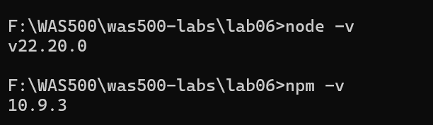
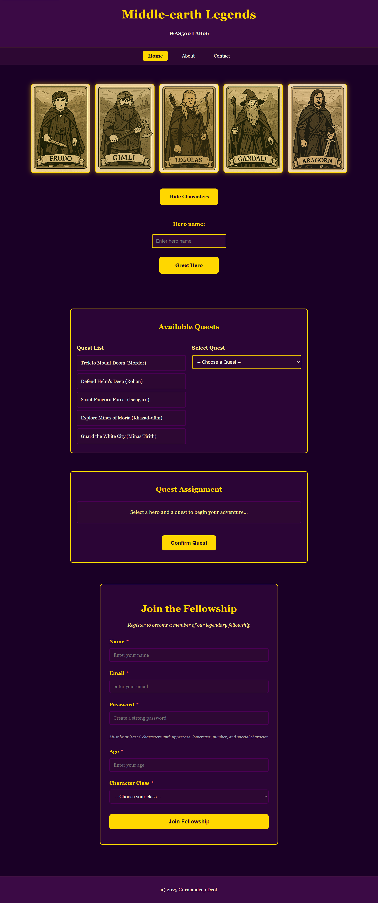
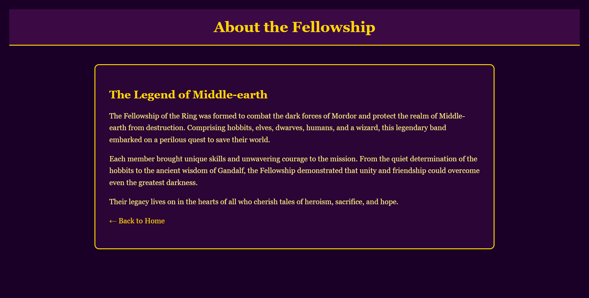
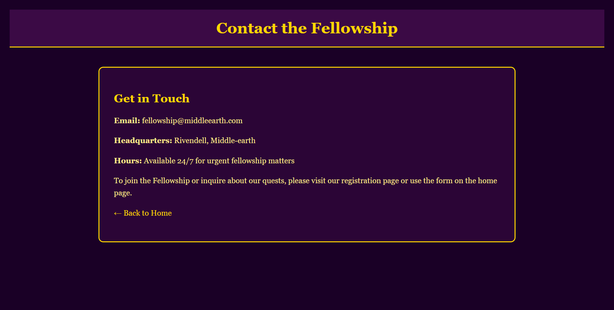
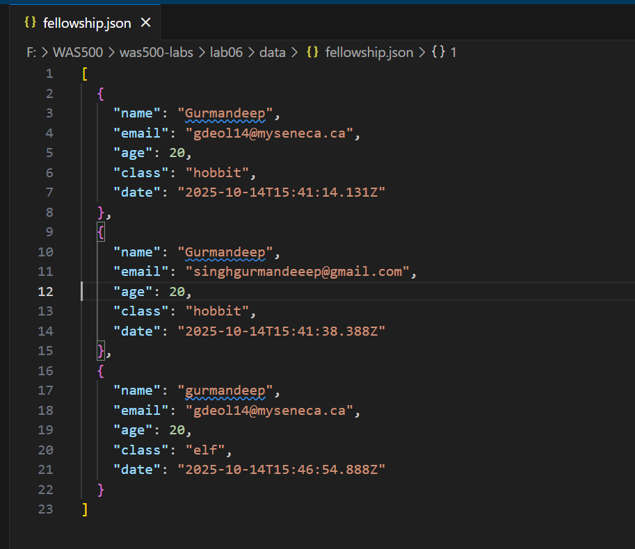

# Lab Submission Template
## Title: Lab06
- **Name**: Gurmandeep Deol
- **Student ID**: 104120233
- **Date**: 2025-10-14
---
## Table of Contents
1. [Introduction](#introduction)
2. [VM Configuration Details](#vm-configuration-details)
3. [Code Block Deliverables](#code-block-deliverables)
4. [Screenshots Deliverables](#screenshots-deliverables)
5. [Experience and Challenges](#experience-and-challenges)
---
## Introduction
In this lab I built a Node.js HTTP server to power the middle-earth legends from lab 5 the objective was to transition from a client side application to a full stack experience with server side routing static files serving form data persistence the server also implements manual routing for about or contact pages and handles post requests whether the form was successfully submitted or not
---
## VM Configuration Details
OS: Window 11 Editor: Visual Studio Code Browser: Microsoft Edge
---
## Code Block Deliverables
### Deliverable 1: index.html
```html
<!DOCTYPE html>
<html lang="en">
<head>
  <meta charset="UTF-8" />
  <meta name="viewport" content="width=device-width, initial-scale=1.0">
  <title>Middle-earth Legends</title>
  <link rel="stylesheet" href="styles.css" />
</head>
<body>
  <a class="skip-link" href="#main">Skip to main content</a>
 
  <header>
    <h1>Middle-earth Legends</h1>
    <p><strong>WAS500 LAB06</strong></p>
  </header>
 
  <nav aria-label="Primary" role="navigation">
    <ul class="nav-list">
      <li><a href="/" aria-current="page">Home</a></li>
      <li><a href="/about">About</a></li>
      <li><a href="/contact">Contact</a></li>
    </ul>
  </nav>
 
  <main id="main" class="main-container">
    <!-- Character cards section -->
    <section id="characters" class="card-container">
      <div class="card" data-hero="Frodo Baggins">
        <div class="card-inner">
          <div class="card-front" style="background-image: url('images/frodo.png')"></div>
          <div class="card-back">
            <h2>Frodo Baggins</h2>
            <p>Race: Hobbit</p>
            <p>Class: Ring-bearer</p>
            <p>Origin: The Shire</p>
            <p>Specialty: Resistance to the Ring</p>
          </div>
        </div>
      </div>
      <div class="card" data-hero="Gimli">
        <div class="card-inner">
          <div class="card-front" style="background-image: url('images/gimli.png')"></div>
          <div class="card-back">
            <h2>Gimli</h2>
            <p>Race: Dwarf</p>
            <p>Class: Warrior</p>
            <p>Origin: Erebor</p>
            <p>Specialty: Strength, Endurance</p>
          </div>
        </div>
      </div>
      <div class="card" data-hero="Legolas">
        <div class="card-inner">
          <div class="card-front" style="background-image: url('images/legolas.png')"></div>
          <div class="card-back">
            <h2>Legolas</h2>
            <p>Race: Elf</p>
            <p>Class: Archer</p>
            <p>Origin: Mirkwood</p>
            <p>Specialty: Enhanced Agility, Keen Vision</p>
          </div>
        </div>
      </div>
      <div class="card" data-hero="Gandalf">
        <div class="card-inner">
          <div class="card-front" style="background-image: url('images/gandalf.png')"></div>
          <div class="card-back">
            <h2>Gandalf</h2>
            <p>Race: Maia</p>
            <p>Class: Wizard</p>
            <p>Origin: Valinor</p>
            <p>Specialty: Magic, Wisdom, Immortality</p>
          </div>
        </div>
      </div>
      <div class="card" data-hero="Aragorn">
        <div class="card-inner">
          <div class="card-front" style="background-image: url('images/aragorn.png')"></div>
          <div class="card-back">
            <h2>Aragorn</h2>
            <p>Race: Human</p>
            <p>Class: Ranger</p>
            <p>Origin: Rivendell</p>
            <p>Specialty: Leadership, Healing</p>
          </div>
        </div>
      </div>
    </section>
   
    <!-- Toggle button -->
    <div id="toggleBtn" class="siteBtn" tabindex="0">Hide Characters</div>
   
    <!-- Greeting section -->
    <div class="greeting-section">
      <label for="heroName">Hero name:</label>
      <input type="text" id="heroName" placeholder="Enter hero name">
      <div id="greetBtn" class="siteBtn" tabindex="0">Greet Hero</div>
      <p id="greetMsg"></p>
    </div>

    <!-- Available Quests Section -->
    <section class="quests-section">
      <h2>Available Quests</h2>
      <div class="quests-container">
        <div class="quest-list-container">
          <h3>Quest List</h3>
          <ul id="taskList" class="task-list"></ul>
        </div>
        <div class="quest-dropdown-container">
          <h3>Select Quest</h3>
          <select id="taskSelect" class="task-select">
            <option value="">-- Choose a Quest --</option>
          </select>
        </div>
      </div>
    </section>

    <!-- Choose Hero & Confirm Section -->
    <section class="quest-confirm-section">
      <h2>Quest Assignment</h2>
      <p id="questLogText" class="quest-log" aria-live="polite">
        Select a hero and a quest to begin your adventure...
      </p>
      <button id="confirmQuestBtn" class="siteBtn">Confirm Quest</button>
    </section>

    <!-- LAB 5: Join the Fellowship Form -->
    <section class="fellowship-section">
      <h2>Join the Fellowship</h2>
      <p class="section-intro">Register to become a member of our legendary fellowship</p>
      
      <form id="joinForm" action="/api/join" method="POST" novalidate>
        <!-- Name Field -->
        <div class="form-group">
          <label for="fellowName">Name <span class="required">*</span></label>
          <input 
            type="text" 
            id="fellowName" 
            name="fellowName"
            required 
            minlength="2"
            placeholder="Enter your name"
            aria-describedby="nameError"
          >
          <div id="nameError" class="error-message" aria-live="polite"></div>
        </div>

        <!-- Email Field -->
        <div class="form-group">
          <label for="fellowEmail">Email <span class="required">*</span></label>
          <input 
            type="email" 
            id="fellowEmail" 
            name="fellowEmail"
            required
            placeholder="enter your email"
            aria-describedby="emailError"
          >
          <div id="emailError" class="error-message" aria-live="polite"></div>
        </div>

        <!-- Password Field -->
        <div class="form-group">
          <label for="fellowPassword">Password <span class="required">*</span></label>
          <input 
            type="password" 
            id="fellowPassword" 
            name="fellowPassword"
            required
            minlength="8"
            placeholder="Create a strong password"
            aria-describedby="passwordError passwordStrength"
          >
          <div id="passwordStrength" class="password-strength"></div>
          <div id="passwordError" class="error-message" aria-live="polite"></div>
          <small class="help-text">Must be at least 8 characters with uppercase, lowercase, number, and special character</small>
        </div>

        <!-- Age Field -->
        <div class="form-group">
          <label for="fellowAge">Age <span class="required">*</span></label>
          <input 
            type="number" 
            id="fellowAge" 
            name="fellowAge"
            required
            min="1"
            max="999"
            placeholder="Enter your age"
            aria-describedby="ageError"
          >
          <div id="ageError" class="error-message" aria-live="polite"></div>
        </div>

        <!-- Character Class Field -->
        <div class="form-group">
          <label for="fellowClass">Character Class <span class="required">*</span></label>
          <select 
            id="fellowClass" 
            name="fellowClass"
            required
            aria-describedby="classError"
          >
            <option value="">-- Choose your class --</option>
            <option value="hobbit">Hobbit</option>
            <option value="elf">Elf</option>
            <option value="dwarf">Dwarf</option>
            <option value="human">Human</option>
            <option value="wizard">Wizard</option>
          </select>
          <div id="classError" class="error-message" aria-live="polite"></div>
        </div>

        <!-- Submit Button -->
        <button type="submit" class="siteBtn submit-btn">Join Fellowship</button>
      </form>

      <!-- Success Message -->
      <div id="successMessage" class="success-message" aria-live="polite"></div>
    </section>
  </main>
 
  <footer>
    <p>&copy; 2025 Gurmandeep Deol</p>
  </footer>
 
  <script src="script.js"></script>
</body>
</html>
```
### Deliverable 2: script.js
```js
// Quest data array
const TASKS = [
  { id: "mt-doom", title: "Trek to Mount Doom", location: "Mordor" },
  { id: "helms-deep", title: "Defend Helm's Deep", location: "Rohan" },
  { id: "fangorn", title: "Scout Fangorn Forest", location: "Isengard" },
  { id: "moria", title: "Explore Mines of Moria", location: "Khazad-dûm" },
  { id: "minas-tirith", title: "Guard the White City", location: "Minas Tirith" }
];

// State variables
let selectedHero = null;
let selectedQuest = null;

// Toggle Characters Section
const toggleBtn = document.getElementById("toggleBtn");
const section = document.getElementById("characters");
toggleBtn.onclick = () => {
  const hidden = section.style.display === "none";
  section.style.display = hidden ? "flex" : "none";
  toggleBtn.textContent = hidden ? "Hide Characters" : "Show Characters";
};

// Character Greeting
const greetBtn = document.getElementById("greetBtn");
const nameInput = document.getElementById("heroName");
const msg = document.getElementById("greetMsg");
const heroes = ["Frodo", "Gimli", "Legolas", "Gandalf", "Aragorn"];

greetBtn.onclick = () => {
  const name = nameInput.value.trim();
 
  if (!name) {
    msg.textContent = "Please enter a character name.";
  } else {
    const heroMatch = heroes.find(hero => hero.toLowerCase() === name.toLowerCase());
   
    if (heroMatch) {
      msg.textContent = `Welcome, ${heroMatch} of Middle-earth!`;
    } else {
      msg.textContent = "That hero is not part of our fellowship.";
    }
  }
};

// Allow Enter key to trigger greeting
nameInput.addEventListener("keypress", (e) => {
  if (e.key === "Enter") {
    greetBtn.onclick();
  }
});

// LAB 4: Quest Features

// Initialize Quest List and Dropdown
function initializeQuests() {
  const taskList = document.getElementById("taskList");
  const taskSelect = document.getElementById("taskSelect");
  
  // Populate the task list
  TASKS.forEach(task => {
    const li = document.createElement("li");
    li.textContent = `${task.title} (${task.location})`;
    li.dataset.taskId = task.id;
    li.classList.add("task-item");
    li.tabIndex = 0;
    
    // Click event for list item
    li.addEventListener("click", () => selectQuestFromList(task.id));
    
    // Keyboard support
    li.addEventListener("keypress", (e) => {
      if (e.key === "Enter" || e.key === " ") {
        e.preventDefault();
        selectQuestFromList(task.id);
      }
    });
    
    taskList.appendChild(li);
  });
  
  // Populate the dropdown
  TASKS.forEach(task => {
    const option = document.createElement("option");
    option.value = task.id;
    option.textContent = `${task.title} (${task.location})`;
    taskSelect.appendChild(option);
  });
  
  // Dropdown change event
  taskSelect.addEventListener("change", (e) => {
    if (e.target.value) {
      selectQuestFromDropdown(e.target.value);
    }
  });
}

// Select quest from list
function selectQuestFromList(taskId) {
  selectedQuest = TASKS.find(task => task.id === taskId);
  
  // Highlight selected list item
  document.querySelectorAll(".task-item").forEach(item => {
    item.classList.remove("selected");
  });
  const selectedItem = document.querySelector(`[data-task-id="${taskId}"]`);
  if (selectedItem) {
    selectedItem.classList.add("selected");
  }
  
  // Update dropdown
  const taskSelect = document.getElementById("taskSelect");
  taskSelect.value = taskId;
  
  updateQuestLog();
}

// Select quest from dropdown
function selectQuestFromDropdown(taskId) {
  selectedQuest = TASKS.find(task => task.id === taskId);
  
  // Highlight selected list item
  document.querySelectorAll(".task-item").forEach(item => {
    item.classList.remove("selected");
  });
  const selectedItem = document.querySelector(`[data-task-id="${taskId}"]`);
  if (selectedItem) {
    selectedItem.classList.add("selected");
  }
  
  updateQuestLog();
}

// Hero Card Selection
document.querySelectorAll(".card").forEach((card) => {
  card.tabIndex = 0;
  
  card.addEventListener("click", () => {
    selectHero(card);
  });
  
  // Keyboard support
  card.addEventListener("keypress", (e) => {
    if (e.key === "Enter" || e.key === " ") {
      e.preventDefault();
      selectHero(card);
    }
  });
});

function selectHero(card) {
  // Remove selected class from all cards
  document.querySelectorAll(".card").forEach((c) => c.classList.remove("selected"));
  
  // Add selected class to clicked card
  card.classList.add("selected");
  
  // Store selected hero name
  selectedHero = card.dataset.hero;
  
  updateQuestLog();
}

// Update Quest Log
function updateQuestLog() {
  const questLogText = document.getElementById("questLogText");
  
  if (!selectedHero && !selectedQuest) {
    questLogText.textContent = "Select a hero and a quest to begin your adventure...";
  } else if (!selectedHero) {
    questLogText.textContent = `Quest selected: ${selectedQuest.title}. Now choose a hero!`;
  } else if (!selectedQuest) {
    questLogText.textContent = `Hero selected: ${selectedHero}. Now choose a quest!`;
  } else {
    questLogText.textContent = `${selectedHero} is ready for: ${selectedQuest.title} in ${selectedQuest.location}. Click Confirm to begin!`;
  }
}

// Confirm Quest Button
const confirmQuestBtn = document.getElementById("confirmQuestBtn");

confirmQuestBtn.addEventListener("click", () => {
  const questLogText = document.getElementById("questLogText");
  
  // Validation
  if (!selectedHero) {
    questLogText.textContent = "Select a hero by clicking a card.";
    return;
  }
  
  if (!selectedQuest) {
    questLogText.textContent = "Select a quest from the dropdown.";
    return;
  }
  
  // Run quest with random outcome
  const roll = Math.random();
  const success = roll >= 0.5;
  
  const resultMessage = success 
    ? `Victory! ${selectedHero} successfully completed "${selectedQuest.title}" in ${selectedQuest.location}. Roll: ${roll.toFixed(2)} - Success!`
    : `Defeat. ${selectedHero} was unable to complete "${selectedQuest.title}" in ${selectedQuest.location}. Roll: ${roll.toFixed(2)} - Failure.`;
  
  questLogText.textContent = resultMessage;
  
  // Reset selections after a delay
  setTimeout(() => {
    resetQuest();
  }, 5000);
});

// Reset quest selection
function resetQuest() {
  selectedHero = null;
  selectedQuest = null;
  
  // Clear hero selection
  document.querySelectorAll(".card").forEach((c) => c.classList.remove("selected"));
  
  // Clear quest selection
  document.querySelectorAll(".task-item").forEach(item => {
    item.classList.remove("selected");
  });
  document.getElementById("taskSelect").value = "";
  
  // Reset quest log
  document.getElementById("questLogText").textContent = "Select a hero and a quest to begin your adventure...";
}

// LAB 5: FORM VALIDATION

// Form elements
const joinForm = document.getElementById("joinForm");
const fellowName = document.getElementById("fellowName");
const fellowEmail = document.getElementById("fellowEmail");
const fellowPassword = document.getElementById("fellowPassword");
const fellowAge = document.getElementById("fellowAge");
const fellowClass = document.getElementById("fellowClass");

// Error message elements
const nameError = document.getElementById("nameError");
const emailError = document.getElementById("emailError");
const passwordError = document.getElementById("passwordError");
const ageError = document.getElementById("ageError");
const classError = document.getElementById("classError");
const successMessage = document.getElementById("successMessage");
const passwordStrength = document.getElementById("passwordStrength");

// Validation functions
function validateName() {
  const value = fellowName.value.trim();
  
  if (value === "") {
    showError(nameError, fellowName, "Name is required");
    return false;
  }
  
  if (value.length < 2) {
    showError(nameError, fellowName, "Name must be at least 2 characters long");
    return false;
  }
  
  showSuccess(nameError, fellowName);
  return true;
}

function validateEmail() {
  const value = fellowEmail.value.trim();
  const emailPattern = /^[^\s@]+@[^\s@]+\.[^\s@]+$/;
  
  if (value === "") {
    showError(emailError, fellowEmail, "Email is required");
    return false;
  }
  
  if (!emailPattern.test(value)) {
    showError(emailError, fellowEmail, "Please enter a valid email address");
    return false;
  }
  
  showSuccess(emailError, fellowEmail);
  return true;
}

function validatePassword() {
  const value = fellowPassword.value;
  
  if (value === "") {
    showError(passwordError, fellowPassword, "Password is required");
    passwordStrength.textContent = "";
    return false;
  }
  
  if (value.length < 8) {
    showError(passwordError, fellowPassword, "Password must be at least 8 characters long");
    updatePasswordStrength(value);
    return false;
  }
  
  const hasUppercase = /[A-Z]/.test(value);
  const hasLowercase = /[a-z]/.test(value);
  const hasNumber = /[0-9]/.test(value);
  const hasSpecial = /[!@#$%^&*(),.?":{}|<>]/.test(value);
  
  if (!hasUppercase) {
    showError(passwordError, fellowPassword, "Password must include at least one uppercase letter");
    updatePasswordStrength(value);
    return false;
  }
  
  if (!hasLowercase) {
    showError(passwordError, fellowPassword, "Password must include at least one lowercase letter");
    updatePasswordStrength(value);
    return false;
  }
  
  if (!hasNumber) {
    showError(passwordError, fellowPassword, "Password must include at least one number");
    updatePasswordStrength(value);
    return false;
  }
  
  if (!hasSpecial) {
    showError(passwordError, fellowPassword, "Password must include at least one special character (!@#$%^&*)");
    updatePasswordStrength(value);
    return false;
  }
  
  showSuccess(passwordError, fellowPassword);
  updatePasswordStrength(value);
  return true;
}

function updatePasswordStrength(password) {
  if (password.length === 0) {
    passwordStrength.textContent = "";
    passwordStrength.className = "password-strength";
    return;
  }
  
  let strength = 0;
  
  if (password.length >= 8) strength++;
  if (/[A-Z]/.test(password)) strength++;
  if (/[a-z]/.test(password)) strength++;
  if (/[0-9]/.test(password)) strength++;
  if (/[!@#$%^&*(),.?":{}|<>]/.test(password)) strength++;
  
  passwordStrength.className = "password-strength";
  
  if (strength <= 2) {
    passwordStrength.textContent = "Strength: Weak";
    passwordStrength.classList.add("weak");
  } else if (strength <= 4) {
    passwordStrength.textContent = "Strength: Medium";
    passwordStrength.classList.add("medium");
  } else {
    passwordStrength.textContent = "Strength: Strong";
    passwordStrength.classList.add("strong");
  }
}

function validateAge() {
  const value = fellowAge.value;
  
  if (value === "") {
    showError(ageError, fellowAge, "Age is required");
    return false;
  }
  
  const age = parseInt(value);
  
  if (isNaN(age) || age < 1) {
    showError(ageError, fellowAge, "Age must be at least 1");
    return false;
  }
  
  if (age > 999) {
    showError(ageError, fellowAge, "Age must be 999 or less");
    return false;
  }
  
  showSuccess(ageError, fellowAge);
  return true;
}

function validateClass() {
  const value = fellowClass.value;
  
  if (value === "") {
    showError(classError, fellowClass, "Please select a character class");
    return false;
  }
  
  showSuccess(classError, fellowClass);
  return true;
}

// Helper functions to show/hide errors
function showError(errorElement, inputElement, message) {
  errorElement.textContent = message;
  errorElement.style.display = "block";
  inputElement.classList.add("invalid");
  inputElement.classList.remove("valid");
}

function showSuccess(errorElement, inputElement) {
  errorElement.textContent = "";
  errorElement.style.display = "none";
  inputElement.classList.remove("invalid");
  inputElement.classList.add("valid");
}

// Real-time validation event listeners
fellowName.addEventListener("blur", validateName);
fellowName.addEventListener("input", () => {
  if (fellowName.value.trim().length >= 2) {
    validateName();
  }
});

fellowEmail.addEventListener("blur", validateEmail);
fellowEmail.addEventListener("input", () => {
  if (fellowEmail.value.includes("@")) {
    validateEmail();
  }
});

fellowPassword.addEventListener("input", () => {
  updatePasswordStrength(fellowPassword.value);
});

fellowPassword.addEventListener("blur", validatePassword);

fellowAge.addEventListener("blur", validateAge);
fellowAge.addEventListener("input", () => {
  if (fellowAge.value.length > 0) {
    validateAge();
  }
});

fellowClass.addEventListener("change", validateClass);

// LAB 6: Form submission with server-side POST
joinForm.addEventListener("submit", (e) => {
  e.preventDefault();
  
  // Hide previous success or error message
  successMessage.textContent = "";
  successMessage.style.display = "none";
  
  // Run all client-side validations to give the user immediate feedback.
  // The form will be submitted regardless of the outcome of these checks.
  const isNameValid = validateName();
  const isEmailValid = validateEmail();
  const isPasswordValid = validatePassword();
  const isAgeValid = validateAge();
  const isClassValid = validateClass();
  
  // Always send the form data to the server.
  // The server is the final authority on data validation.
  const formData = new FormData(joinForm);
  
  fetch('/api/join', {
    method: 'POST',
    body: new URLSearchParams(formData)
  })
  .then(response => {
    // Parse the JSON response from the server
    return response.json().then(data => ({
      ok: response.ok,
      data: data
    }));
  })
  .then(result => {
    // Display the server's response message
    if (result.ok && result.data.ok) {
      // Show success message from the server
      successMessage.textContent = `🎉 ${result.data.message}`;
      successMessage.style.display = "block";
      successMessage.style.background = "rgba(0, 255, 0, 0.1)";
      successMessage.style.borderColor = "#00ff00";
      successMessage.style.color = "#00ff00";
      
      joinForm.reset();
      document.querySelectorAll(".form-group input, .form-group select").forEach(field => {
        field.classList.remove("valid", "invalid");
      });
      passwordStrength.textContent = "";
      passwordStrength.className = "password-strength";
      successMessage.scrollIntoView({ behavior: "smooth", block: "center" });
      
    } else {
      // Show error message from the server (e.g., from a 400 response)
      successMessage.textContent = `❌ Error: ${result.data.error || 'An unknown error occurred.'}`;
      successMessage.style.display = "block";
      successMessage.style.background = "rgba(255, 107, 107, 0.1)";
      successMessage.style.borderColor = "#ff6b6b";
      successMessage.style.color = "#ff6b6b";
    }
  })
  .catch(error => {
    console.error('Fetch Error:', error);
    successMessage.textContent = "❌ Network error. Could not connect to the server.";
    successMessage.style.display = "block";
    successMessage.style.background = "rgba(255, 107, 107, 0.1)";
    successMessage.style.borderColor = "#ff6b6b";
    successMessage.style.color = "#ff6b6b";
  });
});


// Initialize everything when DOM is ready
document.addEventListener("DOMContentLoaded", () => {
  initializeQuests();
});
```
### Deliverable 3: styles.css
```css
/* Reset and base styles */
* {
  box-sizing: border-box;
}

body {
  background: #1a0026; 
  color: #fff8dc; 
  font-family: 'Georgia', serif;
  margin: 0;
  padding: 0;
  line-height: 1.6;
}

/* Skip link */
.skip-link {
  position: absolute;
  top: -40px;
  left: 6px;
  background: #ffd700;
  color: #1a0026;
  padding: 8px 12px;
  border-radius: 4px;
  text-decoration: none;
  font-weight: bold;
  z-index: 1000;
  transition: top 0.3s;
}

.skip-link:focus {
  top: 6px;
  outline: 2px solid #fff;
}

/* Header and footer */
header, footer {
  background: #3b0a45; 
  text-align: center;
  padding: 1em;
  border-bottom: 2px solid #ffd700; 
}

footer {
  border-top: 2px solid #ffd700;
  border-bottom: none;
  margin-top: 2em;
}

h1 {
  color: #ffd700; 
  font-size: 2.5em;
  margin: 0 0 0.5em 0;
}

/* Navigation */
nav {
  background: #2d0833;
  padding: 1em;
}

.nav-list {
  list-style: none;
  margin: 0;
  padding: 0;
  display: flex;
  justify-content: center;
  gap: 2em;
}

.nav-list li {
  margin: 0;
}

.nav-list a {
  color: #fff8dc;
  text-decoration: none;
  padding: 0.5em 1em;
  border-radius: 4px;
  transition: all 0.3s ease;
}

.nav-list a:hover {
  background: #4b0055;
  color: #ffd700;
}

.nav-list a:focus {
  outline: 2px solid #ffd700;
  background: #4b0055;
  color: #ffd700;
}

.nav-list a[aria-current="page"] {
  background: #ffd700;
  color: #1a0026;
  font-weight: bold;
}

/* Main container - column layout */
.main-container {
  display: flex;
  flex-direction: column;
  align-items: center;
  padding: 2em;
  max-width: 1200px;
  margin: 0 auto;
}

/* Card container */
.card-container {
  display: flex;
  flex-wrap: wrap;
  justify-content: center;
  gap: 1em;
  padding: 2em;
  width: 100%;
}

/* Individual cards */
.card {
  perspective: 1000px;
  width: 200px;
  height: 300px;
  flex-shrink: 0;
  cursor: pointer;
  transition: transform 0.2s ease;
}

.card:focus {
  outline: 3px solid #ffd700;
  outline-offset: 4px;
}

.card.selected {
  transform: scale(1.05);
}

.card.selected .card-front,
.card.selected .card-back {
  border: 4px solid #00ff00;
  box-shadow: 0 0 25px rgba(0, 255, 0, 0.8);
}

.card-inner {
  position: relative;
  width: 100%;
  height: 100%;
  text-align: center;
  transition: transform 0.8s;
  transform-style: preserve-3d;
}

.card:hover .card-inner {
  transform: rotateY(180deg);
}

.card-front, .card-back {
  position: absolute;
  width: 100%;
  height: 100%;
  backface-visibility: hidden;
  border: 2px solid #ffd700; 
  border-radius: 10px;
  overflow: hidden;
  box-shadow: 0 0 15px rgba(255, 215, 0, 0.5);
  transition: all 0.3s ease;
}

.card-front {
  background-size: cover;
  background-position: center;
  background-repeat: no-repeat;
}

.card-back {
  background-color: #4b0055; 
  color: #fff8dc; 
  transform: rotateY(180deg);
  display: flex;
  flex-direction: column;
  justify-content: center;
  align-items: center;
  padding: 1em;
  text-align: center;
}

.card-back h2 {
  margin: 0 0 0.5em 0;
  color: #ffec8b; 
  font-size: 1.2em;
}

.card-back p {
  margin: 0.2em 0;
  font-size: 0.9em;
}

/* Site buttons */
.siteBtn {
  background-color: #ffd700;
  color: #1a0026;
  padding: 15px 30px;
  text-align: center;
  margin: 20px auto;
  cursor: pointer;
  border-radius: 8px;
  max-width: 200px;
  font-weight: bold;
  transition: all 0.3s ease;
  border: none;
  font-size: 1em;
}

.siteBtn:hover {
  background-color: #ffec8b;
  box-shadow: 0 0 20px rgba(255, 215, 0, 0.8);
  transform: scale(1.05);
}

.siteBtn:focus {
  outline: 3px solid #fff8dc;
  outline-offset: 2px;
}

/* Greeting section */
.greeting-section {
  text-align: center;
  margin: 30px auto;
  max-width: 400px;
  width: 100%;
}

.greeting-section label {
  display: block;
  margin-bottom: 10px;
  color: #ffd700;
  font-weight: bold;
  font-size: 1.1em;
}

#heroName {
  padding: 12px;
  margin: 10px;
  border: 2px solid #ffd700;
  border-radius: 5px;
  width: 250px;
  background-color: #2d0833;
  color: #fff8dc;
  font-size: 1em;
  transition: border-color 0.3s ease;
}

#heroName:focus {
  outline: none;
  border-color: #ffec8b;
  box-shadow: 0 0 10px rgba(255, 215, 0, 0.5);
}

#greetMsg {
  margin-top: 15px;
  font-weight: bold;
  min-height: 20px;
  color: #ffec8b;
  font-size: 1.1em;
}

/* LAB 4: Quest Styles

/* Quests Section */
.quests-section {
  width: 100%;
  max-width: 800px;
  margin: 30px auto;
  padding: 20px;
  background: rgba(59, 10, 69, 0.5);
  border: 2px solid #ffd700;
  border-radius: 10px;
}

.quests-section h2 {
  color: #ffd700;
  text-align: center;
  margin-bottom: 20px;
}

.quests-container {
  display: flex;
  gap: 20px;
  justify-content: space-between;
}

.quest-list-container,
.quest-dropdown-container {
  flex: 1;
}

.quest-list-container h3,
.quest-dropdown-container h3 {
  color: #ffec8b;
  font-size: 1.1em;
  margin-bottom: 10px;
}

/* Task List */
.task-list {
  list-style: none;
  padding: 0;
  margin: 0;
}

.task-item {
  padding: 12px;
  margin: 8px 0;
  background: #2d0833;
  border: 2px solid #4b0055;
  border-radius: 6px;
  cursor: pointer;
  transition: all 0.3s ease;
  color: #fff8dc;
}

.task-item:hover {
  background: #4b0055;
  border-color: #ffd700;
  transform: translateX(5px);
}

.task-item:focus {
  outline: 2px solid #ffd700;
  outline-offset: 2px;
}

.task-item.selected {
  background: #4b0055;
  border: 3px solid #00ff00;
  box-shadow: 0 0 15px rgba(0, 255, 0, 0.5);
  font-weight: bold;
}

/* Task Select Dropdown */
.task-select {
  width: 100%;
  padding: 12px;
  background: #2d0833;
  color: #fff8dc;
  border: 2px solid #ffd700;
  border-radius: 6px;
  font-size: 1em;
  cursor: pointer;
  transition: all 0.3s ease;
}

.task-select:hover {
  border-color: #ffec8b;
}

.task-select:focus {
  outline: none;
  border-color: #00ff00;
  box-shadow: 0 0 10px rgba(255, 215, 0, 0.5);
}

.task-select option {
  background: #2d0833;
  color: #fff8dc;
  padding: 10px;
}

/* Quest Confirm Section */
.quest-confirm-section {
  width: 100%;
  max-width: 800px;
  margin: 30px auto;
  padding: 20px;
  background: rgba(59, 10, 69, 0.5);
  border: 2px solid #ffd700;
  border-radius: 10px;
  text-align: center;
}

.quest-confirm-section h2 {
  color: #ffd700;
  margin-bottom: 20px;
}

.quest-log {
  padding: 20px;
  margin: 20px 0;
  background: #2d0833;
  border: 2px solid #4b0055;
  border-radius: 8px;
  min-height: 60px;
  font-size: 1.1em;
  color: #ffec8b;
  line-height: 1.8;
}

#confirmQuestBtn {
  max-width: 250px;
  font-size: 1.1em;
}

/* LAB 5: FORM STYLES

/* Fellowship Section */
.fellowship-section {
  width: 100%;
  max-width: 600px;
  margin: 40px auto;
  padding: 30px;
  background: rgba(59, 10, 69, 0.5);
  border: 2px solid #ffd700;
  border-radius: 10px;
}

.fellowship-section h2 {
  color: #ffd700;
  text-align: center;
  margin-bottom: 10px;
  font-size: 2em;
}

.section-intro {
  text-align: center;
  color: #ffec8b;
  margin-bottom: 30px;
  font-style: italic;
}

/* Form Groups */
.form-group {
  margin-bottom: 25px;
}

.form-group label {
  display: block;
  margin-bottom: 8px;
  color: #ffd700;
  font-weight: bold;
  font-size: 1.05em;
}

.required {
  color: #ff6b6b;
  margin-left: 2px;
}

/* Form Inputs */
.form-group input,
.form-group select {
  width: 100%;
  padding: 12px;
  background: #2d0833;
  color: #fff8dc;
  border: 2px solid #4b0055;
  border-radius: 6px;
  font-size: 1em;
  font-family: 'Georgia', serif;
  transition: all 0.3s ease;
}

.form-group input:focus,
.form-group select:focus {
  outline: none;
  border-color: #ffd700;
  box-shadow: 0 0 10px rgba(255, 215, 0, 0.3);
}

.form-group input:hover,
.form-group select:hover {
  border-color: #ffd700;
}

/* Valid and Invalid States */
.form-group input.valid,
.form-group select.valid {
  border-color: #00ff00;
  background: rgba(0, 255, 0, 0.05);
}

.form-group input.invalid,
.form-group select.invalid {
  border-color: #ff6b6b;
  background: rgba(255, 107, 107, 0.05);
}

/* Error Messages */
.error-message {
  display: none;
  color: #ff6b6b;
  font-size: 0.9em;
  margin-top: 6px;
  padding: 8px;
  background: rgba(255, 107, 107, 0.1);
  border-left: 3px solid #ff6b6b;
  border-radius: 4px;
}

/* Help Text */
.help-text {
  display: block;
  color: #a8a8a8;
  font-size: 0.85em;
  margin-top: 6px;
  font-style: italic;
}

/* Password Strength Indicator */
.password-strength {
  margin-top: 8px;
  padding: 8px;
  border-radius: 4px;
  font-weight: bold;
  font-size: 0.9em;
  text-align: center;
  transition: all 0.3s ease;
}

.password-strength.weak {
  background: rgba(255, 107, 107, 0.2);
  color: #ff6b6b;
  border: 1px solid #ff6b6b;
}

.password-strength.medium {
  background: rgba(255, 193, 7, 0.2);
  color: #ffc107;
  border: 1px solid #ffc107;
}

.password-strength.strong {
  background: rgba(0, 255, 0, 0.2);
  color: #00ff00;
  border: 1px solid #00ff00;
}

/* Submit Button */
.submit-btn {
  width: 100%;
  max-width: 100%;
  margin-top: 10px;
  padding: 15px;
  font-size: 1.15em;
}

/* Success Message */
.success-message {
  display: none;
  margin-top: 25px;
  padding: 20px;
  background: rgba(0, 255, 0, 0.1);
  border: 2px solid #00ff00;
  border-radius: 8px;
  color: #00ff00;
  text-align: center;
  font-weight: bold;
  font-size: 1.1em;
  animation: slideIn 0.5s ease;
}

@keyframes slideIn {
  from {
    opacity: 0;
    transform: translateY(-20px);
  }
  to {
    opacity: 1;
    transform: translateY(0);
  }
}

/* Responsive design */
@media (max-width: 768px) {
  .nav-list {
    flex-direction: column;
    align-items: center;
    gap: 0.5em;
  }
  
  .nav-list a {
    display: block;
    width: 200px;
    text-align: center;
  }
  
  .main-container {
    padding: 1em;
  }
  
  .card-container {
    padding: 1em;
    gap: 1.5em;
  }
  
  .card {
    width: 100%;
    max-width: 250px;
  }
  
  h1 {
    font-size: 2em;
  }
  
  .siteBtn {
    width: 80%;
    max-width: 250px;
  }
  
  #heroName {
    width: 200px;
  }

  .quests-container {
    flex-direction: column;
  }

  .quests-section,
  .quest-confirm-section {
    padding: 15px;
  }

  .fellowship-section {
    padding: 20px;
    margin: 20px auto;
  }

  .fellowship-section h2 {
    font-size: 1.6em;
  }
}

@media (max-width: 480px) {
  .card-container {
    padding: 0.5em;
  }
  
  .card {
    max-width: 200px;
    height: 280px;
  }
  
  .card-back {
    padding: 0.8em;
  }
  
  .card-back h2 {
    font-size: 1.1em;
  }
  
  .card-back p {
    font-size: 0.8em;
  }

  .task-item {
    padding: 10px;
    font-size: 0.9em;
  }

  .quest-log {
    padding: 15px;
    font-size: 1em;
  }

  .fellowship-section {
    padding: 15px;
  }

  .form-group input,
  .form-group select {
    font-size: 16px; /* Prevents zoom on iOS */
  }
}

@media (min-width: 769px) and (max-width: 1024px) {
  .card-container {
    max-width: 800px;
  }
}

@media (min-width: 1025px) {
  .card-container {
    max-width: 1200px;
  }
}
```
### Deliverable 4: server.js
```js
const http = require('http');
const fs = require('fs');
const path = require('path');
const querystring = require('querystring');

const PORT = 3000;

const server = http.createServer((req, res) => {
  console.log(`${req.method} ${req.url}`);

  // Route: GET /
  if (req.url === '/' && req.method === 'GET') {
    fs.readFile(path.join(__dirname, 'public', 'index.html'), 'utf8', (err, data) => {
      if (err) {
        res.writeHead(500, { 'Content-Type': 'text/html' });
        res.end('<h1>500 - Server Error</h1>');
        console.error('Error reading index.html:', err);
      } else {
        res.writeHead(200, { 'Content-Type': 'text/html' });
        res.end(data);
      }
    });
  }
  // Route: GET /about
  else if (req.url === '/about' && req.method === 'GET') {
    res.writeHead(200, { 'Content-Type': 'text/html' });
    res.end(`
      <!DOCTYPE html>
      <html lang="en">
      <head>
        <meta charset="UTF-8">
        <meta name="viewport" content="width=device-width, initial-scale=1.0">
        <title>About - Middle-earth Legends</title>
        <style>
          body { background: #1a0026; color: #fff8dc; font-family: Georgia, serif; margin: 0; padding: 20px; }
          header { background: #3b0a45; padding: 20px; border-bottom: 2px solid #ffd700; text-align: center; }
          h1 { color: #ffd700; margin: 0; }
          .content { max-width: 800px; margin: 40px auto; background: rgba(59, 10, 69, 0.5); padding: 30px; border: 2px solid #ffd700; border-radius: 10px; }
          p { line-height: 1.6; color: #ffec8b; }
          a { color: #ffd700; text-decoration: none; }
          a:hover { text-decoration: underline; }
        </style>
      </head>
      <body>
        <header>
          <h1>About the Fellowship</h1>
        </header>
        <div class="content">
          <h2 style="color: #ffd700;">The Legend of Middle-earth</h2>
          <p>The Fellowship of the Ring was formed to combat the dark forces of Mordor and protect the realm of Middle-earth from destruction. Comprising hobbits, elves, dwarves, humans, and a wizard, this legendary band embarked on a perilous quest to save their world.</p>
          <p>Each member brought unique skills and unwavering courage to the mission. From the quiet determination of the hobbits to the ancient wisdom of Gandalf, the Fellowship demonstrated that unity and friendship could overcome even the greatest darkness.</p>
          <p>Their legacy lives on in the hearts of all who cherish tales of heroism, sacrifice, and hope.</p>
          <p><a href="/">← Back to Home</a></p>
        </div>
      </body>
      </html>
    `);
  }
  // Route: GET /contact
  else if (req.url === '/contact' && req.method === 'GET') {
    res.writeHead(200, { 'Content-Type': 'text/html' });
    res.end(`
      <!DOCTYPE html>
      <html lang="en">
      <head>
        <meta charset="UTF-8">
        <meta name="viewport" content="width=device-width, initial-scale=1.0">
        <title>Contact - Middle-earth Legends</title>
        <style>
          body { background: #1a0026; color: #fff8dc; font-family: Georgia, serif; margin: 0; padding: 20px; }
          header { background: #3b0a45; padding: 20px; border-bottom: 2px solid #ffd700; text-align: center; }
          h1 { color: #ffd700; margin: 0; }
          .content { max-width: 800px; margin: 40px auto; background: rgba(59, 10, 69, 0.5); padding: 30px; border: 2px solid #ffd700; border-radius: 10px; }
          p { line-height: 1.6; color: #ffec8b; }
          a { color: #ffd700; text-decoration: none; }
          a:hover { text-decoration: underline; }
        </style>
      </head>
      <body>
        <header>
          <h1>Contact the Fellowship</h1>
        </header>
        <div class="content">
          <h2 style="color: #ffd700;">Get in Touch</h2>
          <p><strong>Email:</strong> fellowship@middleearth.com</p>
          <p><strong>Headquarters:</strong> Rivendell, Middle-earth</p>
          <p><strong>Hours:</strong> Available 24/7 for urgent fellowship matters</p>
          <p>To join the Fellowship or inquire about our quests, please visit our registration page or use the form on the home page.</p>
          <p><a href="/">← Back to Home</a></p>
        </div>
      </body>
      </html>
    `);
  }
  // Route: POST /api/join
  else if (req.url === '/api/join' && req.method === 'POST') {
    let body = '';

    req.on('data', chunk => {
      body += chunk.toString();
    });

    req.on('end', () => {
      try {
        // Parse form data
        const data = querystring.parse(body);

        // Validate required fields
        if (!data.fellowName || !data.fellowEmail || !data.fellowAge) {
          res.writeHead(400, { 'Content-Type': 'application/json' });
          res.end(JSON.stringify({ ok: false, error: 'Missing required fields' }));
          return;
        }

        // Validate email format
        if (!data.fellowEmail.includes('@')) {
          res.writeHead(400, { 'Content-Type': 'application/json' });
          res.end(JSON.stringify({ ok: false, error: 'Invalid email address' }));
          return;
        }

        // Validate age is a number
        const age = parseInt(data.fellowAge);
        if (isNaN(age) || age < 1 || age > 999) {
          res.writeHead(400, { 'Content-Type': 'application/json' });
          res.end(JSON.stringify({ ok: false, error: 'Age must be a valid number between 1 and 999' }));
          return;
        }

        // Validate class selection
        if (!data.fellowClass) {
          res.writeHead(400, { 'Content-Type': 'application/json' });
          res.end(JSON.stringify({ ok: false, error: 'Character class is required' }));
          return;
        }

        // Ensure data directory exists
        const dataDir = path.join(__dirname, 'data');
        if (!fs.existsSync(dataDir)) {
          fs.mkdirSync(dataDir, { recursive: true });
        }

        // Read existing fellowship data
        const filePath = path.join(dataDir, 'fellowship.json');
        let fellows = [];
        if (fs.existsSync(filePath)) {
          try {
            const fileContent = fs.readFileSync(filePath, 'utf8');
            fellows = JSON.parse(fileContent);
          } catch (parseErr) {
            console.error('Error parsing fellowship.json:', parseErr);
            fellows = [];
          }
        }

        // Add new fellow
        fellows.push({
          name: data.fellowName,
          email: data.fellowEmail,
          age: age,
          class: data.fellowClass,
          date: new Date().toISOString()
        });

        // Write updated data back to file
        fs.writeFileSync(filePath, JSON.stringify(fellows, null, 2));

        // Send success response
        res.writeHead(200, { 'Content-Type': 'application/json' });
        res.end(JSON.stringify({
          ok: true,
          message: `Welcome to the Fellowship, ${data.fellowName}!`
        }));
      } catch (err) {
        console.error('Error processing form submission:', err);
        res.writeHead(500, { 'Content-Type': 'application/json' });
        res.end(JSON.stringify({ ok: false, error: 'Server error' }));
      }
    });
  }
  // Static file serving (GET)
  else if (req.method === 'GET') {
    const filePath = path.join(__dirname, 'public', req.url);

    fs.readFile(filePath, (err, data) => {
      if (err) {
        res.writeHead(404, { 'Content-Type': 'text/html' });
        res.end('<h1>404 - File Not Found</h1>');
      } else {
        // Determine MIME type
        const ext = path.extname(filePath).toLowerCase();
        let contentType = 'text/plain';

        if (ext === '.html') contentType = 'text/html';
        if (ext === '.css') contentType = 'text/css';
        if (ext === '.js') contentType = 'application/javascript';
        if (ext === '.png') contentType = 'image/png';
        if (ext === '.jpg' || ext === '.jpeg') contentType = 'image/jpeg';
        if (ext === '.gif') contentType = 'image/gif';
        if (ext === '.svg') contentType = 'image/svg+xml';

        res.writeHead(200, { 'Content-Type': contentType });
        res.end(data);
      }
    });
  }
  // 404 for everything else
  else {
    res.writeHead(404, { 'Content-Type': 'text/html' });
    res.end('<h1>404 - Page Not Found</h1>');
  }
});

server.listen(PORT, () => {
  console.log(`Server running at http://localhost:${PORT}`);
  console.log('Press Ctrl+C to stop the server');
});
```
## Screenshots Deliverables
### Deliverable 1: Versions

### Deliverable 2: HomePage

### Deliverable 3: About Page

### Deliverable 4: Contact Page

### Deliverable 5: Successful Post

### Deliverable 6: Failed Post

### Deliverable 7: Fellowship Json File

## Experience and Challenges
### Reflection on Completing the Lab
- **What did you learn?** **__I learned how to use HTTP methods such as POST I learn that 400 means error 200 means OK I also learnt how client-side validation works and how server-side validation works the server side is more secure than client side because it checks it against the server__**
- **Challenges Faced**: **__Initially the form was handling verification and submission on the client side I had to change it to server side using fetch and handel different responses such as 200 and 400 also I had errors when writing to the fellowship.json file sometimes it would not be created or by empty__** 
- **How You Overcame Challenges**: **__For the first challenge I send the form data to /api/join via POST parsed the json response from the server checked the http status code and displayed a success or fail message for the second challenge I used try and catch blocks to make sure the fellowship.json was initialized as an empty array if it did not exist or was empty__**