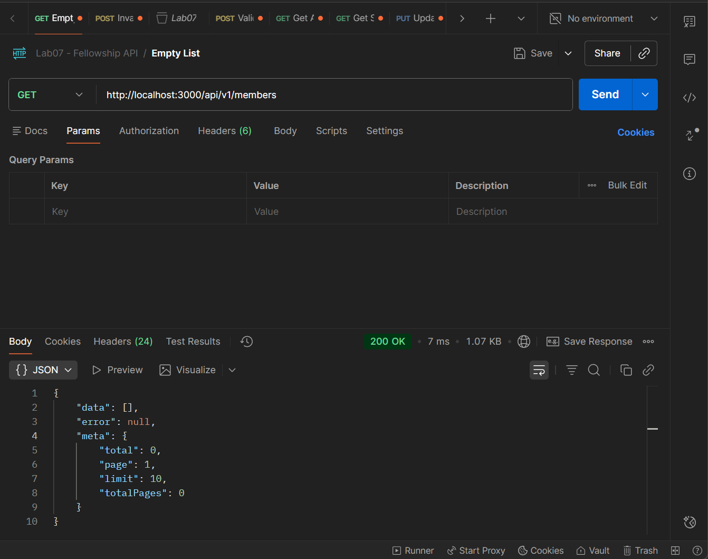
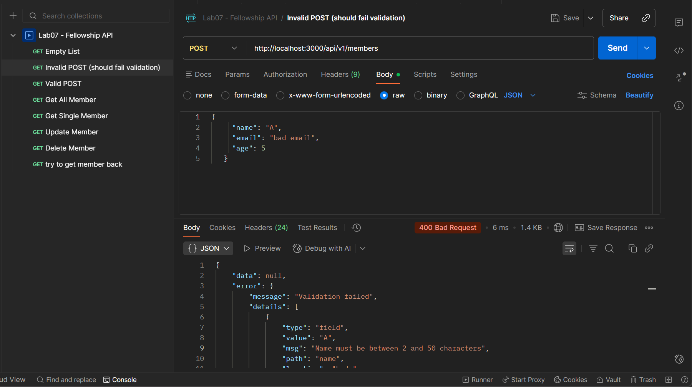
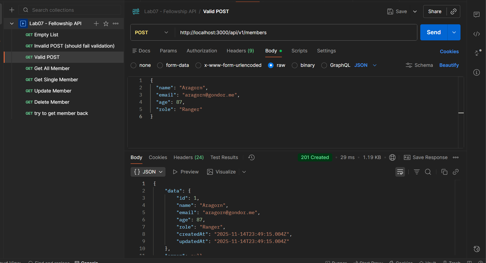
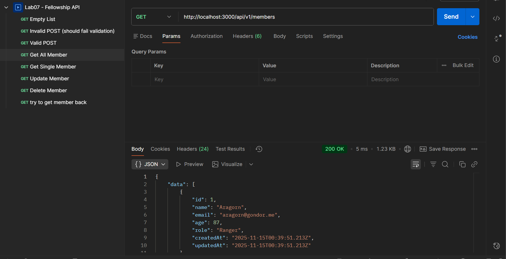
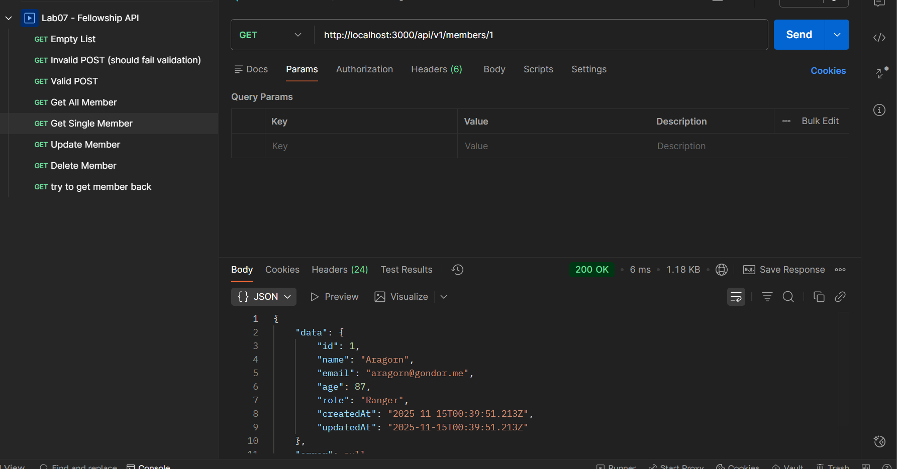
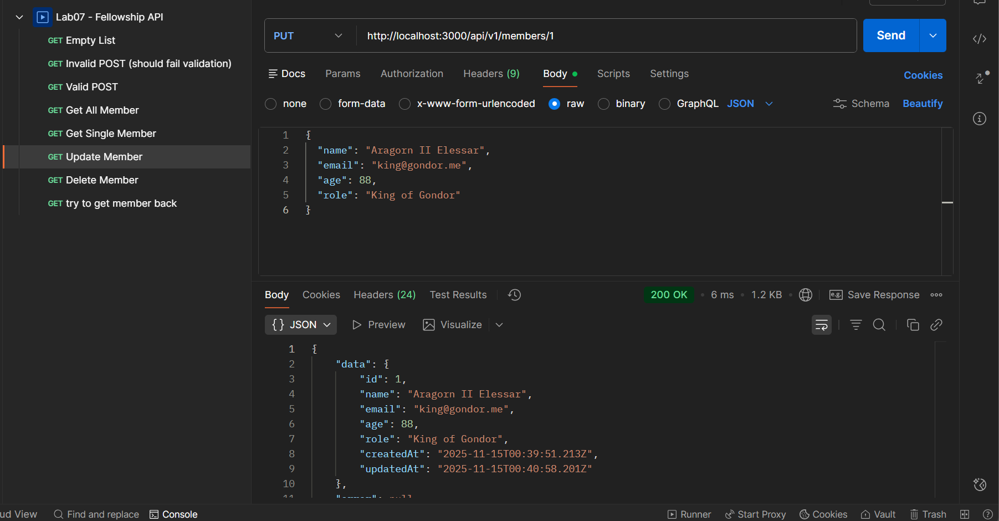
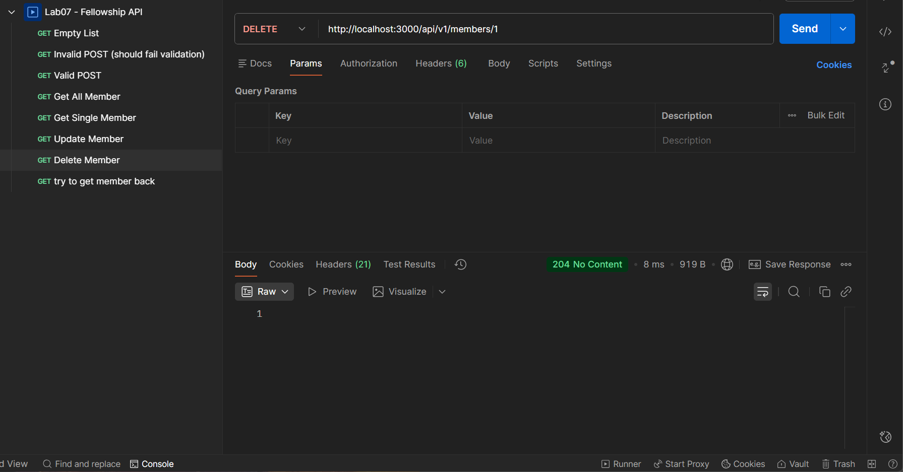
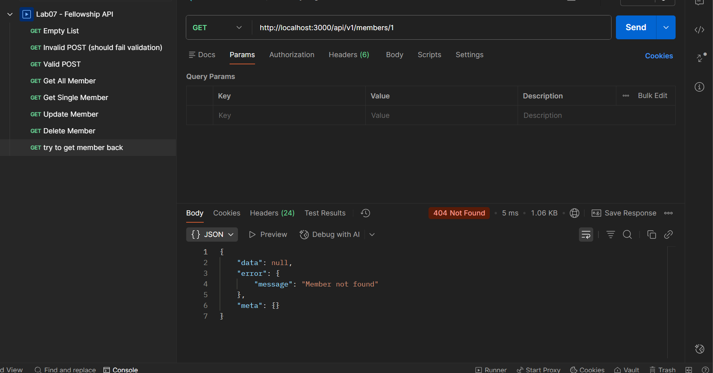

# Lab Submission Template
## Title: Lab 07
- **Name**: Gurmandeep Deol
- **Student ID**: 104120233
- **Date**: 11-14-2025
---
## Table of Contents
1. [Introduction](#introduction)
2. [VM Configuration Details](#vm-configuration-details)
3. [Code Block Deliverables](#code-block-deliverables)
4. [Screenshots Deliverables](#screenshots-deliverables)
5. [Experience and Challenges](#experience-and-challenges)
---
## Introduction
**In this lab I built a restful api using express.js for managing fellowship members in the middle-earth themed registry systems**
## Objectives
**1.1. Install and initialize an Express project with environment config via dotenv.**  

**1.2. Structure a production‑shaped API using routers and controllers under a versioned base path /api/v1.**  

**1.3. Implement CRUD routes for a members resource (Fellowship registrants) with route params and query.**  

**1.4. Apply core middleware in correct order: helmet, CORS, morgan (dev), express.json, express.urlencoded, and a custom logger.**  

**1.5. Enforce validation & sanitization with express-validator for POST/PUT bodies.**  

**1.6. Return consistent JSON response shape with proper HTTP status codes.**  

**1.7. Add centralized error handling and a 404 handler that use the standard response shape.**  

**1.8. Enable CORS and basic hardening with helmet + simple rate limiting.**  

**1.9. Support filtering/sorting/pagination via query parameters for list endpoints.**  
---
## VM Configuration Details
**OS: Windows 11 Editor: VS Code Terminal: Command Prompt**
## Code Block Deliverables
### Deliverable 1: .env
```env
PORT=3000
NODE_ENV=development
```
### Deliverable 2: .env.example
```env
PORT=
NODE_ENV=
```
### Deliverable 3: package.json
```json
{
  "name": "lab07",
  "version": "1.0.0",
  "description": "Fellowship Registry API",
  "main": "src/server.js",
  "scripts": {
    "start": "node src/server.js",
    "dev": "nodemon src/server.js"
  },
  "keywords": [],
  "author": "",
  "license": "ISC",
  "dependencies": {
    "cors": "^2.8.5",
    "dotenv": "^16.4.7",
    "express": "^4.21.2",
    "express-rate-limit": "^7.5.0",
    "express-validator": "^7.2.1",
    "helmet": "^8.0.0",
    "morgan": "^1.10.0"
  },
  "devDependencies": {
    "nodemon": "^3.1.9"
  }
}
```
### Deliverable 4: app.js
```js
// App configuration - builds and configures Express app (no listen here)

require('dotenv').config();
const express = require('express');
const helmet = require('helmet');
const cors = require('cors');
const morgan = require('morgan');
const rateLimit = require('express-rate-limit');

// Import middleware
const logger = require('./middlewares/logger');
const errorHandler = require('./middlewares/errorHandler');
const { fail } = require('./utils/responses');

// Import routes
const membersRoutes = require('./routes/members.routes');

// Initialize app
const app = express();

// 1. Helmet - security headers
app.use(helmet());

// 2. CORS - cross-origin resource sharing
app.use(cors({
  origin: true,
  credentials: true
}));

// 3. Morgan - HTTP request logger (only in development)
if (process.env.NODE_ENV !== 'production') {
  app.use(morgan('dev'));
}

// 4. Body parsers
app.use(express.json());
app.use(express.urlencoded({ extended: true }));

// 5. Custom logger
app.use(logger);

// Rate limiting for API routes
const apiLimiter = rateLimit({
  windowMs: 1 * 60 * 1000, // 15 minutes
  max: 5, // limit each IP to 100 requests per windowMs
  standardHeaders: true,
  legacyHeaders: false,
  handler: (req, res) => {
    res.status(429).json(fail('Too many requests, please try again later.', null, {
      retryAfter: req.rateLimit.resetTime
    }));
  }
});

// Apply rate limiter to all API routes
app.use('/api/', apiLimiter);

// Mount routers at /api/v1
app.use('/api/v1/members', membersRoutes);

// Health check endpoint
app.get('/health', (req, res) => {
  res.status(200).json({ status: 'ok', timestamp: new Date().toISOString() });
});

// 404 handler - must be after all other routes
app.use((req, res) => {
  res.status(404).json(fail('Route not found', null, {
    path: req.path,
    method: req.method
  }));
});

// Centralized error handler - must be last
app.use(errorHandler);

module.exports = app;
```
### Deliverable 5: server.js
```js
// Server entry point - imports app and starts the server

require('dotenv').config();
const app = require('./app');

// Get PORT from environment with fallback
const PORT = process.env.PORT || 3000;

// Start server
app.listen(PORT, () => {
  console.log('\n🚀 Fellowship Registry API Server Started!');
  console.log(`━━━━━━━━━━━━━━━━━━━━━━━━━━━━━━━━━━━━━━━`);
  console.log(`📍 Server running on: http://localhost:${PORT}`);
  console.log(`🔗 API Base URL: http://localhost:${PORT}/api/v1`);
  console.log(`🌍 Environment: ${process.env.NODE_ENV || 'development'}`);
  console.log(`━━━━━━━━━━━━━━━━━━━━━━━━━━━━━━━━━━━━━━━\n`);
  console.log('Available endpoints:');
  console.log(`  GET    /api/v1/members          - List all members`);
  console.log(`  GET    /api/v1/members/:id      - Get member by ID`);
  console.log(`  POST   /api/v1/members          - Create new member`);
  console.log(`  PUT    /api/v1/members/:id      - Update member`);
  console.log(`  DELETE /api/v1/members/:id      - Delete member`);
  console.log(`  GET    /health                  - Health check\n`);
});
```
### Deliverable 6: members.controller.js
```js
// Members Controller - handles all CRUD operations for Fellowship members

const fs = require('fs').promises;
const path = require('path');
const { validationResult } = require('express-validator');
const { ok, fail } = require('../utils/responses');

const DATA_FILE = path.join(__dirname, '../data/members.json');

// Helper: Read members from JSON file
const readMembers = async () => {
  try {
    const data = await fs.readFile(DATA_FILE, 'utf8');
    return JSON.parse(data);
  } catch (error) {
    return [];
  }
};

// Helper: Write members to JSON file
const writeMembers = async (members) => {
  await fs.writeFile(DATA_FILE, JSON.stringify(members, null, 2), 'utf8');
};

// Helper: Generate simple ID
const generateId = (members) => {
  if (members.length === 0) return 1;
  return Math.max(...members.map(m => m.id)) + 1;
};

// GET /api/v1/members - List all members (with filtering, sorting, pagination)
exports.listMembers = async (req, res, next) => {
  try {
    let members = await readMembers();
    
    // Filtering
    const { role, minAge, maxAge } = req.query;
    
    if (role) {
      members = members.filter(m => m.role && m.role.toLowerCase() === role.toLowerCase());
    }
    
    if (minAge) {
      const min = parseInt(minAge);
      members = members.filter(m => m.age >= min);
    }
    
    if (maxAge) {
      const max = parseInt(maxAge);
      members = members.filter(m => m.age <= max);
    }
    
    // Sorting
    const { sort = 'createdAt', order = 'asc' } = req.query;
    const validSortFields = ['name', 'createdAt'];
    const sortField = validSortFields.includes(sort) ? sort : 'createdAt';
    const sortOrder = order.toLowerCase() === 'desc' ? -1 : 1;
    
    members.sort((a, b) => {
      if (a[sortField] < b[sortField]) return -1 * sortOrder;
      if (a[sortField] > b[sortField]) return 1 * sortOrder;
      return 0;
    });
    
    // Pagination
    const page = parseInt(req.query.page) || 1;
    const limit = Math.min(parseInt(req.query.limit) || 10, 50);
    const startIndex = (page - 1) * limit;
    const endIndex = startIndex + limit;
    
    const total = members.length;
    const paginatedMembers = members.slice(startIndex, endIndex);
    
    res.status(200).json(ok(paginatedMembers, {
      total,
      page,
      limit,
      totalPages: Math.ceil(total / limit)
    }));
  } catch (error) {
    next(error);
  }
};

// GET /api/v1/members/:id - Get single member
exports.getMember = async (req, res, next) => {
  try {
    const members = await readMembers();
    const id = parseInt(req.params.id);
    const member = members.find(m => m.id === id);
    
    if (!member) {
      return res.status(404).json(fail('Member not found'));
    }
    
    res.status(200).json(ok(member));
  } catch (error) {
    next(error);
  }
};

// POST /api/v1/members - Create new member
exports.createMember = async (req, res, next) => {
  try {
    // Check validation results
    const errors = validationResult(req);
    if (!errors.isEmpty()) {
      return res.status(400).json(fail('Validation failed', errors.array()));
    }
    
    const members = await readMembers();
    const { name, email, age, role } = req.body;
    
    const newMember = {
      id: generateId(members),
      name,
      email,
      age: parseInt(age),
      role: role || 'Member',
      createdAt: new Date().toISOString(),
      updatedAt: new Date().toISOString()
    };
    
    members.push(newMember);
    await writeMembers(members);
    
    res.status(201).json(ok(newMember));
  } catch (error) {
    next(error);
  }
};

// PUT /api/v1/members/:id - Update member (full replacement)
exports.updateMember = async (req, res, next) => {
  try {
    // Check validation results
    const errors = validationResult(req);
    if (!errors.isEmpty()) {
      return res.status(400).json(fail('Validation failed', errors.array()));
    }
    
    const members = await readMembers();
    const id = parseInt(req.params.id);
    const index = members.findIndex(m => m.id === id);
    
    if (index === -1) {
      return res.status(404).json(fail('Member not found'));
    }
    
    const { name, email, age, role } = req.body;
    
    // Full replacement - keep id and createdAt
    members[index] = {
      id,
      name,
      email,
      age: parseInt(age),
      role: role || 'Member',
      createdAt: members[index].createdAt,
      updatedAt: new Date().toISOString()
    };
    
    await writeMembers(members);
    
    res.status(200).json(ok(members[index]));
  } catch (error) {
    next(error);
  }
};

// DELETE /api/v1/members/:id - Delete member
exports.deleteMember = async (req, res, next) => {
  try {
    const members = await readMembers();
    const id = parseInt(req.params.id);
    const index = members.findIndex(m => m.id === id);
    
    if (index === -1) {
      return res.status(404).json(fail('Member not found'));
    }
    
    members.splice(index, 1);
    await writeMembers(members);
    
    // Return 204 No Content (preferred) - no body
    res.status(204).send();
  } catch (error) {
    next(error);
  }
};
```
### Deliverable 7: members.json
```json
[]
```
### Deliverable 8: errorHandler.js
```js
// Centralized error handling middleware

const { fail } = require('../utils/responses');

const errorHandler = (err, req, res, next) => {
  // Log full error details to console (for debugging)
  console.error('Error occurred:', {
    message: err.message,
    stack: process.env.NODE_ENV !== 'production' ? err.stack : 'Stack trace hidden in production',
    requestId: req.id,
    path: req.path,
    method: req.method
  });

  // Determine status code
  const statusCode = err.statusCode || 500;
  
  // Prepare error message
  const message = err.message || 'Internal Server Error';
  
  // In production, mask internal errors
  const safeMessage = process.env.NODE_ENV === 'production' && statusCode === 500 
    ? 'Internal Server Error' 
    : message;

  // Send response using standard shape
  res.status(statusCode).json(fail(safeMessage, err.details || null, { requestId: req.id }));
};

module.exports = errorHandler;
```
### Deliverable 10: logger.js
```js
// Custom logger middleware - attaches request ID and logs incoming requests

const logger = (req, res, next) => {
  // Attach unique request ID (timestamp + random)
  req.id = `${Date.now()}-${Math.random().toString(36).substr(2, 9)}`;
  
  // Log request details
  console.log(`[${new Date().toISOString()}] ${req.method} ${req.path} | Request ID: ${req.id}`);
  
  next();
};

module.exports = logger;
```
### Deliverable 10: members.routes.js
```js
// Members Routes - defines all endpoints for the members resource

const express = require('express');
const router = express.Router();
const { body } = require('express-validator');
const membersController = require('../controllers/members.controller');

// Validation rules for POST and PUT
const memberValidation = [
  body('name')
    .trim()
    .isLength({ min: 2, max: 50 })
    .withMessage('Name must be between 2 and 50 characters')
    .escape(),
  body('email')
    .trim()
    .isEmail()
    .withMessage('Must be a valid email address')
    .normalizeEmail(),
  body('age')
    .isInt({ min: 13, max: 999 })
    .withMessage('Age must be an integer between 13 and 999')
    .toInt(),
  body('role')
    .optional()
    .trim()
    .isLength({ min: 2, max: 50 })
    .withMessage('Role must be between 2 and 50 characters if provided')
    .escape()
];

// Routes
router.get('/', membersController.listMembers);
router.get('/:id', membersController.getMember);
router.post('/', memberValidation, membersController.createMember);
router.put('/:id', memberValidation, membersController.updateMember);
router.delete('/:id', membersController.deleteMember);

module.exports = router;
```
### Deliverable 11: responses.js
```js
// Standard response shape: { data, error, meta }

const ok = (data, meta = {}) => ({
  data,
  error: null,
  meta
});

const fail = (message, details = null, meta = {}) => ({
  data: null,
  error: {
    message,
    ...(details ? { details } : {})
  },
  meta
});

module.exports = { ok, fail };
```
---
## Screenshots Deliverables
### Deliverable 1: GET returns an empty list


### Deliverable 2: Invalid POST request fails


### Deliverable 3: Valid POST request succeeds


### Deliverable 4: GET all members


### Deliverable 5: GET a single member


### Deliverable 6: Update member works


### Deliverable 7: Delete member succeeds


### Deliverable 7: Trying to get deleted member fails

---
## Experience and Challenges
### Reflection on Completing the Lab
**What did you learn?** **This lab was really fun I learned how API's are built the biggest thing I learned how important the middleware order is helmet has to come first for security than cors than the body parsers before your routes i also understand why app.js is separate from server.js because it makes testing easier**

**I also learned about proper rest api designs like using the correct status codes such as (200,201,204,404,429)**

## Challenges Faced 
- **The first challenge was getting postman to work properly I kept just putting the request in thinking why its not working I didn't realize I also had to use the headers tab and body tab separately**

- **The second challenge was that I had to figure out how to rate limit because initially i had it set to 100 requests per 15 minutes that would take too long i would have to request 100 times instead I figured out I could temporality edit the requests to 5 requests per minute which made testing very easier**