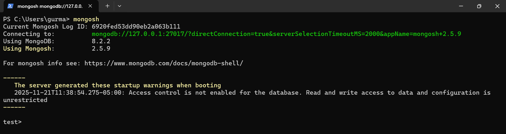
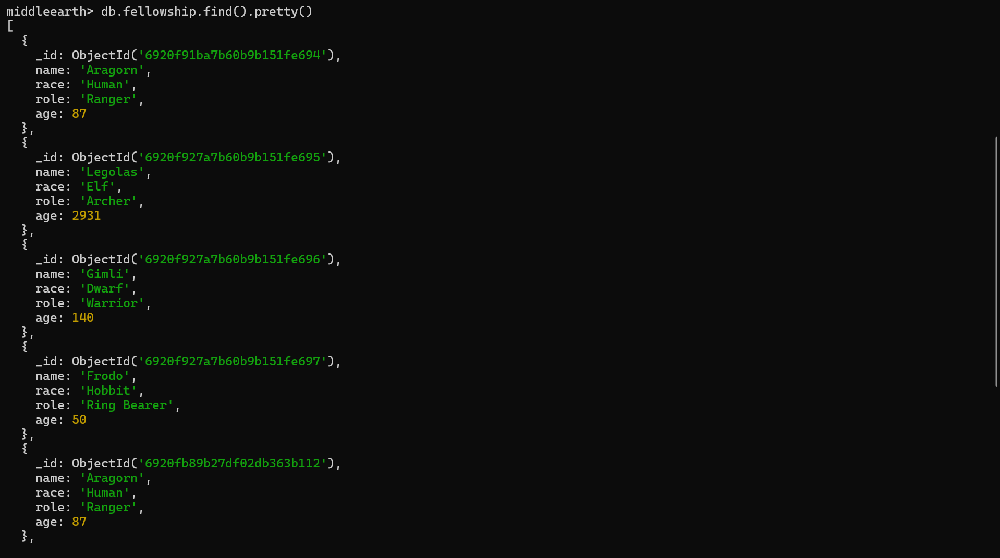
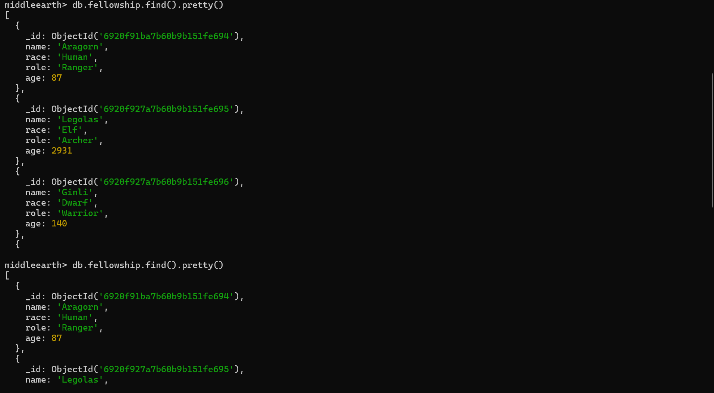
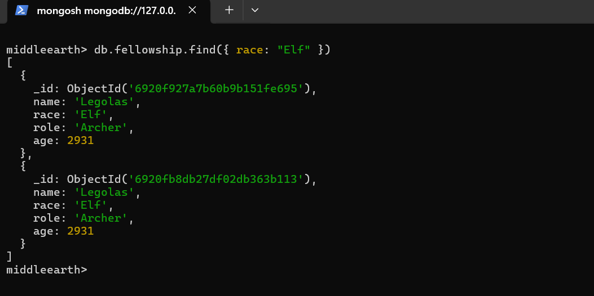
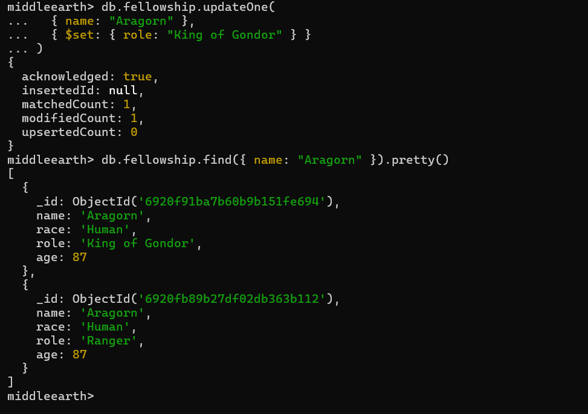
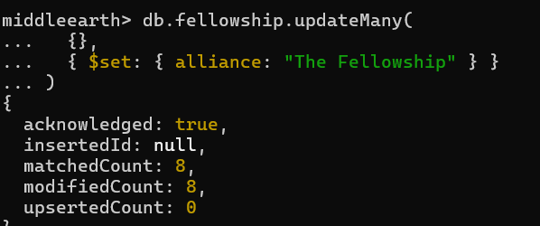
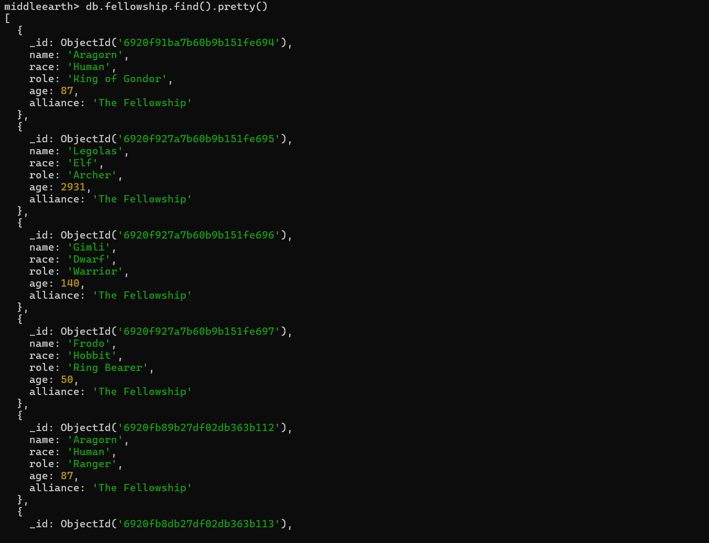
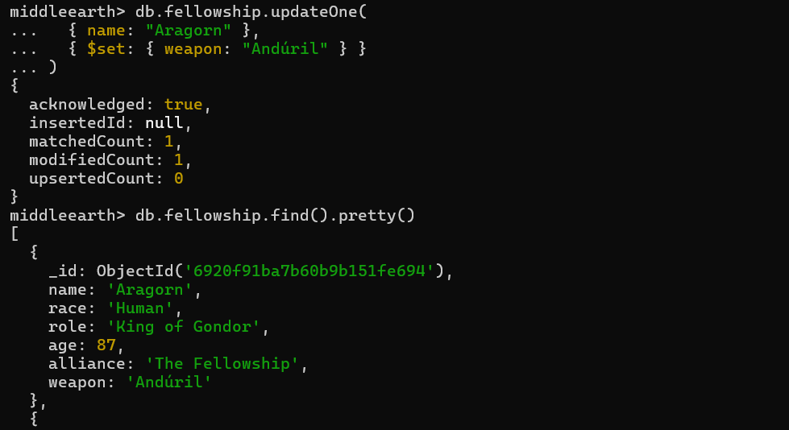
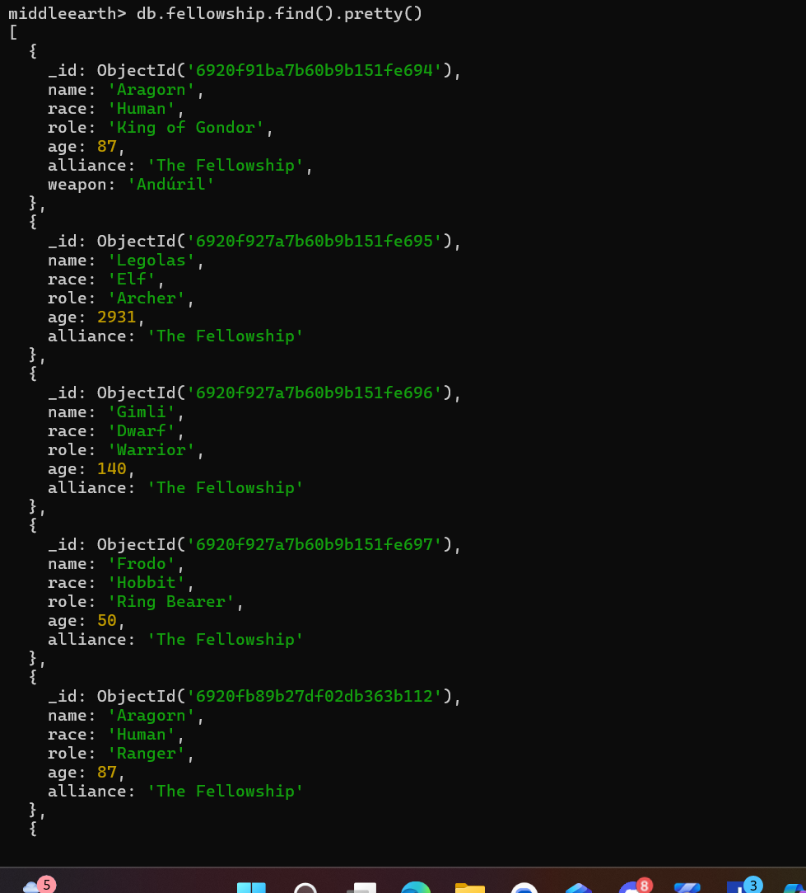

# Lab Submission Template
## Title: Lab 08
- **Name**: **Gurmandeep Deol**
- **Student ID**: **104120233**
- **Date**: **11-21-2025**
---
## Table of Contents
1. [Introduction](#introduction)
2. [VM Configuration Details](#vm-configuration-details)
3. [Command Outputs](#command-outputs)
4. [Screenshots-Deliverables](#screenshots-deliverables)
5. [Experience and Challenges](#experience-and-challenges)
---
## Introduction
**In this lab I installed MongoDB Community server locally and created a database for the middle-earth fellowship and perfomed curd operations using the mongoshell**
## VM Configuration Details
**OS: Windows 11 Editor:VS Code**
## Command Outputs
### Command 1: Switch to middleearth database
```bash
use middleearth
```

### Command 2: Create fellowship collection
```bash
db.createCollection("fellowship")
```

### Command 3: Insert Aragorn
```bash
db.fellowship.insertOne({ name: "Aragorn", race: "Human", role: "Ranger", age: 87 })
```

### Command 4: Insert multiple fellowship members
```bash
db.fellowship.insertMany([
  { name: "Legolas", race: "Elf", role: "Archer", age: 2931 },
  { name: "Gimli", race: "Dwarf", role: "Warrior", age: 140 },
  { name: "Frodo", race: "Hobbit", role: "Ring Bearer", age: 50 }
])
```

### Command 5: Find all documents
```bash
db.fellowship.find().pretty()
```

### Command 6: Find Elves only
```bash
db.fellowship.find({ race: "Elf" })
```

### Command 7: Update Aragorn's role
```bash
db.fellowship.updateOne(
  { name: "Aragorn" },
  { $set: { role: "King of Gondor" } }
)
```

### Command 8: Add alliance field to all members
```bash
db.fellowship.updateMany(
  {},
  { $set: { alliance: "The Fellowship" } }
)
```

### Command 9: Delete Boromir
```bash
db.fellowship.deleteOne({ name: "Boromir" })
```

### Command 10: Add weapon field to Aragorn
```bash
db.fellowship.updateOne(
  { name: "Aragorn" },
  { $set: { weapon: "Andúril" } }
)
```
## Screenshots Deliverables

### Deliverable 1: MongoDB Server Running


### Deliverable 2: ID Verified


### Deliverable 3: Find All Documents


### Deliverable 4: Filter


### Deliverable 5: Updated Document


### Deliverable 6: Updated Many Documents


### Deliverable 7: Verify Updated Many


### Deliverable 8: Deleted Document


### Deliverable 9: Add Custom Field


### Deliverable 10: Find All End

---
## Experience and Challenges
### Reflection on Completing the Lab
- **What did you learn?** 
**I learned how to install and configure MongoDB locally and how to use the Mongo Shell to perform CRUD operations and work with document databases.**
- **Challenges Faced**: 
**Initially had trouble connecting to mongo db the service was not running and cmd prompt would not detect it** 
**Initially my syntax was wrong it would not work**
- **How You Overcame Challenges**: 
**I went to the folder with mongodb installed and started mongoDB from there than everything was fine**
**I searched up the correct syntax**