# Lab Submission Template
## Title: Lab 09
- **Name**: Gurmandeep Deol
- **Student ID**: 104120233
- **Date**: 11-27-2025
---
## Table of Contents
1. [Introduction](#introduction)
2. [VM Configuration Details](#vm-configuration-details)
3. [Code Block Deliverables](#code-block-deliverables)
4. [Screenshot Deliverables](#screenshots-deliverables)
5. [Experience and Challenges](#experience-and-challenges)
---
## Introduction
**In this lab I built a full-stack web development by integrating express.js with mongodb and a front end**  
## Objectives
- Connect your Express API to a real MongoDB database using Mongoose.
- Replace JSON‑file persistence from Lab07 with a proper MongoDB collection.
- Implement DTO‑style validation at the API boundary and enforce schema rules in Mongoose.
- Expose RESTful CRUD endpoints under /api/v1 and return a consistent response shape.
- Build a simple frontend (served by Express) that uses fetch() to call your API, with live DOM updates (no full page reload).
- Configure CORS, environment variables, and proper middleware order for a production‑shaped app.
- Test endpoints with Postman and verify data in MongoDB Compass.
---
## VM Configuration Details
**OS: Windows 10 Editor: VS Code**

## Code Block Deliverables
### Deliverable 1: app.js
```js
require('dotenv').config();
const express = require('express');
const helmet = require('helmet');
const cors = require('cors');
const morgan = require('morgan');
const path = require('path');
const logger = require('./middlewares/logger');
const errorHandler = require('./middlewares/errorHandler');
const { fail } = require('./utils/responses');

const app = express();

// Security middleware
app.use(helmet());

// CORS configuration
app.use(cors({
  origin: true,
  credentials: true
}));

// Logging middleware (development only)
if (process.env.NODE_ENV !== 'production') {
  app.use(morgan('dev'));
}

// Body parsing middleware
app.use(express.json());
app.use(express.urlencoded({ extended: true }));

// Custom logger
app.use(logger);

// Serve static files
app.use(express.static(path.join(__dirname, 'public')));

// API Routes
app.use('/api/v1/members', require('./routes/members.routes'));

// 404 handler
app.use((req, res) => {
  res.status(404).json(fail('Route not found'));
});

// Centralized error handler
app.use(errorHandler);

module.exports = app;
```
### Deliverable 2: server.js
```js
require('dotenv').config();
const app = require('./app');
const connectDB = require('./config/db');

const PORT = process.env.PORT || 3000;

// Connect to database then start server
const startServer = async () => {
  try {
    await connectDB();
    
    app.listen(PORT, () => {
      console.log(`🚀 Server running on port ${PORT}`);
      console.log(`📍 Environment: ${process.env.NODE_ENV}`);
      console.log(`🔗 Base API: http://localhost:${PORT}/api/v1`);
      console.log(`🌐 Frontend: http://localhost:${PORT}`);
    });
  } catch (error) {
    console.error('Failed to start server:', error);
    process.exit(1);
  }
};

startServer();
```
### Deliverable 3: db.js
```js
const mongoose = require('mongoose');

const connectDB = async () => {
  try {
    const conn = await mongoose.connect(process.env.MONGO_URI);
    console.log(`✅ MongoDB Connected: ${conn.connection.host}`);
    console.log(`📊 Database: ${conn.connection.name}`);
  } catch (error) {
    console.error('❌ MongoDB Connection Error:', error.message);
    process.exit(1);
  }
};

module.exports = connectDB;
```
### Deliverable 4: members.controller.js
```js
const Member = require('../models/member.model');
const { ok, fail } = require('../utils/responses');
const { validationResult } = require('express-validator');

// GET /api/v1/members - List all members with optional filters
exports.getAllMembers = async (req, res, next) => {
  try {
    const { page = 1, limit = 10, sort = 'createdAt', order = 'desc', role, minAge, maxAge } = req.query;

    // Build filter
    const filter = {};
    if (role) filter.role = role;
    if (minAge || maxAge) {
      filter.age = {};
      if (minAge) filter.age.$gte = parseInt(minAge);
      if (maxAge) filter.age.$lte = parseInt(maxAge);
    }

    // Calculate pagination
    const pageNum = parseInt(page);
    const limitNum = Math.min(parseInt(limit), 50); // Max 50 items
    const skip = (pageNum - 1) * limitNum;

    // Build sort
    const sortOrder = order === 'asc' ? 1 : -1;
    const sortObj = { [sort]: sortOrder };

    // Execute query
    const members = await Member.find(filter)
      .sort(sortObj)
      .limit(limitNum)
      .skip(skip);

    const total = await Member.countDocuments(filter);

    res.status(200).json(ok(members, {
      total,
      page: pageNum,
      limit: limitNum,
      pages: Math.ceil(total / limitNum)
    }));
  } catch (error) {
    next(error);
  }
};

// GET /api/v1/members/:id - Get single member
exports.getMemberById = async (req, res, next) => {
  try {
    const member = await Member.findById(req.params.id);
    
    if (!member) {
      return res.status(404).json(fail('Member not found'));
    }

    res.status(200).json(ok(member));
  } catch (error) {
    next(error);
  }
};

// POST /api/v1/members - Create new member
exports.createMember = async (req, res, next) => {
  try {
    // Check validation results
    const errors = validationResult(req);
    if (!errors.isEmpty()) {
      return res.status(400).json(fail('Validation failed', errors.array()));
    }

    const member = await Member.create(req.body);
    res.status(201).json(ok(member));
  } catch (error) {
    next(error);
  }
};

// PUT /api/v1/members/:id - Update member (full replacement)
exports.updateMember = async (req, res, next) => {
  try {
    // Check validation results
    const errors = validationResult(req);
    if (!errors.isEmpty()) {
      return res.status(400).json(fail('Validation failed', errors.array()));
    }

    const member = await Member.findByIdAndUpdate(
      req.params.id,
      req.body,
      { new: true, runValidators: true }
    );

    if (!member) {
      return res.status(404).json(fail('Member not found'));
    }

    res.status(200).json(ok(member));
  } catch (error) {
    next(error);
  }
};

// DELETE /api/v1/members/:id - Delete member
exports.deleteMember = async (req, res, next) => {
  try {
    const member = await Member.findByIdAndDelete(req.params.id);

    if (!member) {
      return res.status(404).json(fail('Member not found'));
    }

    res.status(204).send();
  } catch (error) {
    next(error);
  }
};
```
### Deliverable 5: errorHandler.js
```js
const { fail } = require('../utils/responses');

const errorHandler = (err, req, res, next) => {
  console.error('Error:', err);

  // Mongoose validation error
  if (err.name === 'ValidationError') {
    const details = Object.values(err.errors).map(e => ({
      field: e.path,
      message: e.message
    }));
    return res.status(400).json(fail('Validation failed', details));
  }

  // Mongoose duplicate key error
  if (err.code === 11000) {
    const field = Object.keys(err.keyPattern)[0];
    return res.status(409).json(fail(`${field} already exists`));
  }

  // Mongoose cast error (invalid ID)
  if (err.name === 'CastError') {
    return res.status(400).json(fail('Invalid ID format'));
  }

  // Default server error
  const isDev = process.env.NODE_ENV !== 'production';
  res.status(err.status || 500).json(
    fail(
      err.message || 'Internal server error',
      isDev ? err.stack : null
    )
  );
};

module.exports = errorHandler;
```
### Deliverable 6: logger.js
```js
const logger = (req, res, next) => {
  const timestamp = new Date().toISOString();
  req.id = `${Date.now()}-${Math.random().toString(36).substr(2, 9)}`;
  console.log(`[${timestamp}] [${req.id}] ${req.method} ${req.path}`);
  next();
};

module.exports = logger;
```
### Deliverable 7: member.model.js
```js
const mongoose = require('mongoose');

const memberSchema = new mongoose.Schema({
  name: {
    type: String,
    required: [true, 'Name is required'],
    minlength: [2, 'Name must be at least 2 characters'],
    maxlength: [50, 'Name cannot exceed 50 characters'],
    trim: true
  },
  email: {
    type: String,
    required: [true, 'Email is required'],
    unique: true,
    lowercase: true,
    trim: true,
    match: [/.+@.+\..+/, 'Please provide a valid email']
  },
  age: {
    type: Number,
    required: [true, 'Age is required'],
    min: [13, 'Age must be at least 13'],
    max: [999, 'Age cannot exceed 999']
  },
  role: {
    type: String,
    enum: {
      values: ['Ranger', 'Archer', 'Warrior', 'Hobbit', 'Wizard', 'Dwarf'],
      message: '{VALUE} is not a valid role'
    },
    default: 'Ranger'
  }
}, {
  timestamps: true
});

// Transform output to remove __v and normalize _id to id
memberSchema.set('toJSON', {
  transform: (doc, ret) => {
    ret.id = ret._id;
    delete ret._id;
    delete ret.__v;
    return ret;
  }
});

// Create index on email
memberSchema.index({ email: 1 });

module.exports = mongoose.model('Member', memberSchema);
```
### Deliverable 8: app.js
```js
// API Base URL
const API_BASE = '/api/v1/members';

// State
let editingId = null;

// DOM Elements
const memberForm = document.getElementById('memberForm');
const submitBtn = document.getElementById('submitBtn');
const cancelBtn = document.getElementById('cancelBtn');
const membersList = document.getElementById('membersList');
const messageDiv = document.getElementById('message');
const loadingDiv = document.getElementById('loading');

// Initialize
document.addEventListener('DOMContentLoaded', () => {
  loadMembers();
  memberForm.addEventListener('submit', handleSubmit);
  cancelBtn.addEventListener('click', cancelEdit);
  
  // Event delegation for edit and delete buttons
  membersList.addEventListener('click', (e) => {
    if (e.target.classList.contains('btn-edit')) {
      const id = e.target.closest('.member-card').dataset.id;
      editMember(id);
    } else if (e.target.classList.contains('btn-delete')) {
      const id = e.target.closest('.member-card').dataset.id;
      deleteMember(id);
    }
  });
});

// Show message to user
function showMessage(text, type = 'success') {
  messageDiv.textContent = text;
  messageDiv.className = `message ${type}`;
  messageDiv.classList.remove('hidden');
  
  setTimeout(() => {
    messageDiv.classList.add('hidden');
  }, 5000);
}

// Show/hide loading
function setLoading(isLoading) {
  if (isLoading) {
    loadingDiv.classList.remove('hidden');
    membersList.innerHTML = '';
  } else {
    loadingDiv.classList.add('hidden');
  }
}

// Load all members
async function loadMembers() {
  try {
    setLoading(true);
    const response = await fetch(API_BASE);
    const result = await response.json();
    
    if (!response.ok) {
      throw new Error(result.error?.message || 'Failed to load members');
    }
    
    displayMembers(result.data);
  } catch (error) {
    showMessage(error.message, 'error');
    membersList.innerHTML = '<div class="empty-state"><p>Failed to load members</p></div>';
  } finally {
    setLoading(false);
  }
}

// Display members in DOM
function displayMembers(members) {
  if (!members || members.length === 0) {
    membersList.innerHTML = `
      <div class="empty-state">
        <p>No members yet</p>
        <p style="font-size: 0.9rem; color: #aaa;">Add your first Fellowship member above!</p>
      </div>
    `;
    return;
  }
  
  membersList.innerHTML = members.map(member => `
    <div class="member-card" data-id="${member.id}">
      <div class="member-header">
        <div class="member-info">
          <h3>${escapeHtml(member.name)}</h3>
          <span class="member-role">${member.role}</span>
        </div>
        <div class="member-actions">
          <button class="btn-edit">Edit</button>
          <button class="btn-delete">Delete</button>
        </div>
      </div>
      <div class="member-details">
        <p><strong>Email:</strong> ${escapeHtml(member.email)}</p>
        <p><strong>Age:</strong> ${member.age}</p>
        <p><strong>Joined:</strong> ${new Date(member.createdAt).toLocaleDateString()}</p>
      </div>
    </div>
  `).join('');
}

// Handle form submission (create or update)
async function handleSubmit(e) {
  e.preventDefault();
  
  const formData = new FormData(memberForm);
  const data = {
    name: formData.get('name'),
    email: formData.get('email'),
    age: parseInt(formData.get('age')),
    role: formData.get('role')
  };
  
  try {
    submitBtn.disabled = true;
    submitBtn.textContent = editingId ? 'Updating...' : 'Adding...';
    
    const url = editingId ? `${API_BASE}/${editingId}` : API_BASE;
    const method = editingId ? 'PUT' : 'POST';
    
    const response = await fetch(url, {
      method,
      headers: {
        'Content-Type': 'application/json'
      },
      body: JSON.stringify(data)
    });
    
    const result = await response.json();
    
    if (!response.ok) {
      const errorMsg = result.error?.details 
        ? result.error.details.map(d => d.msg || d.message).join(', ')
        : result.error?.message || 'Operation failed';
      throw new Error(errorMsg);
    }
    
    showMessage(
      editingId ? 'Member updated successfully!' : 'Member added successfully!',
      'success'
    );
    
    memberForm.reset();
    cancelEdit();
    loadMembers();
    
  } catch (error) {
    showMessage(error.message, 'error');
  } finally {
    submitBtn.disabled = false;
    submitBtn.textContent = editingId ? 'Update Member' : 'Add Member';
  }
}

// Edit member
async function editMember(id) {
  try {
    const response = await fetch(`${API_BASE}/${id}`);
    const result = await response.json();
    
    if (!response.ok) {
      throw new Error(result.error?.message || 'Failed to load member');
    }
    
    const member = result.data;
    
    // Populate form
    document.getElementById('name').value = member.name;
    document.getElementById('email').value = member.email;
    document.getElementById('age').value = member.age;
    document.getElementById('role').value = member.role;
    
    // Update UI state
    editingId = id;
    submitBtn.textContent = 'Update Member';
    cancelBtn.classList.remove('hidden');
    
    // Scroll to form
    window.scrollTo({ top: 0, behavior: 'smooth' });
    
  } catch (error) {
    showMessage(error.message, 'error');
  }
}

// Cancel edit mode
function cancelEdit() {
  editingId = null;
  memberForm.reset();
  submitBtn.textContent = 'Add Member';
  cancelBtn.classList.add('hidden');
}

// Delete member
async function deleteMember(id) {
  if (!confirm('Are you sure you want to remove this member from the Fellowship?')) {
    return;
  }
  
  try {
    const response = await fetch(`${API_BASE}/${id}`, {
      method: 'DELETE'
    });
    
    if (!response.ok && response.status !== 204) {
      const result = await response.json();
      throw new Error(result.error?.message || 'Failed to delete member');
    }
    
    showMessage('Member removed successfully!', 'success');
    loadMembers();
    
  } catch (error) {
    showMessage(error.message, 'error');
  }
}

// Escape HTML to prevent XSS
function escapeHtml(text) {
  const div = document.createElement('div');
  div.textContent = text;
  return div.innerHTML;
}
```
### Deliverable 9: index.html
```html
<!DOCTYPE html>
<html lang="en">
<head>
  <meta charset="UTF-8">
  <meta name="viewport" content="width=device-width, initial-scale=1.0">
  <title>Fellowship Registry - Middle-earth Legends</title>
  <link rel="stylesheet" href="styles.css">
</head>
<body>
  <div class="container">
    <header>
      <h1>⚔️ Fellowship Registry</h1>
      <p>Middle-earth Legends Database</p>
    </header>

    <!-- Message Area -->
    <div id="message" class="message hidden"></div>

    <!-- Add Member Form -->
    <section class="form-section">
      <h2>Add New Member</h2>
      <form id="memberForm">
        <div class="form-group">
          <label for="name">Name *</label>
          <input type="text" id="name" name="name" required minlength="2" maxlength="50">
        </div>

        <div class="form-group">
          <label for="email">Email *</label>
          <input type="email" id="email" name="email" required>
        </div>

        <div class="form-group">
          <label for="age">Age *</label>
          <input type="number" id="age" name="age" required min="13" max="999">
        </div>

        <div class="form-group">
          <label for="role">Role</label>
          <select id="role" name="role">
            <option value="Ranger">Ranger</option>
            <option value="Archer">Archer</option>
            <option value="Warrior">Warrior</option>
            <option value="Hobbit">Hobbit</option>
            <option value="Wizard">Wizard</option>
            <option value="Dwarf">Dwarf</option>
          </select>
        </div>

        <button type="submit" id="submitBtn">Add Member</button>
        <button type="button" id="cancelBtn" class="hidden">Cancel Edit</button>
      </form>
    </section>

    <!-- Members List -->
    <section class="list-section">
      <h2>Current Members</h2>
      <div id="loading" class="loading hidden">Loading...</div>
      <div id="membersList"></div>
    </section>
  </div>

  <script src="app.js"></script>
</body>
</html>
```
### Deliverable 10: styles.css
```css
* {
  margin: 0;
  padding: 0;
  box-sizing: border-box;
}

body {
  font-family: 'Segoe UI', Tahoma, Geneva, Verdana, sans-serif;
  background: linear-gradient(135deg, #667eea 0%, #764ba2 100%);
  min-height: 100vh;
  padding: 20px;
}

.container {
  max-width: 900px;
  margin: 0 auto;
  background: white;
  border-radius: 12px;
  box-shadow: 0 20px 60px rgba(0, 0, 0, 0.3);
  overflow: hidden;
}

header {
  background: linear-gradient(135deg, #667eea 0%, #764ba2 100%);
  color: white;
  padding: 30px;
  text-align: center;
}

header h1 {
  font-size: 2.5rem;
  margin-bottom: 10px;
}

header p {
  opacity: 0.9;
  font-size: 1.1rem;
}

.form-section, .list-section {
  padding: 30px;
}

.form-section {
  background: #f8f9fa;
  border-bottom: 2px solid #e9ecef;
}

h2 {
  color: #333;
  margin-bottom: 20px;
  font-size: 1.5rem;
}

.form-group {
  margin-bottom: 15px;
}

label {
  display: block;
  margin-bottom: 5px;
  color: #555;
  font-weight: 600;
}

input, select {
  width: 100%;
  padding: 12px;
  border: 2px solid #ddd;
  border-radius: 6px;
  font-size: 1rem;
  transition: border-color 0.3s;
}

input:focus, select:focus {
  outline: none;
  border-color: #667eea;
}

button {
  background: linear-gradient(135deg, #667eea 0%, #764ba2 100%);
  color: white;
  border: none;
  padding: 12px 24px;
  border-radius: 6px;
  cursor: pointer;
  font-size: 1rem;
  font-weight: 600;
  margin-right: 10px;
  transition: transform 0.2s, opacity 0.2s;
}

button:hover {
  transform: translateY(-2px);
  opacity: 0.9;
}

button:active {
  transform: translateY(0);
}

button:disabled {
  opacity: 0.5;
  cursor: not-allowed;
  transform: none;
}

#cancelBtn {
  background: #6c757d;
}

.message {
  margin: 20px 30px;
  padding: 15px;
  border-radius: 6px;
  font-weight: 500;
}

.message.success {
  background: #d4edda;
  color: #155724;
  border: 1px solid #c3e6cb;
}

.message.error {
  background: #f8d7da;
  color: #721c24;
  border: 1px solid #f5c6cb;
}

.hidden {
  display: none !important;
}

.loading {
  text-align: center;
  padding: 20px;
  color: #666;
  font-size: 1.1rem;
}

.member-card {
  background: white;
  border: 2px solid #e9ecef;
  border-radius: 8px;
  padding: 20px;
  margin-bottom: 15px;
  transition: box-shadow 0.3s, transform 0.3s;
}

.member-card:hover {
  box-shadow: 0 5px 15px rgba(0, 0, 0, 0.1);
  transform: translateY(-2px);
}

.member-header {
  display: flex;
  justify-content: space-between;
  align-items: start;
  margin-bottom: 10px;
}

.member-info h3 {
  color: #333;
  margin-bottom: 5px;
}

.member-role {
  display: inline-block;
  background: #667eea;
  color: white;
  padding: 4px 12px;
  border-radius: 12px;
  font-size: 0.85rem;
  font-weight: 600;
}

.member-details {
  color: #666;
  margin: 10px 0;
}

.member-details p {
  margin: 5px 0;
}

.member-actions {
  display: flex;
  gap: 10px;
}

.btn-edit {
  background: #ffc107;
  color: #000;
  padding: 8px 16px;
  font-size: 0.9rem;
}

.btn-delete {
  background: #dc3545;
  padding: 8px 16px;
  font-size: 0.9rem;
}

.empty-state {
  text-align: center;
  padding: 40px;
  color: #999;
}

.empty-state p {
  font-size: 1.2rem;
  margin-bottom: 10px;
}

@media (max-width: 600px) {
  header h1 {
    font-size: 1.8rem;
  }
  
  .member-header {
    flex-direction: column;
  }
  
  .member-actions {
    margin-top: 10px;
  }
}
```
### Deliverable 11: member.routes.js
```js
const express = require('express');
const router = express.Router();
const { body } = require('express-validator');
const {
  getAllMembers,
  getMemberById,
  createMember,
  updateMember,
  deleteMember
} = require('../controllers/members.controller');

// Validation rules
const memberValidation = [
  body('name')
    .trim()
    .isLength({ min: 2, max: 50 })
    .withMessage('Name must be between 2 and 50 characters'),
  body('email')
    .trim()
    .isEmail()
    .normalizeEmail()
    .withMessage('Must be a valid email'),
  body('age')
    .isInt({ min: 13, max: 999 })
    .withMessage('Age must be between 13 and 999'),
  body('role')
    .optional()
    .isIn(['Ranger', 'Archer', 'Warrior', 'Hobbit', 'Wizard', 'Dwarf'])
    .withMessage('Invalid role')
];

// Routes
router.get('/', getAllMembers);
router.get('/:id', getMemberById);
router.post('/', memberValidation, createMember);
router.put('/:id', memberValidation, updateMember);
router.delete('/:id', deleteMember);

module.exports = router;
### Deliverable 12: responses.js
const ok = (data, meta = {}) => ({
  data,
  error: null,
  meta
});

const fail = (message, details = null, meta = {}) => ({
  data: null,
  error: {
    message,
    ...(details ? { details } : {})
  },
  meta
});

module.exports = { ok, fail };
```
---
## Screenshots Deliverables
Deliverable 1: starting server
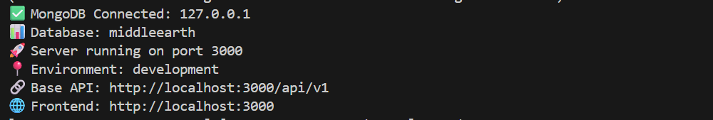

Deliverable 2: viewing mongodb compass
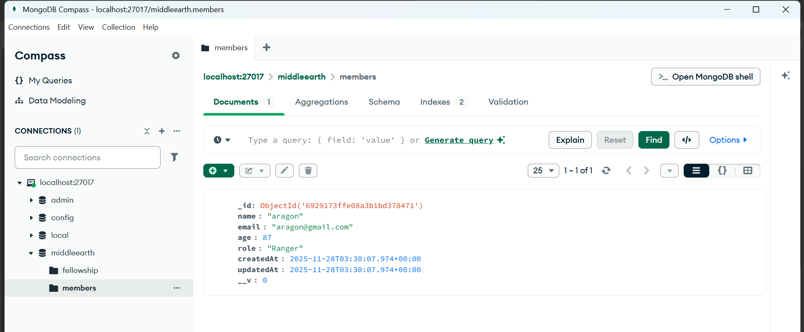

Deliverable 3: getting empty list
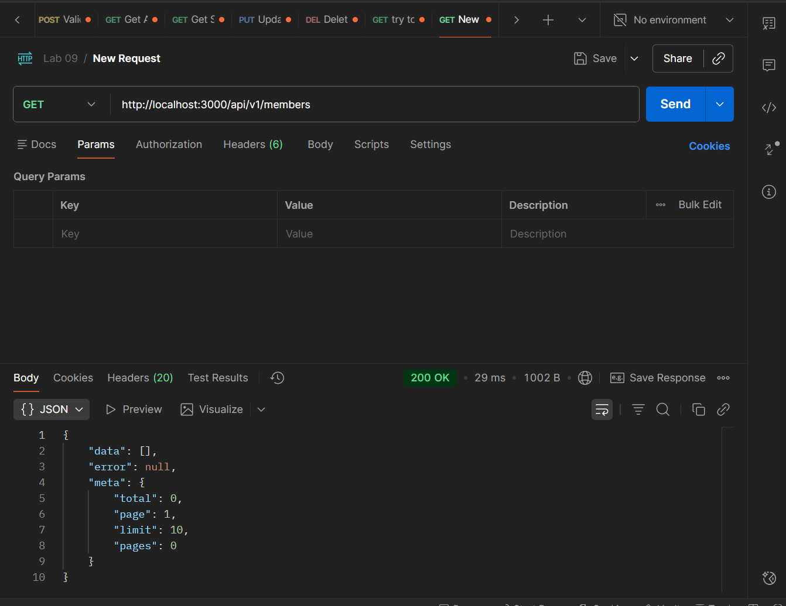

Deliverable 4: posting using invalid data
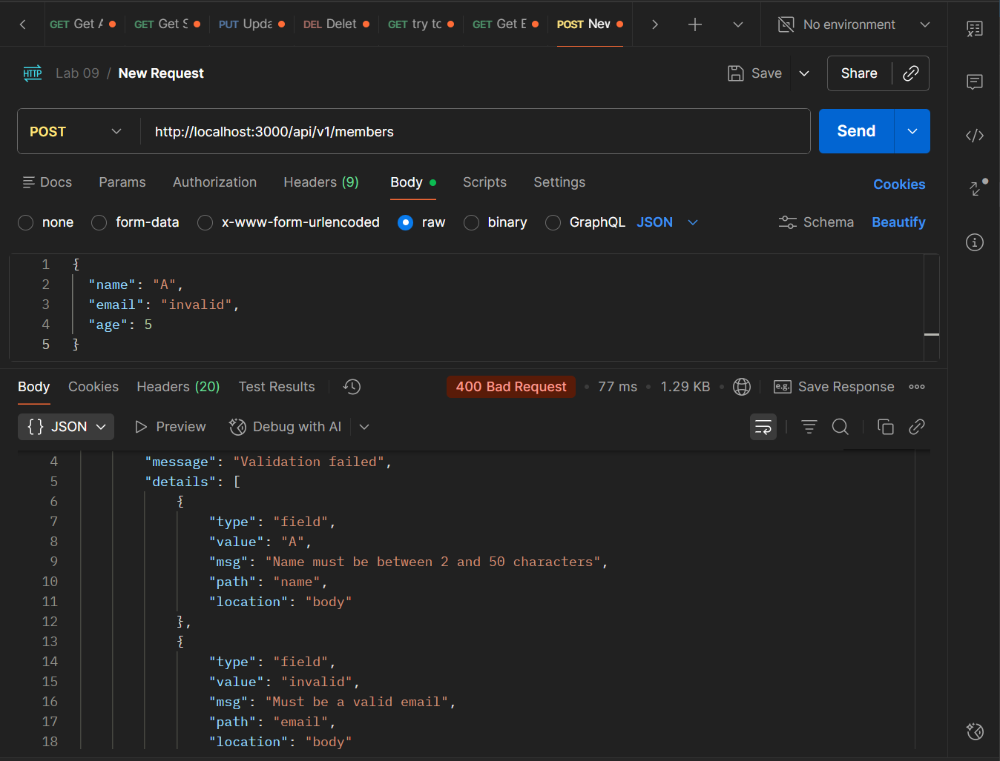

Deliverable 5: posting using valid data
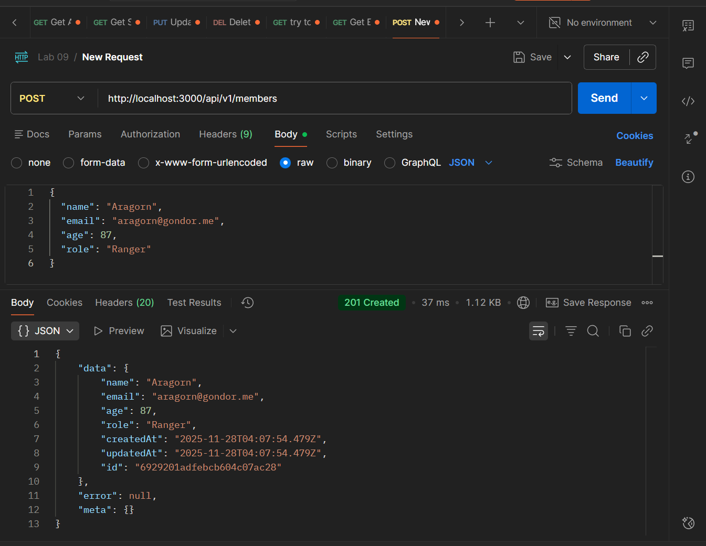

Deliverable 6: getting updated list
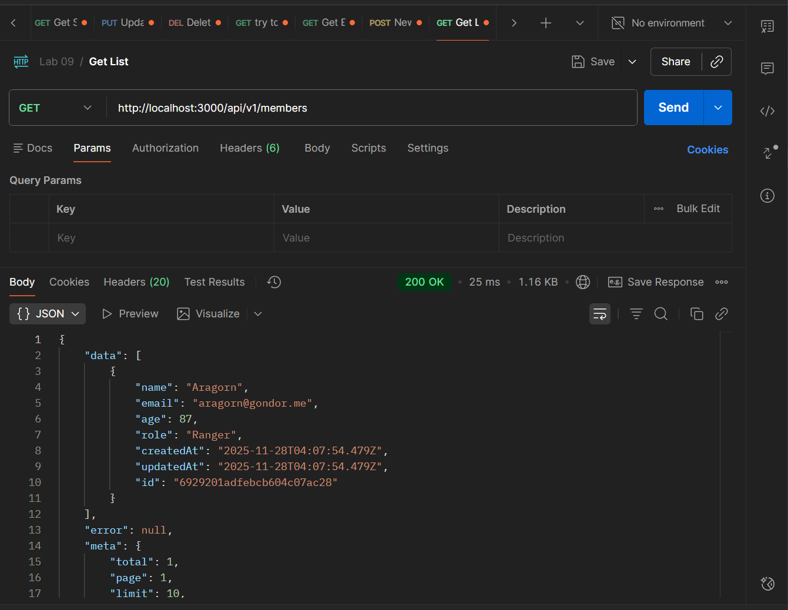

Deliverable 7: getting single member
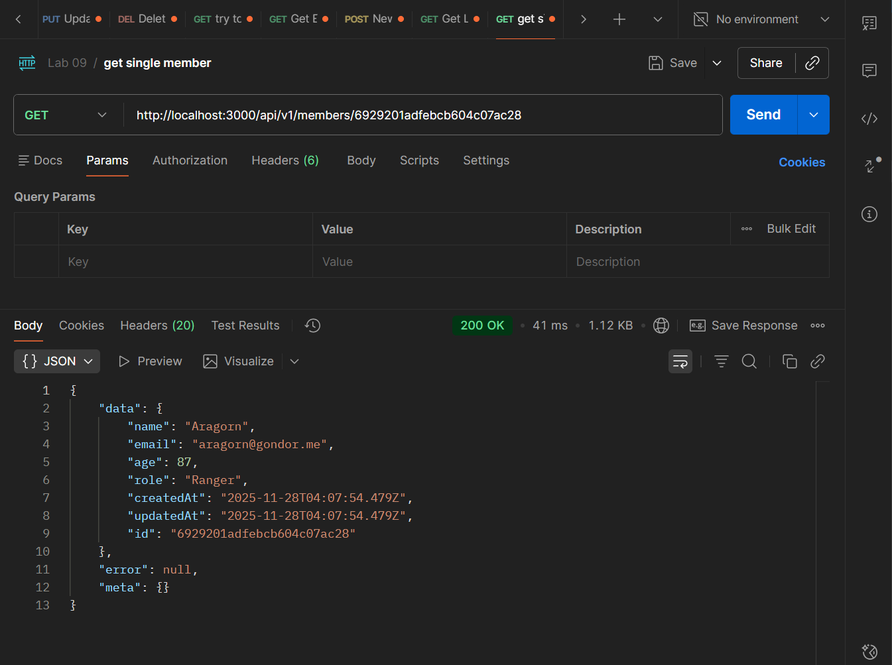

Deliverable 8: updating member
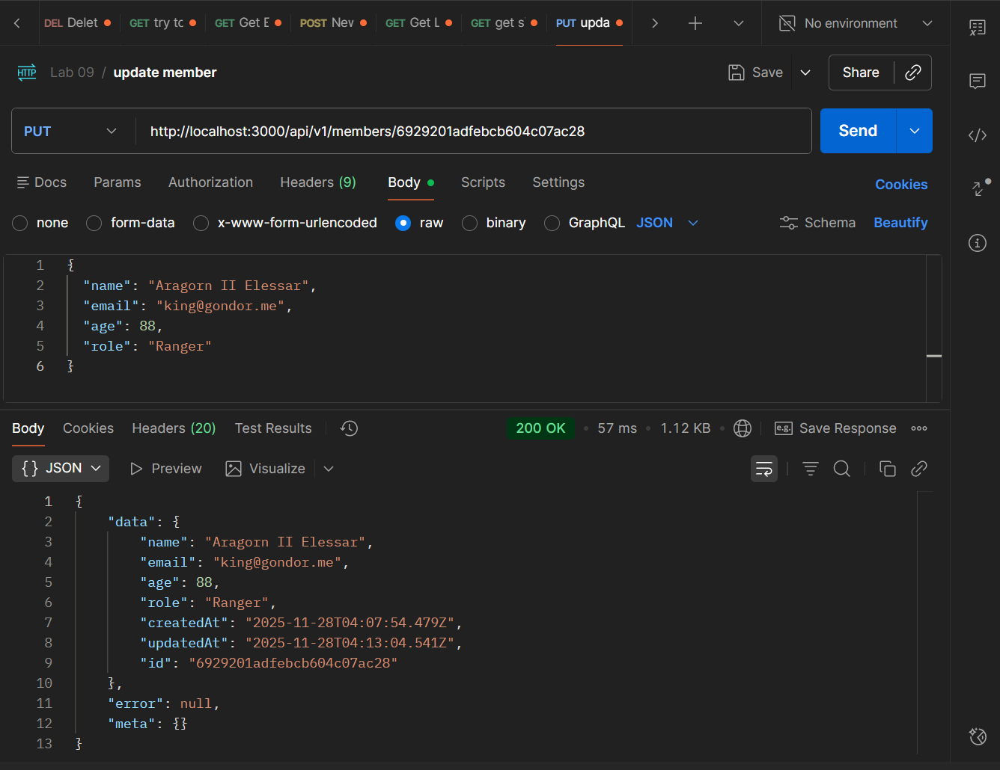

Deliverable 9: deleting member
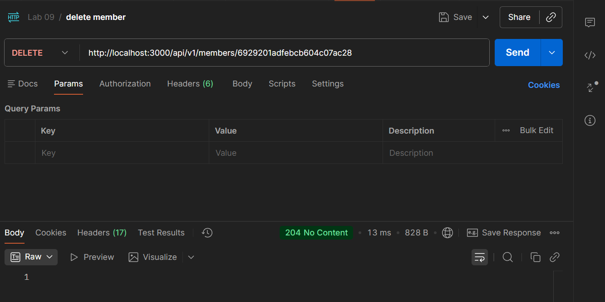

Deliverable 10: email already exists
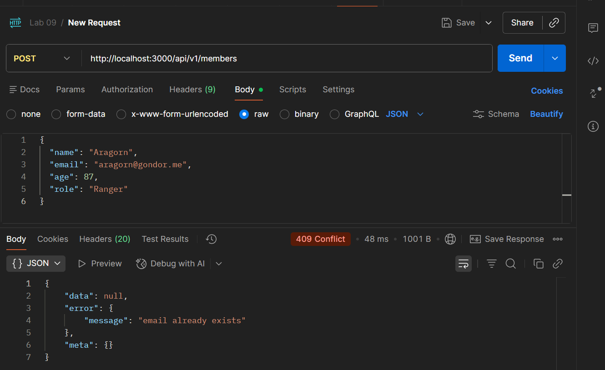

Deliverable 11: website loading
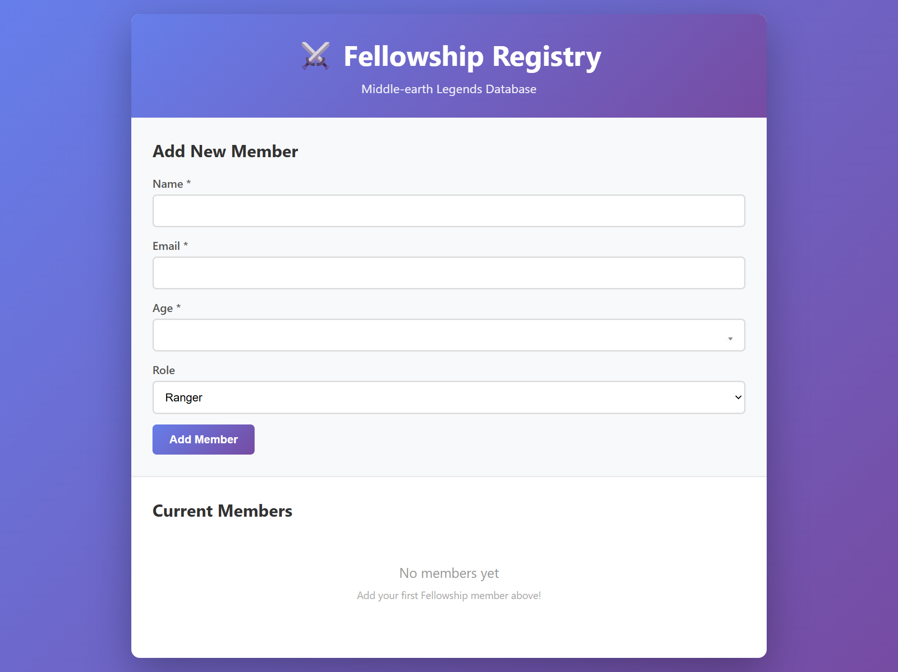

Deliverable 12: adding member using website


Deliverable 13: updating member using website
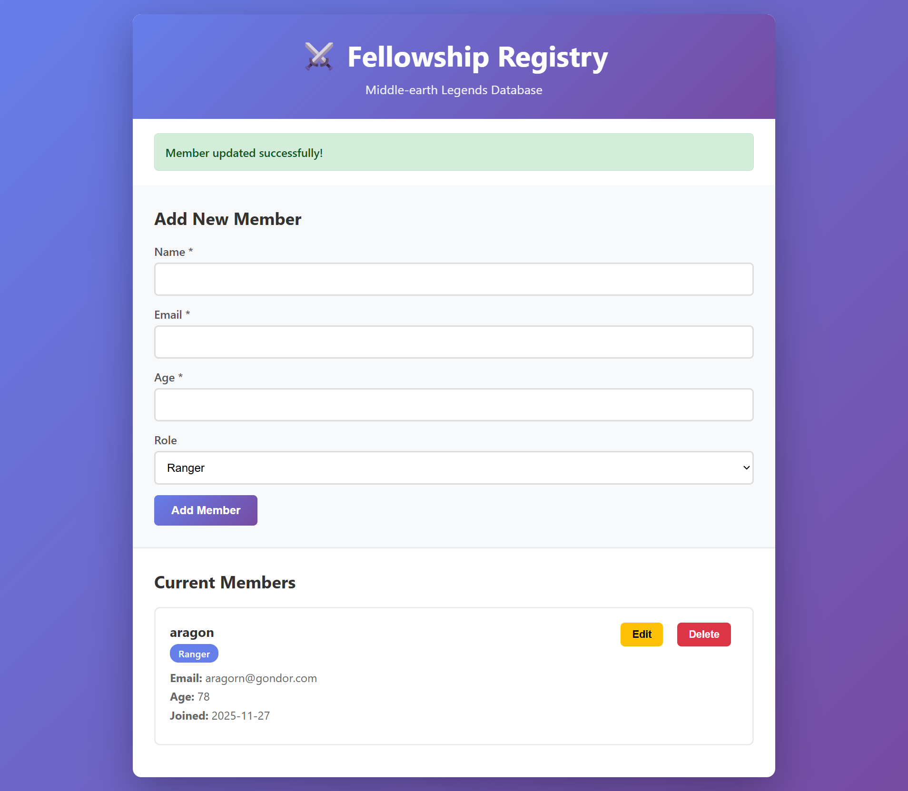

Deliverable 14: member removed using website
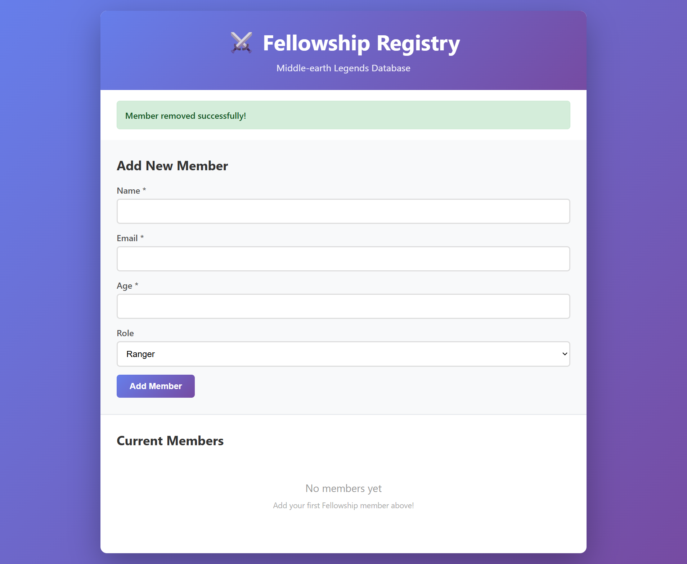

---
## Experience and Challenges
### Reflection on Completing the Lab

#### **What did you learn?** 
**I learned how to clean data using mongoose before sending to the client and created error handling that handles all errors and I learned how to build a website that updates the DOM in real time**

#### **Challenges Faced**: 
- __**Edit/Delete button not working**__

#### **How You Overcame Challenges**
- __**To solve this I implemented event delegation by adding listeners to the parent container**__